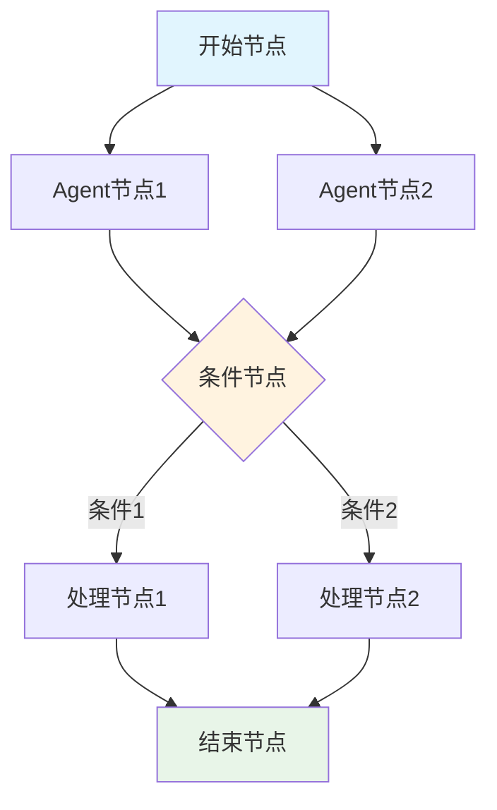

# Agents-Flex - Chain 工作流模块详解

## 模块概述

**Chain工作流模块** 是Agents-Flex框架中最具创新性的核心功能之一，提供了强大而灵活的工作流编排能力。该模块通过图结构的方式定义和执行复杂的AI任务流程，支持顺序执行、并行处理、条件分支、循环控制等多种执行模式。

## 核心架构

### 1. 模块结构图

```
agents-flex-chain/
├── com.agentsflex.core.chain/
│   ├── Chain.java                      # 工作流主类
│   ├── ChainNode.java                  # 节点抽象
│   ├── ChainEdge.java                  # 边连接
│   ├── ChainContext.java               # 执行上下文
│   ├── ChainHolder.java                # 链持有者
│   ├── ChainStatus.java                # 执行状态
│   ├── ChainNodeStatus.java            # 节点状态
│   ├── Parameter.java                  # 参数定义
│   ├── DataType.java                   # 数据类型
│   ├── NodeContext.java                # 节点上下文
│   ├── EdgeCondition.java              # 边条件
│   ├── JsCodeCondition.java            # JS条件
│   ├── NodeCondition.java              # 节点条件
│   ├── ChainException.java             # 链异常
│   ├── ChainSuspendException.java      # 链挂起异常
│   └── RefType.java                    # 引用类型
├── impl/                               # 实现类
│   ├── SequentialChain.java            # 顺序链
│   ├── ParallelChain.java              # 并行链
│   └── LoopChain.java                  # 循环链
├── node/                               # 节点类型
│   ├── AgentNode.java                  # 智能体节点
│   ├── EndNode.java                    # 结束节点
│   ├── ConditionNode.java              # 条件节点
│   └── LoopNode.java                   # 循环节点
├── listener/                           # 监听器
│   └── ChainEventListener.java         # 事件监听器
└── event/                             # 事件系统
    └── ChainEvent.java                 # 链事件
```

### 2. 核心设计理念

#### 2.1 有向无环图（DAG）模型


#### 2.2 执行模式分类
- **SequentialChain**: 顺序执行链
- **ParallelChain**: 并行执行链  
- **LoopChain**: 循环执行链
- **ConditionalChain**: 条件分支链

## 核心类详解

### 1. Chain 主类实现

#### 1.1 基础结构
```java
public class Chain {
    
    /**
     * 链的唯一标识
     */
    private String id;
    
    /**
     * 链的名称
     */
    private String name;
    
    /**
     * 链的描述
     */
    private String description;
    
    /**
     * 节点列表
     */
    private List<ChainNode> nodes = new ArrayList<>();
    
    /**
     * 边列表（节点之间的连接）
     */
    private List<ChainEdge> edges = new ArrayList<>();
    
    /**
     * 链的执行状态
     */
    private ChainStatus status = ChainStatus.READY;
    
    /**
     * 链的元数据
     */
    private Map<String, Object> metadata = new HashMap<>();
    
    /**
     * 事件监听器
     */
    private List<ChainEventListener> listeners = new ArrayList<>();
    
    /**
     * 执行超时时间（毫秒）
     */
    private long timeout = 300000; // 5分钟默认超时
    
    /**
     * 最大重试次数
     */
    private int maxRetries = 3;
    
    public Chain() {
        this.id = generateId();
        this.status = ChainStatus.READY;
    }
    
    public Chain(String name) {
        this();
        this.name = name;
    }
    
    public Chain(String name, String description) {
        this(name);
        this.description = description;
    }
}
```

#### 1.2 核心执行逻辑
```java
/**
 * 执行工作流链
 * 
 * @param variables 初始变量
 * @return 执行结果
 */
public Object execute(Map<String, Object> variables) {
    return execute(variables, null);
}

/**
 * 执行工作流链（带监听器）
 * 
 * @param variables 初始变量
 * @param listener 执行监听器
 * @return 执行结果
 */
public Object execute(Map<String, Object> variables, ChainEventListener listener) {
    
    // 添加临时监听器
    if (listener != null) {
        addListener(listener);
    }
    
    try {
        // 初始化执行上下文
        ChainContext context = createContext(variables);
        
        // 触发开始事件
        fireEvent(ChainEvent.start(this, context));
        
        // 设置执行状态
        setStatus(ChainStatus.RUNNING);
        
        // 查找起始节点
        List<ChainNode> startNodes = findStartNodes();
        if (startNodes.isEmpty()) {
            throw new ChainException("未找到起始节点");
        }
        
        // 执行工作流
        Object result = executeNodes(startNodes, context);
        
        // 设置完成状态
        setStatus(ChainStatus.COMPLETED);
        
        // 触发完成事件
        fireEvent(ChainEvent.complete(this, context, result));
        
        return result;
        
    } catch (ChainSuspendException e) {
        // 链被挂起
        setStatus(ChainStatus.SUSPENDED);
        fireEvent(ChainEvent.suspend(this, e));
        throw e;
        
    } catch (Exception e) {
        // 链执行失败
        setStatus(ChainStatus.FAILED);
        fireEvent(ChainEvent.error(this, e));
        
        // 重试逻辑
        if (shouldRetry(e)) {
            return retryExecution(variables, listener);
        }
        
        throw new ChainException("链执行失败", e);
        
    } finally {
        // 移除临时监听器
        if (listener != null) {
            removeListener(listener);
        }
    }
}

/**
 * 执行节点集合
 */
private Object executeNodes(List<ChainNode> nodes, ChainContext context) {
    Object lastResult = null;
    
    for (ChainNode node : nodes) {
        try {
            // 检查节点是否应该执行
            if (!shouldExecuteNode(node, context)) {
                continue;
            }
            
            // 设置节点状态
            node.setStatus(ChainNodeStatus.RUNNING);
            
            // 创建节点上下文
            NodeContext nodeContext = createNodeContext(node, context);
            
            // 触发节点开始事件
            fireEvent(ChainEvent.nodeStart(this, node, nodeContext));
            
            // 执行节点
            Object result = node.execute(nodeContext);
            
            // 保存结果到上下文
            context.setVariable(node.getId() + "_result", result);
            context.setVariable("last_result", result);
            lastResult = result;
            
            // 设置节点完成状态
            node.setStatus(ChainNodeStatus.SUCCESS);
            
            // 触发节点完成事件
            fireEvent(ChainEvent.nodeComplete(this, node, nodeContext, result));
            
            // 查找下一个要执行的节点
            List<ChainNode> nextNodes = findNextNodes(node, context);
            if (!nextNodes.isEmpty()) {
                Object nextResult = executeNodes(nextNodes, context);
                if (nextResult != null) {
                    lastResult = nextResult;
                }
            }
            
        } catch (Exception e) {
            // 节点执行失败
            node.setStatus(ChainNodeStatus.FAILED);
            fireEvent(ChainEvent.nodeError(this, node, e));
            
            // 根据错误处理策略决定是否继续
            if (!handleNodeError(node, e, context)) {
                throw e;
            }
        }
    }
    
    return lastResult;
}

/**
 * 查找起始节点（没有入边的节点）
 */
private List<ChainNode> findStartNodes() {
    return nodes.stream()
        .filter(node -> !hasIncomingEdges(node))
        .collect(Collectors.toList());
}

/**
 * 查找下一个要执行的节点
 */
private List<ChainNode> findNextNodes(ChainNode currentNode, ChainContext context) {
    return edges.stream()
        .filter(edge -> edge.getSource().equals(currentNode))
        .filter(edge -> evaluateEdgeCondition(edge, context))
        .map(ChainEdge::getTarget)
        .collect(Collectors.toList());
}

/**
 * 判断节点是否应该执行
 */
private boolean shouldExecuteNode(ChainNode node, ChainContext context) {
    // 检查节点条件
    if (node.getCondition() != null) {
        return node.getCondition().evaluate(context);
    }
    
    // 检查所有入边条件
    List<ChainEdge> incomingEdges = getIncomingEdges(node);
    if (incomingEdges.isEmpty()) {
        return true; // 起始节点
    }
    
    // 所有入边的源节点都必须成功执行
    return incomingEdges.stream()
        .allMatch(edge -> edge.getSource().getStatus() == ChainNodeStatus.SUCCESS);
}
```

### 2. ChainNode 节点抽象

#### 2.1 节点基类设计
```java
public abstract class ChainNode {
    
    /**
     * 节点唯一标识
     */
    protected String id;
    
    /**
     * 节点名称
     */
    protected String name;
    
    /**
     * 节点描述
     */
    protected String description;
    
    /**
     * 节点类型
     */
    protected NodeType type;
    
    /**
     * 节点状态
     */
    protected ChainNodeStatus status = ChainNodeStatus.READY;
    
    /**
     * 节点条件
     */
    protected NodeCondition condition;
    
    /**
     * 输入参数定义
     */
    protected List<Parameter> inputParameters = new ArrayList<>();
    
    /**
     * 输出参数定义
     */
    protected List<Parameter> outputParameters = new ArrayList<>();
    
    /**
     * 节点配置
     */
    protected Map<String, Object> config = new HashMap<>();
    
    /**
     * 节点元数据
     */
    protected Map<String, Object> metadata = new HashMap<>();
    
    public ChainNode(String id, String name, NodeType type) {
        this.id = id;
        this.name = name;
        this.type = type;
    }
    
    /**
     * 执行节点逻辑 - 子类必须实现
     * 
     * @param context 节点执行上下文
     * @return 执行结果
     */
    public abstract Object execute(NodeContext context) throws Exception;
    
    /**
     * 验证节点配置 - 子类可以重写
     * 
     * @return 验证结果
     */
    public boolean validate() {
        // 检查必需参数
        for (Parameter param : inputParameters) {
            if (param.isRequired() && !config.containsKey(param.getName())) {
                return false;
            }
        }
        return true;
    }
    
    /**
     * 初始化节点 - 子类可以重写
     */
    public void initialize() {
        // 默认实现为空
    }
    
    /**
     * 清理资源 - 子类可以重写
     */
    public void cleanup() {
        // 默认实现为空
    }
    
    // Getters and Setters
    public String getId() { return id; }
    public String getName() { return name; }
    public NodeType getType() { return type; }
    public ChainNodeStatus getStatus() { return status; }
    public void setStatus(ChainNodeStatus status) { this.status = status; }
    
    public NodeCondition getCondition() { return condition; }
    public void setCondition(NodeCondition condition) { this.condition = condition; }
    
    public Map<String, Object> getConfig() { return config; }
    public void setConfig(Map<String, Object> config) { this.config = config; }
    
    public Object getConfigValue(String key) { return config.get(key); }
    public void setConfigValue(String key, Object value) { config.put(key, value); }
}

/**
 * 节点类型枚举
 */
public enum NodeType {
    START("开始节点"),
    END("结束节点"),
    AGENT("智能体节点"),
    CONDITION("条件节点"),
    LOOP("循环节点"),
    PARALLEL("并行节点"),
    SCRIPT("脚本节点"),
    HTTP("HTTP请求节点"),
    DATABASE("数据库节点"),
    CUSTOM("自定义节点");
    
    private final String description;
    
    NodeType(String description) {
        this.description = description;
    }
    
    public String getDescription() {
        return description;
    }
}
```

#### 2.2 具体节点实现

**AgentNode - 智能体节点**:
```java
public class AgentNode extends ChainNode {
    
    private final Agent agent;
    private String prompt;
    private ChatOptions chatOptions;
    
    public AgentNode(String id, String name, Agent agent) {
        super(id, name, NodeType.AGENT);
        this.agent = agent;
        this.chatOptions = ChatOptions.DEFAULT;
        
        // 定义输入参数
        addInputParameter(Parameter.builder()
            .name("prompt")
            .type(DataType.STRING)
            .required(true)
            .description("输入提示词")
            .build());
        
        // 定义输出参数
        addOutputParameter(Parameter.builder()
            .name("response")
            .type(DataType.STRING)
            .description("Agent响应结果")
            .build());
    }
    
    @Override
    public Object execute(NodeContext context) throws Exception {
        // 获取输入提示词
        String inputPrompt = getInputPrompt(context);
        
        // 执行Agent对话
        String response = agent.chat(inputPrompt, chatOptions);
        
        // 保存输出结果
        context.setOutput("response", response);
        
        return response;
    }
    
    private String getInputPrompt(NodeContext context) {
        // 优先使用配置的提示词
        if (prompt != null) {
            return processTemplate(prompt, context.getVariables());
        }
        
        // 其次使用参数传入的提示词
        Object promptParam = context.getInput("prompt");
        if (promptParam != null) {
            return promptParam.toString();
        }
        
        // 最后使用上一个节点的结果
        Object lastResult = context.getVariable("last_result");
        if (lastResult != null) {
            return lastResult.toString();
        }
        
        throw new IllegalArgumentException("未找到有效的输入提示词");
    }
    
    private String processTemplate(String template, Map<String, Object> variables) {
        String result = template;
        for (Map.Entry<String, Object> entry : variables.entrySet()) {
            String placeholder = "{" + entry.getKey() + "}";
            result = result.replace(placeholder, String.valueOf(entry.getValue()));
        }
        return result;
    }
    
    // 配置方法
    public AgentNode withPrompt(String prompt) {
        this.prompt = prompt;
        return this;
    }
    
    public AgentNode withChatOptions(ChatOptions options) {
        this.chatOptions = options;
        return this;
    }
}
```

**ConditionNode - 条件节点**:
```java
public class ConditionNode extends ChainNode {
    
    private String conditionExpression;
    private Map<String, Object> conditionVariables;
    
    public ConditionNode(String id, String name) {
        super(id, name, NodeType.CONDITION);
        this.conditionVariables = new HashMap<>();
        
        // 定义输入参数
        addInputParameter(Parameter.builder()
            .name("condition")
            .type(DataType.STRING)
            .required(true)
            .description("条件表达式")
            .build());
        
        // 定义输出参数
        addOutputParameter(Parameter.builder()
            .name("result")
            .type(DataType.BOOLEAN)
            .description("条件评估结果")
            .build());
    }
    
    @Override
    public Object execute(NodeContext context) throws Exception {
        // 获取条件表达式
        String expression = getConditionExpression(context);
        
        // 评估条件
        boolean result = evaluateCondition(expression, context);
        
        // 保存结果
        context.setOutput("result", result);
        
        return result;
    }
    
    private String getConditionExpression(NodeContext context) {
        if (conditionExpression != null) {
            return conditionExpression;
        }
        
        Object conditionParam = context.getInput("condition");
        if (conditionParam != null) {
            return conditionParam.toString();
        }
        
        throw new IllegalArgumentException("未找到条件表达式");
    }
    
    private boolean evaluateCondition(String expression, NodeContext context) {
        // 简化的条件评估实现
        // 实际项目中可以集成如JEXL、SpEL等表达式引擎
        
        // 替换变量
        String processedExpression = expression;
        for (Map.Entry<String, Object> entry : context.getVariables().entrySet()) {
            String placeholder = "{" + entry.getKey() + "}";
            processedExpression = processedExpression.replace(placeholder, 
                                                             String.valueOf(entry.getValue()));
        }
        
        // 简单的比较操作
        if (processedExpression.contains("==")) {
            String[] parts = processedExpression.split("==");
            return parts[0].trim().equals(parts[1].trim());
        }
        
        if (processedExpression.contains(">")) {
            String[] parts = processedExpression.split(">");
            try {
                double left = Double.parseDouble(parts[0].trim());
                double right = Double.parseDouble(parts[1].trim());
                return left > right;
            } catch (NumberFormatException e) {
                return false;
            }
        }
        
        // 默认返回true
        return Boolean.parseBoolean(processedExpression);
    }
    
    // 配置方法
    public ConditionNode withExpression(String expression) {
        this.conditionExpression = expression;
        return this;
    }
    
    public ConditionNode withVariable(String name, Object value) {
        this.conditionVariables.put(name, value);
        return this;
    }
}
```

### 3. 工作流类型实现

#### 3.1 SequentialChain - 顺序执行链
```java
public class SequentialChain extends Chain {
    
    public SequentialChain() {
        super();
    }
    
    public SequentialChain(String name) {
        super(name);
    }
    
    /**
     * 添加节点到顺序链
     */
    public SequentialChain addNode(ChainNode node) {
        addNode(node);
        
        // 自动连接到前一个节点
        if (getNodes().size() > 1) {
            List<ChainNode> nodes = getNodes();
            ChainNode previousNode = nodes.get(nodes.size() - 2);
            addEdge(new ChainEdge(previousNode, node));
        }
        
        return this;
    }
    
    /**
     * 便利的构建方法
     */
    public static SequentialChain create(String name) {
        return new SequentialChain(name);
    }
    
    public static SequentialChain create() {
        return new SequentialChain();
    }
    
    /**
     * 流式构建API
     */
    public SequentialChain then(ChainNode node) {
        return addNode(node);
    }
    
    public SequentialChain thenAgent(String name, Agent agent) {
        return addNode(new AgentNode(generateNodeId(), name, agent));
    }
    
    public SequentialChain thenCondition(String name, String expression) {
        return addNode(new ConditionNode(generateNodeId(), name)
                      .withExpression(expression));
    }
}
```

#### 3.2 ParallelChain - 并行执行链
```java
public class ParallelChain extends Chain {
    
    private MergeStrategy mergeStrategy = MergeStrategy.ALL;
    private int maxConcurrency = Runtime.getRuntime().availableProcessors();
    
    public ParallelChain() {
        super();
    }
    
    public ParallelChain(String name) {
        super(name);
    }
    
    /**
     * 添加并行分支
     */
    public ParallelChain addBranch(Chain branch) {
        // 将分支的节点添加到当前链
        for (ChainNode node : branch.getNodes()) {
            addNode(node);
        }
        
        // 添加分支的边
        for (ChainEdge edge : branch.getEdges()) {
            addEdge(edge);
        }
        
        return this;
    }
    
    /**
     * 并行执行逻辑重写
     */
    @Override
    public Object execute(Map<String, Object> variables) {
        ChainContext context = createContext(variables);
        
        // 查找所有起始节点
        List<ChainNode> startNodes = findStartNodes();
        
        // 创建线程池
        ExecutorService executor = Executors.newFixedThreadPool(maxConcurrency);
        
        try {
            // 并行执行各个分支
            List<Future<Object>> futures = new ArrayList<>();
            
            for (ChainNode startNode : startNodes) {
                Future<Object> future = executor.submit(() -> {
                    return executeNodeBranch(startNode, context);
                });
                futures.add(future);
            }
            
            // 收集结果
            List<Object> results = new ArrayList<>();
            for (Future<Object> future : futures) {
                try {
                    Object result = future.get();
                    results.add(result);
                } catch (Exception e) {
                    throw new ChainException("并行分支执行失败", e);
                }
            }
            
            // 根据合并策略处理结果
            return mergeResults(results);
            
        } finally {
            executor.shutdown();
        }
    }
    
    private Object executeNodeBranch(ChainNode startNode, ChainContext context) {
        // 为每个分支创建独立的上下文
        ChainContext branchContext = context.createBranch();
        
        // 执行分支
        return executeNodes(List.of(startNode), branchContext);
    }
    
    private Object mergeResults(List<Object> results) {
        switch (mergeStrategy) {
            case FIRST:
                return results.isEmpty() ? null : results.get(0);
            case LAST:
                return results.isEmpty() ? null : results.get(results.size() - 1);
            case ALL:
                return results;
            case CONCAT:
                return results.stream()
                    .map(Object::toString)
                    .collect(Collectors.joining("\n"));
            default:
                return results;
        }
    }
    
    // 配置方法
    public ParallelChain withMergeStrategy(MergeStrategy strategy) {
        this.mergeStrategy = strategy;
        return this;
    }
    
    public ParallelChain withMaxConcurrency(int maxConcurrency) {
        this.maxConcurrency = maxConcurrency;
        return this;
    }
    
    /**
     * 结果合并策略
     */
    public enum MergeStrategy {
        FIRST,      // 取第一个结果
        LAST,       // 取最后一个结果
        ALL,        // 保留所有结果
        CONCAT      // 连接所有结果
    }
}
```

#### 3.3 LoopChain - 循环执行链
```java
public class LoopChain extends Chain {
    
    private String condition;
    private int maxIterations = 100;
    private LoopType loopType = LoopType.WHILE;
    
    public LoopChain() {
        super();
    }
    
    public LoopChain(String name) {
        super(name);
    }
    
    /**
     * 循环执行逻辑
     */
    @Override
    public Object execute(Map<String, Object> variables) {
        ChainContext context = createContext(variables);
        
        Object lastResult = null;
        int iteration = 0;
        
        // 根据循环类型执行
        switch (loopType) {
            case WHILE:
                while (evaluateCondition(condition, context) && 
                       iteration < maxIterations) {
                    
                    lastResult = executeIteration(context, iteration);
                    iteration++;
                }
                break;
                
            case FOR:
                for (int i = 0; i < maxIterations; i++) {
                    context.setVariable("loop_index", i);
                    lastResult = executeIteration(context, i);
                    
                    // 检查退出条件
                    if (condition != null && !evaluateCondition(condition, context)) {
                        break;
                    }
                }
                break;
                
            case DO_WHILE:
                do {
                    lastResult = executeIteration(context, iteration);
                    iteration++;
                } while (evaluateCondition(condition, context) && 
                         iteration < maxIterations);
                break;
        }
        
        return lastResult;
    }
    
    private Object executeIteration(ChainContext context, int iteration) {
        // 设置迭代变量
        context.setVariable("iteration", iteration);
        
        // 执行链中的节点
        List<ChainNode> startNodes = findStartNodes();
        return executeNodes(startNodes, context);
    }
    
    private boolean evaluateCondition(String condition, ChainContext context) {
        if (condition == null) {
            return true;
        }
        
        // 简化的条件评估（实际项目中应使用表达式引擎）
        String processedCondition = condition;
        for (Map.Entry<String, Object> entry : context.getVariables().entrySet()) {
            String placeholder = "{" + entry.getKey() + "}";
            processedCondition = processedCondition.replace(placeholder, 
                                                           String.valueOf(entry.getValue()));
        }
        
        return Boolean.parseBoolean(processedCondition);
    }
    
    // 配置方法
    public LoopChain setCondition(String condition) {
        this.condition = condition;
        return this;
    }
    
    public LoopChain setMaxIterations(int maxIterations) {
        this.maxIterations = maxIterations;
        return this;
    }
    
    public LoopChain setLoopType(LoopType loopType) {
        this.loopType = loopType;
        return this;
    }
    
    /**
     * 循环类型
     */
    public enum LoopType {
        WHILE,      // while循环
        FOR,        // for循环
        DO_WHILE    // do-while循环
    }
}
```

## 高级特性

### 1. 条件执行和分支

#### 1.1 边条件系统
```java
public class EdgeCondition {
    
    private String expression;
    private Map<String, Object> variables;
    
    public EdgeCondition(String expression) {
        this.expression = expression;
        this.variables = new HashMap<>();
    }
    
    /**
     * 评估边条件
     */
    public boolean evaluate(ChainContext context) {
        // 替换上下文变量
        String processedExpression = expression;
        for (Map.Entry<String, Object> entry : context.getVariables().entrySet()) {
            String placeholder = "{" + entry.getKey() + "}";
            processedExpression = processedExpression.replace(placeholder, 
                                                             String.valueOf(entry.getValue()));
        }
        
        // 评估表达式
        return evaluateExpression(processedExpression);
    }
    
    private boolean evaluateExpression(String expression) {
        // 支持基本的比较操作
        if (expression.contains("==")) {
            String[] parts = expression.split("==");
            return parts[0].trim().equals(parts[1].trim());
        }
        
        if (expression.contains("!=")) {
            String[] parts = expression.split("!=");
            return !parts[0].trim().equals(parts[1].trim());
        }
        
        if (expression.contains(">=")) {
            return compareNumbers(expression, ">=");
        }
        
        if (expression.contains("<=")) {
            return compareNumbers(expression, "<=");
        }
        
        if (expression.contains(">")) {
            return compareNumbers(expression, ">");
        }
        
        if (expression.contains("<")) {
            return compareNumbers(expression, "<");
        }
        
        // 默认解析为布尔值
        return Boolean.parseBoolean(expression);
    }
    
    private boolean compareNumbers(String expression, String operator) {
        String[] parts = expression.split(operator);
        try {
            double left = Double.parseDouble(parts[0].trim());
            double right = Double.parseDouble(parts[1].trim());
            
            switch (operator) {
                case ">=": return left >= right;
                case "<=": return left <= right;
                case ">": return left > right;
                case "<": return left < right;
                default: return false;
            }
        } catch (NumberFormatException e) {
            return false;
        }
    }
}
```

### 2. 错误处理和重试

#### 2.1 异常处理策略
```java
public class ChainErrorHandler {
    
    private ErrorHandlingStrategy strategy = ErrorHandlingStrategy.FAIL_FAST;
    private int maxRetries = 3;
    private long retryDelay = 1000; // 1秒
    
    /**
     * 处理节点执行错误
     */
    public boolean handleNodeError(ChainNode node, Exception error, ChainContext context) {
        switch (strategy) {
            case FAIL_FAST:
                // 立即失败，停止整个链的执行
                return false;
                
            case CONTINUE:
                // 忽略错误，继续执行下一个节点
                logError(node, error);
                return true;
                
            case RETRY:
                // 重试当前节点
                return retryNode(node, context);
                
            case SKIP:
                // 跳过当前节点，标记为跳过状态
                node.setStatus(ChainNodeStatus.SKIPPED);
                return true;
                
            default:
                return false;
        }
    }
    
    private boolean retryNode(ChainNode node, ChainContext context) {
        int retryCount = context.getRetryCount(node.getId());
        
        if (retryCount < maxRetries) {
            // 增加重试计数
            context.incrementRetryCount(node.getId());
            
            // 等待重试延迟
            try {
                Thread.sleep(retryDelay * (retryCount + 1)); // 指数退避
            } catch (InterruptedException e) {
                Thread.currentThread().interrupt();
                return false;
            }
            
            // 重新设置节点状态
            node.setStatus(ChainNodeStatus.READY);
            
            // 可以重试
            return true;
        }
        
        // 重试次数用完，失败
        return false;
    }
    
    private void logError(ChainNode node, Exception error) {
        System.err.printf("节点 %s 执行失败: %s%n", node.getName(), error.getMessage());
    }
    
    /**
     * 错误处理策略
     */
    public enum ErrorHandlingStrategy {
        FAIL_FAST,   // 快速失败
        CONTINUE,    // 继续执行
        RETRY,       // 重试
        SKIP         // 跳过
    }
}
```

### 3. 可视化和监控

#### 3.1 链执行监控
```java
public class ChainMonitor implements ChainEventListener {
    
    private final Map<String, ChainExecutionStats> stats = new ConcurrentHashMap<>();
    
    @Override
    public void onChainStart(ChainEvent event) {
        String chainId = event.getChain().getId();
        stats.put(chainId, new ChainExecutionStats(chainId));
    }
    
    @Override
    public void onChainComplete(ChainEvent event) {
        String chainId = event.getChain().getId();
        ChainExecutionStats stat = stats.get(chainId);
        if (stat != null) {
            stat.markCompleted();
        }
    }
    
    @Override
    public void onNodeStart(ChainEvent event) {
        String chainId = event.getChain().getId();
        String nodeId = event.getNode().getId();
        
        ChainExecutionStats stat = stats.get(chainId);
        if (stat != null) {
            stat.recordNodeStart(nodeId);
        }
    }
    
    @Override
    public void onNodeComplete(ChainEvent event) {
        String chainId = event.getChain().getId();
        String nodeId = event.getNode().getId();
        
        ChainExecutionStats stat = stats.get(chainId);
        if (stat != null) {
            stat.recordNodeComplete(nodeId);
        }
    }
    
    /**
     * 获取执行统计
     */
    public ChainExecutionStats getStats(String chainId) {
        return stats.get(chainId);
    }
    
    /**
     * 生成可视化图形
     */
    public String generateMermaidDiagram(Chain chain) {
        StringBuilder sb = new StringBuilder();
        sb.append("graph TD\n");
        
        // 添加节点
        for (ChainNode node : chain.getNodes()) {
            String shape = getNodeShape(node.getType());
            sb.append(String.format("    %s%s%s\n", 
                node.getId(), shape.charAt(0), node.getName(), shape.charAt(1)));
        }
        
        // 添加边
        for (ChainEdge edge : chain.getEdges()) {
            sb.append(String.format("    %s --> %s\n", 
                edge.getSource().getId(), edge.getTarget().getId()));
        }
        
        return sb.toString();
    }
    
    private String getNodeShape(NodeType type) {
        switch (type) {
            case START: return "([])";
            case END: return "(())";
            case CONDITION: return "{}";
            case AGENT: return "[]";
            default: return "[]";
        }
    }
}
```

## 使用示例

### 1. 构建简单的顺序工作流

```java
public class DocumentAnalysisWorkflow {
    
    public void createWorkflow() {
        // 创建Agent
        Agent extractorAgent = new OpenAIAgent("文档提取器");
        Agent summarizerAgent = new OpenAIAgent("摘要生成器");
        Agent classifierAgent = new OpenAIAgent("分类器");
        
        // 构建顺序链
        SequentialChain chain = SequentialChain.create("文档分析流程")
            .thenAgent("提取文档内容", extractorAgent)
            .thenAgent("生成文档摘要", summarizerAgent)  
            .thenAgent("文档分类", classifierAgent);
        
        // 执行工作流
        Map<String, Object> input = Map.of(
            "document_path", "/path/to/document.pdf"
        );
        
        Object result = chain.execute(input);
        System.out.println("分析结果: " + result);
    }
}
```

### 2. 构建条件分支工作流

```java
public class ConditionalWorkflow {
    
    public void createWorkflow() {
        Agent classifierAgent = new OpenAIAgent("分类器");
        Agent handlerAgent1 = new OpenAIAgent("处理器1");
        Agent handlerAgent2 = new OpenAIAgent("处理器2");
        
        // 构建条件链
        Chain chain = new Chain("条件分支流程");
        
        // 添加节点
        AgentNode classifier = new AgentNode("classifier", "分类器", classifierAgent);
        AgentNode handler1 = new AgentNode("handler1", "处理器1", handlerAgent1);
        AgentNode handler2 = new AgentNode("handler2", "处理器2", handlerAgent2);
        
        chain.addNode(classifier);
        chain.addNode(handler1);
        chain.addNode(handler2);
        
        // 添加条件边
        chain.addEdge(new ChainEdge(classifier, handler1, 
            new EdgeCondition("{classifier_result} == 'type1'")));
        chain.addEdge(new ChainEdge(classifier, handler2, 
            new EdgeCondition("{classifier_result} == 'type2'")));
        
        // 执行工作流
        Object result = chain.execute(Map.of("input", "待分类的内容"));
        System.out.println("处理结果: " + result);
    }
}
```

## 总结

Agents-Flex的Chain工作流模块提供了强大而灵活的工作流编排能力，具有以下特点：

**核心优势**：
- **灵活性**：支持顺序、并行、循环、条件等多种执行模式
- **可扩展性**：基于图结构的设计，易于扩展新的节点类型
- **可视化**：支持工作流的可视化展示和监控
- **容错性**：完善的错误处理和重试机制

**设计特色**：
- 简洁的链式API设计
- 强大的条件表达式系统
- 完整的事件监听机制
- 丰富的预定义节点类型

该模块为构建复杂的AI应用工作流提供了强有力的支持，是Agents-Flex框架的核心创新之一。

---

*作者：senrian*  
*最后更新：2024年* 