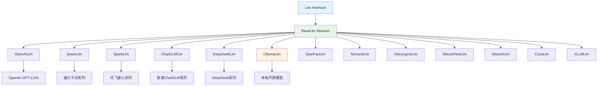

# Agents-Flex - LLM 多提供商集成模块详解

## 模块概述

**Agents-Flex LLM模块** 是框架中最重要的多提供商抽象层，提供了统一的LLM接口来集成各种大语言模型服务。该模块通过统一的抽象接口，支持了13+个主流LLM提供商，为开发者提供了强大的多模型选择能力和无缝切换体验。

## 核心架构

### 1. 提供商生态图谱



### 2. 统一抽象设计

#### 2.1 核心接口层次
```java
/**
 * LLM顶级接口 - 统一所有LLM提供商
 */
public interface Llm extends EmbeddingModel {
    
    /**
     * 简单文本对话 - 最简洁的API
     */
    default String chat(String prompt) {
        return chat(prompt, ChatOptions.DEFAULT);
    }
    
    /**
     * 带配置的文本对话
     */
    default String chat(String prompt, ChatOptions options) {
        AbstractBaseMessageResponse<AiMessage> response = chat(new TextPrompt(prompt), options);
        if (response != null && response.isError()) {
            throw new LlmException(response.getErrorMessage());
        }
        return response != null && response.getMessage() != null ? 
               response.getMessage().getContent() : null;
    }
    
    /**
     * 结构化提示词对话 - 核心方法
     */
    AiMessageResponse chat(Prompt prompt, ChatOptions options);
    
    /**
     * 流式对话 - 核心方法
     */
    void chatStream(Prompt prompt, StreamResponseListener listener, ChatOptions options);
}

/**
 * 嵌入模型接口
 */
public interface EmbeddingModel {
    
    /**
     * 文本嵌入
     */
    default EmbeddingResponse embedding(String text) {
        return embedding(EmbeddingRequest.ofTexts(text));
    }
    
    /**
     * 批量文本嵌入
     */
    default EmbeddingResponse embedding(List<String> texts) {
        return embedding(EmbeddingRequest.ofTexts(texts));
    }
    
    /**
     * 文档嵌入
     */
    default EmbeddingResponse embedding(Document document) {
        return embedding(EmbeddingRequest.ofDocuments(document));
    }
    
    /**
     * 完整嵌入请求 - 核心方法
     */
    EmbeddingResponse embedding(EmbeddingRequest request);
}
```

#### 2.2 基础抽象实现
```java
/**
 * LLM基础抽象类 - 所有具体实现的父类
 */
public abstract class BaseLlm<T extends LlmConfig> implements Llm {
    
    protected T config;
    protected LlmClient llmClient;
    protected ChatOptions defaultChatOptions;
    
    public BaseLlm(T config) {
        this.config = config;
        this.defaultChatOptions = ChatOptions.DEFAULT;
        initializeLlmClient();
    }
    
    /**
     * 初始化HTTP客户端
     */
    protected void initializeLlmClient() {
        this.llmClient = new HttpClient();
        configureHttpClient();
    }
    
    /**
     * 配置HTTP客户端 - 子类可重写
     */
    protected void configureHttpClient() {
        if (llmClient instanceof HttpClient) {
            HttpClient httpClient = (HttpClient) llmClient;
            
            // 设置基础配置
            httpClient.setTimeout(config.getTimeout());
            httpClient.setConnectTimeout(config.getConnectTimeout());
            httpClient.setMaxRetries(config.getMaxRetries());
            
            // 设置请求头
            Map<String, String> headers = buildDefaultHeaders();
            httpClient.setDefaultHeaders(headers);
            
            // 设置代理
            if (config.getProxy() != null) {
                httpClient.setProxy(config.getProxy());
            }
        }
    }
    
    /**
     * 构建默认请求头 - 子类可重写
     */
    protected Map<String, String> buildDefaultHeaders() {
        Map<String, String> headers = new HashMap<>();
        headers.put("Content-Type", "application/json");
        headers.put("User-Agent", "agents-flex/" + getVersion());
        
        // 添加认证头
        if (config.getApiKey() != null) {
            headers.put("Authorization", buildAuthorizationHeader());
        }
        
        return headers;
    }
    
    /**
     * 构建认证头 - 子类需要实现
     */
    protected abstract String buildAuthorizationHeader();
    
    /**
     * 子类必须实现的核心方法
     */
    @Override
    public abstract AiMessageResponse chat(Prompt prompt, ChatOptions options);
    
    @Override
    public abstract void chatStream(Prompt prompt, StreamResponseListener listener, 
                                   ChatOptions options);
    
    /**
     * 默认嵌入实现 - 子类可重写
     */
    @Override
    public EmbeddingResponse embedding(EmbeddingRequest request) {
        throw new UnsupportedOperationException(
            "当前LLM实现不支持嵌入功能: " + this.getClass().getSimpleName());
    }
    
    /**
     * 工具方法：处理API响应
     */
    protected <R> R handleApiResponse(String responseBody, Class<R> responseType) {
        if (StringUtil.isBlank(responseBody)) {
            throw new LlmException("API响应为空");
        }
        
        try {
            return JSON.parseObject(responseBody, responseType);
        } catch (Exception e) {
            throw new LlmException("解析API响应失败: " + e.getMessage(), e);
        }
    }
    
    /**
     * 工具方法：处理API错误
     */
    protected void handleApiError(String responseBody, int statusCode) {
        ApiErrorResponse error = parseApiError(responseBody);
        
        switch (statusCode) {
            case 400:
                throw new LlmException("请求参数错误: " + error.getMessage());
            case 401:
                throw new LlmException("API密钥无效或过期");
            case 403:
                throw new LlmException("访问被拒绝，请检查权限");
            case 429:
                throw new LlmException("请求频率超限，请稍后重试");
            case 500:
                throw new LlmException("服务器内部错误");
            case 503:
                throw new LlmException("服务暂时不可用");
            default:
                throw new LlmException("API调用失败，状态码: " + statusCode + 
                                     ", 错误信息: " + error.getMessage());
        }
    }
    
    /**
     * 解析API错误响应 - 子类可重写
     */
    protected ApiErrorResponse parseApiError(String responseBody) {
        try {
            JSONObject json = JSON.parseObject(responseBody);
            return ApiErrorResponse.builder()
                .code(json.getString("code"))
                .message(json.getString("message"))
                .type(json.getString("type"))
                .build();
        } catch (Exception e) {
            return ApiErrorResponse.builder()
                .message("解析错误响应失败: " + responseBody)
                .build();
        }
    }
}
```

## 具体提供商实现详解

### 1. OpenAI实现 - 标准参考实现

#### 1.1 OpenAI LLM实现
```java
/**
 * OpenAI LLM实现 - 作为标准参考
 */
public class OpenAILlm extends BaseLlm<OpenAILlmConfig> {
    
    private AiMessageParser aiMessageParser = OpenAILlmUtil.getAiMessageParser(false);
    private AiMessageParser streamMessageParser = OpenAILlmUtil.getAiMessageParser(true);
    
    public OpenAILlm(OpenAILlmConfig config) {
        super(config);
    }
    
    @Override
    protected String buildAuthorizationHeader() {
        return "Bearer " + config.getApiKey();
    }
    
    @Override
    public AiMessageResponse chat(Prompt prompt, ChatOptions options) {
        // 1. 构建请求payload
        Map<String, Object> payload = buildChatPayload(prompt, options);
        
        // 2. 发送HTTP请求
        String endpoint = config.getEndpoint() + config.getChatPath();
        LlmClientListener listener = new BaseLlmClientListener(this) {
            @Override
            public void onResponse(LlmClient client, String response) {
                // 处理成功响应
                processSuccessResponse(response);
            }
            
            @Override
            public void onFailure(LlmClient client, Exception exception) {
                // 处理失败响应
                processFailureResponse(exception);
            }
        };
        
        // 3. 同步调用
        String responseBody = llmClient.post(endpoint, payload, listener);
        
        // 4. 解析响应
        return parseAiMessageResponse(responseBody);
    }
    
    @Override
    public void chatStream(Prompt prompt, StreamResponseListener listener, ChatOptions options) {
        // 1. 构建流式请求payload
        Map<String, Object> payload = buildChatPayload(prompt, options);
        payload.put("stream", true);
        
        // 2. 创建SSE客户端
        String endpoint = config.getEndpoint() + config.getChatPath();
        SseClient sseClient = new SseClient();
        
        // 3. 设置流式监听器
        SseEventListener sseListener = new SseEventListener() {
            @Override
            public void onEvent(String eventData) {
                if ("[DONE]".equals(eventData.trim())) {
                    listener.onComplete(new StreamResponseContext());
                    return;
                }
                
                try {
                    // 解析流式数据
                    AiMessage aiMessage = streamMessageParser.parse(eventData);
                    if (aiMessage != null) {
                        StreamResponseContext context = StreamResponseContext.builder()
                            .message(aiMessage)
                            .index(0)
                            .build();
                        listener.onMessage(context, aiMessage);
                    }
                } catch (Exception e) {
                    listener.onError(new StreamResponseContext(), e);
                }
            }
            
            @Override
            public void onError(Exception exception) {
                listener.onError(new StreamResponseContext(), exception);
            }
        };
        
        // 4. 开始流式调用
        sseClient.streamPost(endpoint, payload, sseListener);
    }
    
    /**
     * 构建聊天请求payload
     */
    private Map<String, Object> buildChatPayload(Prompt prompt, ChatOptions options) {
        Map<String, Object> payload = new HashMap<>();
        
        // 模型参数
        payload.put("model", options.getModel() != null ? 
                   options.getModel() : config.getModel());
        
        // 消息列表
        payload.put("messages", OpenAILlmUtil.promptToMessages(prompt));
        
        // 生成参数
        if (options.getTemperature() != null) {
            payload.put("temperature", options.getTemperature());
        }
        if (options.getMaxTokens() != null) {
            payload.put("max_tokens", options.getMaxTokens());
        }
        if (options.getTopP() != null) {
            payload.put("top_p", options.getTopP());
        }
        if (options.getStop() != null && !options.getStop().isEmpty()) {
            payload.put("stop", options.getStop());
        }
        
        // 函数调用
        if (options.getFunctions() != null && !options.getFunctions().isEmpty()) {
            payload.put("functions", OpenAILlmUtil.functionsToJson(options.getFunctions()));
            if (options.getFunctionCall() != null) {
                payload.put("function_call", options.getFunctionCall());
            }
        }
        
        return payload;
    }
    
    /**
     * 解析AI消息响应
     */
    private AiMessageResponse parseAiMessageResponse(String responseBody) {
        try {
            AiMessage aiMessage = aiMessageParser.parse(responseBody);
            
            AiMessageResponse response = new AiMessageResponse();
            response.setMessage(aiMessage);
            
            // 解析使用统计
            JSONObject json = JSON.parseObject(responseBody);
            JSONObject usage = json.getJSONObject("usage");
            if (usage != null) {
                Usage usageInfo = new Usage();
                usageInfo.setPromptTokens(usage.getIntValue("prompt_tokens"));
                usageInfo.setCompletionTokens(usage.getIntValue("completion_tokens"));
                usageInfo.setTotalTokens(usage.getIntValue("total_tokens"));
                response.setUsage(usageInfo);
            }
            
            return response;
            
        } catch (Exception e) {
            AiMessageResponse response = new AiMessageResponse();
            response.setErrorMessage("解析响应失败: " + e.getMessage());
            response.setException(e);
            return response;
        }
    }
    
    @Override
    public EmbeddingResponse embedding(EmbeddingRequest request) {
        // 1. 构建嵌入请求
        Map<String, Object> payload = new HashMap<>();
        payload.put("model", config.getDefaultEmbeddingModel());
        payload.put("input", request.getTexts());
        
        // 2. 发送请求
        String endpoint = config.getEndpoint() + config.getEmbedPath();
        String responseBody = llmClient.post(endpoint, payload);
        
        // 3. 解析响应
        return parseEmbeddingResponse(responseBody);
    }
    
    /**
     * 解析嵌入响应
     */
    private EmbeddingResponse parseEmbeddingResponse(String responseBody) {
        try {
            JSONObject json = JSON.parseObject(responseBody);
            JSONArray data = json.getJSONArray("data");
            
            List<VectorData> embeddings = new ArrayList<>();
            for (int i = 0; i < data.size(); i++) {
                JSONObject item = data.getJSONObject(i);
                JSONArray embedding = item.getJSONArray("embedding");
                
                double[] vector = new double[embedding.size()];
                for (int j = 0; j < embedding.size(); j++) {
                    vector[j] = embedding.getDoubleValue(j);
                }
                
                embeddings.add(new VectorData(i, vector));
            }
            
            EmbeddingResponse response = new EmbeddingResponse();
            response.setEmbeddings(embeddings);
            response.setUsage(parseUsage(json.getJSONObject("usage")));
            
            return response;
            
        } catch (Exception e) {
            EmbeddingResponse response = new EmbeddingResponse();
            response.setErrorMessage("解析嵌入响应失败: " + e.getMessage());
            return response;
        }
    }
}
```

#### 1.2 OpenAI配置类
```java
/**
 * OpenAI LLM配置
 */
public class OpenAILlmConfig extends LlmConfig {
    
    private static final String DEFAULT_MODEL = "gpt-3.5-turbo";
    private static final String DEFAULT_EMBEDDING_MODEL = "text-embedding-ada-002";
    private static final String DEFAULT_ENDPOINT = "https://api.openai.com";
    
    private String defaultEmbeddingModel = DEFAULT_EMBEDDING_MODEL;
    private String chatPath = "/v1/chat/completions";
    private String embedPath = "/v1/embeddings";
    
    public OpenAILlmConfig() {
        setEndpoint(DEFAULT_ENDPOINT);
        setModel(DEFAULT_MODEL);
        setTimeout(Duration.ofSeconds(60));
        setConnectTimeout(Duration.ofSeconds(10));
        setMaxRetries(3);
    }
    
    // Getters and Setters
    public String getDefaultEmbeddingModel() { return defaultEmbeddingModel; }
    public void setDefaultEmbeddingModel(String defaultEmbeddingModel) { 
        this.defaultEmbeddingModel = defaultEmbeddingModel; 
    }
    
    public String getChatPath() { return chatPath; }
    public void setChatPath(String chatPath) { this.chatPath = chatPath; }
    
    public String getEmbedPath() { return embedPath; }
    public void setEmbedPath(String embedPath) { this.embedPath = embedPath; }
}
```

### 2. 通义千问实现 - 中文优化版本

#### 2.1 通义千问LLM实现
```java
/**
 * 通义千问LLM实现 - 专为中文优化
 */
public class QwenLlm extends BaseLlm<QwenLlmConfig> {
    
    public QwenLlm(QwenLlmConfig config) {
        super(config);
    }
    
    @Override
    protected String buildAuthorizationHeader() {
        return "Bearer " + config.getApiKey();
    }
    
    @Override
    protected Map<String, String> buildDefaultHeaders() {
        Map<String, String> headers = super.buildDefaultHeaders();
        headers.put("X-DashScope-SSE", "enable"); // 启用流式响应
        return headers;
    }
    
    @Override
    public AiMessageResponse chat(Prompt prompt, ChatOptions options) {
        // 1. 构建千问特有的请求格式
        Map<String, Object> payload = buildQwenChatPayload(prompt, options);
        
        // 2. 调用千问API
        String endpoint = config.getEndpoint() + config.getChatPath();
        String responseBody = llmClient.post(endpoint, payload);
        
        // 3. 解析千问响应格式
        return parseQwenResponse(responseBody);
    }
    
    /**
     * 构建千问聊天请求
     */
    private Map<String, Object> buildQwenChatPayload(Prompt prompt, ChatOptions options) {
        Map<String, Object> payload = new HashMap<>();
        
        // 千问API格式
        Map<String, Object> model = new HashMap<>();
        model.put("model", options.getModel() != null ? 
                 options.getModel() : config.getModel());
        payload.put("model", model);
        
        // 输入消息
        Map<String, Object> input = new HashMap<>();
        input.put("messages", QwenLlmUtil.promptToMessages(prompt));
        payload.put("input", input);
        
        // 参数配置
        Map<String, Object> parameters = new HashMap<>();
        if (options.getTemperature() != null) {
            parameters.put("temperature", options.getTemperature());
        }
        if (options.getMaxTokens() != null) {
            parameters.put("max_tokens", options.getMaxTokens());
        }
        if (options.getTopP() != null) {
            parameters.put("top_p", options.getTopP());
        }
        if (options.getTopK() != null) {
            parameters.put("top_k", options.getTopK());
        }
        
        // 千问特有参数
        parameters.put("result_format", "message");
        parameters.put("incremental_output", false);
        
        // 搜索增强
        if (options.getEnableSearch() != null && options.getEnableSearch()) {
            parameters.put("enable_search", true);
        }
        
        payload.put("parameters", parameters);
        
        return payload;
    }
    
    /**
     * 解析千问API响应
     */
    private AiMessageResponse parseQwenResponse(String responseBody) {
        try {
            JSONObject json = JSON.parseObject(responseBody);
            
            // 检查错误
            if (json.containsKey("code") && !json.getString("code").equals("200")) {
                AiMessageResponse response = new AiMessageResponse();
                response.setErrorMessage("千问API错误: " + json.getString("message"));
                return response;
            }
            
            // 解析输出
            JSONObject output = json.getJSONObject("output");
            if (output == null) {
                throw new LlmException("千问API响应格式错误：缺少output字段");
            }
            
            // 构建AI消息
            AiMessage aiMessage = new AiMessage();
            aiMessage.setContent(output.getString("text"));
            
            // 设置完成原因
            String finishReason = output.getString("finish_reason");
            aiMessage.setFinishReason(finishReason);
            
            // 解析使用统计
            JSONObject usage = json.getJSONObject("usage");
            Usage usageInfo = null;
            if (usage != null) {
                usageInfo = new Usage();
                usageInfo.setInputTokens(usage.getIntValue("input_tokens"));
                usageInfo.setOutputTokens(usage.getIntValue("output_tokens"));
                usageInfo.setTotalTokens(usage.getIntValue("total_tokens"));
            }
            
            AiMessageResponse response = new AiMessageResponse();
            response.setMessage(aiMessage);
            response.setUsage(usageInfo);
            
            return response;
            
        } catch (Exception e) {
            AiMessageResponse response = new AiMessageResponse();
            response.setErrorMessage("解析千问响应失败: " + e.getMessage());
            response.setException(e);
            return response;
        }
    }
    
    @Override
    public void chatStream(Prompt prompt, StreamResponseListener listener, ChatOptions options) {
        // 1. 构建流式请求
        Map<String, Object> payload = buildQwenChatPayload(prompt, options);
        
        // 修改为流式输出
        Map<String, Object> parameters = (Map<String, Object>) payload.get("parameters");
        parameters.put("incremental_output", true);
        
        // 2. 流式调用
        String endpoint = config.getEndpoint() + config.getChatPath();
        SseClient sseClient = new SseClient();
        
        sseClient.streamPost(endpoint, payload, new SseEventListener() {
            @Override
            public void onEvent(String eventData) {
                if (eventData.contains("finish_reason")) {
                    listener.onComplete(new StreamResponseContext());
                    return;
                }
                
                try {
                    JSONObject json = JSON.parseObject(eventData);
                    JSONObject output = json.getJSONObject("output");
                    if (output != null) {
                        String text = output.getString("text");
                        if (StringUtil.isNotBlank(text)) {
                            AiMessage message = new AiMessage();
                            message.setContent(text);
                            
                            StreamResponseContext context = StreamResponseContext.builder()
                                .message(message)
                                .build();
                            
                            listener.onMessage(context, message);
                        }
                    }
                } catch (Exception e) {
                    listener.onError(new StreamResponseContext(), e);
                }
            }
            
            @Override
            public void onError(Exception exception) {
                listener.onError(new StreamResponseContext(), exception);
            }
        });
    }
}
```

### 3. Ollama实现 - 本地模型支持

#### 3.1 Ollama LLM实现
```java
/**
 * Ollama LLM实现 - 支持本地开源模型
 */
public class OllamaLlm extends BaseLlm<OllamaLlmConfig> {
    
    public OllamaLlm(OllamaLlmConfig config) {
        super(config);
    }
    
    @Override
    protected String buildAuthorizationHeader() {
        // Ollama通常不需要认证
        return null;
    }
    
    @Override
    protected Map<String, String> buildDefaultHeaders() {
        Map<String, String> headers = new HashMap<>();
        headers.put("Content-Type", "application/json");
        return headers;
    }
    
    @Override
    public AiMessageResponse chat(Prompt prompt, ChatOptions options) {
        // 1. 构建Ollama请求格式
        Map<String, Object> payload = buildOllamaPayload(prompt, options);
        
        // 2. 调用本地Ollama服务
        String endpoint = config.getEndpoint() + "/api/chat";
        String responseBody = llmClient.post(endpoint, payload);
        
        // 3. 解析Ollama响应
        return parseOllamaResponse(responseBody);
    }
    
    /**
     * 构建Ollama请求payload
     */
    private Map<String, Object> buildOllamaPayload(Prompt prompt, ChatOptions options) {
        Map<String, Object> payload = new HashMap<>();
        
        // 模型名称
        payload.put("model", options.getModel() != null ? 
                   options.getModel() : config.getModel());
        
        // 消息列表
        payload.put("messages", OllamaLlmUtil.promptToMessages(prompt));
        
        // 生成选项
        Map<String, Object> ollamaOptions = new HashMap<>();
        if (options.getTemperature() != null) {
            ollamaOptions.put("temperature", options.getTemperature());
        }
        if (options.getTopP() != null) {
            ollamaOptions.put("top_p", options.getTopP());
        }
        if (options.getTopK() != null) {
            ollamaOptions.put("top_k", options.getTopK());
        }
        
        // Ollama特有参数
        if (options.getMaxTokens() != null) {
            ollamaOptions.put("num_predict", options.getMaxTokens());
        }
        
        if (!ollamaOptions.isEmpty()) {
            payload.put("options", ollamaOptions);
        }
        
        // 非流式响应
        payload.put("stream", false);
        
        return payload;
    }
    
    /**
     * 解析Ollama响应
     */
    private AiMessageResponse parseOllamaResponse(String responseBody) {
        try {
            JSONObject json = JSON.parseObject(responseBody);
            
            // 获取助手消息
            JSONObject message = json.getJSONObject("message");
            if (message == null) {
                throw new LlmException("Ollama响应格式错误：缺少message字段");
            }
            
            AiMessage aiMessage = new AiMessage();
            aiMessage.setContent(message.getString("content"));
            aiMessage.setRole(message.getString("role"));
            
            // 设置完成状态
            Boolean done = json.getBoolean("done");
            if (done != null && done) {
                aiMessage.setFinishReason("stop");
            }
            
            AiMessageResponse response = new AiMessageResponse();
            response.setMessage(aiMessage);
            
            // Ollama不提供详细的token使用统计
            Usage usage = new Usage();
            usage.setTotalTokens(estimateTokenCount(aiMessage.getContent()));
            response.setUsage(usage);
            
            return response;
            
        } catch (Exception e) {
            AiMessageResponse response = new AiMessageResponse();
            response.setErrorMessage("解析Ollama响应失败: " + e.getMessage());
            response.setException(e);
            return response;
        }
    }
    
    @Override
    public void chatStream(Prompt prompt, StreamResponseListener listener, ChatOptions options) {
        // 1. 构建流式请求
        Map<String, Object> payload = buildOllamaPayload(prompt, options);
        payload.put("stream", true);
        
        // 2. 流式调用
        String endpoint = config.getEndpoint() + "/api/chat";
        SseClient sseClient = new SseClient();
        
        sseClient.streamPost(endpoint, payload, new SseEventListener() {
            @Override
            public void onEvent(String eventData) {
                try {
                    JSONObject json = JSON.parseObject(eventData);
                    
                    // 检查是否完成
                    Boolean done = json.getBoolean("done");
                    if (done != null && done) {
                        listener.onComplete(new StreamResponseContext());
                        return;
                    }
                    
                    // 解析消息内容
                    JSONObject message = json.getJSONObject("message");
                    if (message != null) {
                        String content = message.getString("content");
                        if (StringUtil.isNotBlank(content)) {
                            AiMessage aiMessage = new AiMessage();
                            aiMessage.setContent(content);
                            
                            StreamResponseContext context = StreamResponseContext.builder()
                                .message(aiMessage)
                                .build();
                            
                            listener.onMessage(context, aiMessage);
                        }
                    }
                    
                } catch (Exception e) {
                    listener.onError(new StreamResponseContext(), e);
                }
            }
            
            @Override
            public void onError(Exception exception) {
                listener.onError(new StreamResponseContext(), exception);
            }
        });
    }
    
    /**
     * 估算token数量 - Ollama不提供精确统计
     */
    private int estimateTokenCount(String text) {
        if (text == null) return 0;
        // 简单估算：平均4字符一个token
        return (int) Math.ceil(text.length() / 4.0);
    }
    
    /**
     * 检查模型是否可用
     */
    public boolean isModelAvailable(String modelName) {
        try {
            String endpoint = config.getEndpoint() + "/api/tags";
            String response = llmClient.get(endpoint);
            
            JSONObject json = JSON.parseObject(response);
            JSONArray models = json.getJSONArray("models");
            
            if (models != null) {
                for (int i = 0; i < models.size(); i++) {
                    JSONObject model = models.getJSONObject(i);
                    if (modelName.equals(model.getString("name"))) {
                        return true;
                    }
                }
            }
            
            return false;
            
        } catch (Exception e) {
            log.warn("检查Ollama模型可用性失败: {}", e.getMessage());
            return false;
        }
    }
}

/**
 * Ollama配置类
 */
public class OllamaLlmConfig extends LlmConfig {
    
    private static final String DEFAULT_ENDPOINT = "http://localhost:11434";
    private static final String DEFAULT_MODEL = "llama2";
    
    public OllamaLlmConfig() {
        setEndpoint(DEFAULT_ENDPOINT);
        setModel(DEFAULT_MODEL);
        setTimeout(Duration.ofMinutes(5)); // 本地模型可能需要更长时间
        setConnectTimeout(Duration.ofSeconds(30));
        setMaxRetries(1); // 本地服务重试次数较少
    }
}
```

## 统一配置管理

### 1. 基础配置抽象

```java
/**
 * LLM配置基类
 */
public abstract class LlmConfig {
    
    /**
     * API端点
     */
    private String endpoint;
    
    /**
     * API密钥
     */
    private String apiKey;
    
    /**
     * 默认模型
     */
    private String model;
    
    /**
     * 请求超时时间
     */
    private Duration timeout = Duration.ofSeconds(60);
    
    /**
     * 连接超时时间
     */
    private Duration connectTimeout = Duration.ofSeconds(10);
    
    /**
     * 最大重试次数
     */
    private int maxRetries = 3;
    
    /**
     * 代理配置
     */
    private ProxyConfig proxy;
    
    /**
     * 调试模式
     */
    private boolean debug = false;
    
    /**
     * 自定义请求头
     */
    private Map<String, String> customHeaders = new HashMap<>();
    
    // Getters and Setters
    public String getEndpoint() { return endpoint; }
    public void setEndpoint(String endpoint) { this.endpoint = endpoint; }
    
    public String getApiKey() { return apiKey; }
    public void setApiKey(String apiKey) { this.apiKey = apiKey; }
    
    public String getModel() { return model; }
    public void setModel(String model) { this.model = model; }
    
    public Duration getTimeout() { return timeout; }
    public void setTimeout(Duration timeout) { this.timeout = timeout; }
    
    public Duration getConnectTimeout() { return connectTimeout; }
    public void setConnectTimeout(Duration connectTimeout) { 
        this.connectTimeout = connectTimeout; 
    }
    
    public int getMaxRetries() { return maxRetries; }
    public void setMaxRetries(int maxRetries) { this.maxRetries = maxRetries; }
    
    public ProxyConfig getProxy() { return proxy; }
    public void setProxy(ProxyConfig proxy) { this.proxy = proxy; }
    
    public boolean isDebug() { return debug; }
    public void setDebug(boolean debug) { this.debug = debug; }
    
    public Map<String, String> getCustomHeaders() { return customHeaders; }
    public void setCustomHeaders(Map<String, String> customHeaders) { 
        this.customHeaders = customHeaders; 
    }
    
    /**
     * 添加自定义请求头
     */
    public LlmConfig addCustomHeader(String name, String value) {
        this.customHeaders.put(name, value);
        return this;
    }
    
    /**
     * 验证配置
     */
    public void validate() {
        if (StringUtil.isBlank(endpoint)) {
            throw new IllegalArgumentException("Endpoint不能为空");
        }
        
        if (StringUtil.isBlank(model)) {
            throw new IllegalArgumentException("Model不能为空");
        }
        
        if (timeout == null || timeout.isNegative()) {
            throw new IllegalArgumentException("Timeout必须为正数");
        }
        
        if (maxRetries < 0) {
            throw new IllegalArgumentException("MaxRetries不能为负数");
        }
    }
}
```

### 2. 配置构建器

```java
/**
 * LLM配置构建器
 */
public class LlmConfigBuilder {
    
    /**
     * 创建OpenAI配置
     */
    public static OpenAILlmConfig openAI(String apiKey) {
        OpenAILlmConfig config = new OpenAILlmConfig();
        config.setApiKey(apiKey);
        return config;
    }
    
    /**
     * 创建通义千问配置
     */
    public static QwenLlmConfig qwen(String apiKey) {
        QwenLlmConfig config = new QwenLlmConfig();
        config.setApiKey(apiKey);
        return config;
    }
    
    /**
     * 创建Ollama配置
     */
    public static OllamaLlmConfig ollama() {
        return new OllamaLlmConfig();
    }
    
    public static OllamaLlmConfig ollama(String endpoint) {
        OllamaLlmConfig config = new OllamaLlmConfig();
        config.setEndpoint(endpoint);
        return config;
    }
    
    /**
     * 创建星火配置
     */
    public static SparkLlmConfig spark(String appId, String apiKey, String apiSecret) {
        SparkLlmConfig config = new SparkLlmConfig();
        config.setAppId(appId);
        config.setApiKey(apiKey);
        config.setApiSecret(apiSecret);
        return config;
    }
    
    /**
     * 通用配置方法
     */
    public static <T extends LlmConfig> T configure(T config, 
                                                   Consumer<T> configurator) {
        configurator.accept(config);
        config.validate();
        return config;
    }
}
```

## 使用示例

### 1. 多提供商无缝切换

```java
public class MultiProviderExample {
    
    public void demonstrateProviderSwitching() {
        // 1. OpenAI
        Llm openaiLlm = new OpenAILlm(
            LlmConfigBuilder.openAI("sk-xxx")
                .setModel("gpt-4")
                .setTimeout(Duration.ofSeconds(30))
        );
        
        // 2. 通义千问
        Llm qwenLlm = new QwenLlm(
            LlmConfigBuilder.qwen("dashscope-key")
                .setModel("qwen-plus")
        );
        
        // 3. 本地Ollama
        Llm ollamaLlm = new OllamaLlm(
            LlmConfigBuilder.ollama("http://localhost:11434")
                .setModel("llama2")
        );
        
        // 统一调用方式
        String prompt = "请介绍一下人工智能的发展历史";
        
        System.out.println("OpenAI: " + openaiLlm.chat(prompt));
        System.out.println("通义千问: " + qwenLlm.chat(prompt));
        System.out.println("Ollama: " + ollamaLlm.chat(prompt));
    }
}
```

### 2. 智能提供商选择

```java
@Component
public class SmartLlmSelector {
    
    private final List<Llm> availableLlms;
    private final Map<String, LlmCapability> capabilities;
    
    /**
     * 根据任务类型智能选择LLM
     */
    public Llm selectLlm(TaskType taskType, String language) {
        return availableLlms.stream()
            .filter(llm -> supportsTask(llm, taskType))
            .filter(llm -> supportsLanguage(llm, language))
            .min(Comparator.comparing(this::getCost))
            .orElse(getDefaultLlm());
    }
    
    /**
     * 批量调用多个LLM进行结果对比
     */
    public List<String> compareResponses(String prompt, int count) {
        return availableLlms.stream()
            .limit(count)
            .parallel()
            .map(llm -> {
                try {
                    return llm.getName() + ": " + llm.chat(prompt);
                } catch (Exception e) {
                    return llm.getName() + ": 调用失败 - " + e.getMessage();
                }
            })
            .collect(Collectors.toList());
    }
}
```

### 3. 高级功能展示

```java
public class AdvancedLlmFeatures {
    
    /**
     * 流式对话示例
     */
    public void streamingChatExample() {
        Llm llm = new OpenAILlm(LlmConfigBuilder.openAI("sk-xxx"));
        
        String prompt = "请详细解释什么是机器学习";
        
        llm.chatStream(prompt, new StreamResponseListener() {
            @Override
            public void onMessage(StreamResponseContext context, AiMessage message) {
                System.out.print(message.getContent());
            }
            
            @Override
            public void onComplete(StreamResponseContext context) {
                System.out.println("\n[流式响应完成]");
            }
            
            @Override
            public void onError(StreamResponseContext context, Exception exception) {
                System.err.println("流式响应错误: " + exception.getMessage());
            }
        }, ChatOptions.DEFAULT);
    }
    
    /**
     * 函数调用示例
     */
    public void functionCallingExample() {
        Llm llm = new OpenAILlm(LlmConfigBuilder.openAI("sk-xxx"));
        
        // 定义函数
        ChatFunction weatherFunction = ChatFunction.builder()
            .name("get_weather")
            .description("获取指定城市的天气信息")
            .parameters(Parameters.builder()
                .property("city", Parameters.string("城市名称"))
                .required("city")
                .build())
            .build();
        
        ChatOptions options = ChatOptions.builder()
            .addFunction(weatherFunction)
            .build();
        
        String response = llm.chat("北京今天天气如何？", options);
        System.out.println("函数调用结果: " + response);
    }
    
    /**
     * 嵌入功能示例
     */
    public void embeddingExample() {
        Llm llm = new OpenAILlm(LlmConfigBuilder.openAI("sk-xxx"));
        
        List<String> texts = Arrays.asList(
            "人工智能是计算机科学的一个分支",
            "机器学习是人工智能的核心技术",
            "深度学习是机器学习的一个子领域"
        );
        
        EmbeddingResponse response = llm.embedding(texts);
        System.out.println("生成了 " + response.getEmbeddings().size() + " 个向量");
    }
}
```

## 总结

Agents-Flex LLM模块通过统一的抽象接口和优雅的实现设计，为Java开发者提供了强大的多提供商LLM集成能力。其核心特点包括：

**架构优势**：
- **统一抽象**：单一接口支持13+个主流LLM提供商
- **简洁API**：从简单到复杂的渐进式API设计
- **无缝切换**：零代码改动的提供商切换
- **本地支持**：Ollama集成支持本地开源模型

**功能特色**：
- **多模式调用**：同步、异步、流式多种调用方式
- **智能配置**：类型安全的配置管理系统
- **错误处理**：完善的异常处理和重试机制
- **性能优化**：HTTP连接复用和超时控制

**企业级特性**：
- **生产就绪**：完整的日志、监控和调试支持
- **安全保障**：API密钥安全管理和传输加密
- **扩展性强**：易于添加新的LLM提供商
- **标准兼容**：遵循OpenAI API标准

该模块为Java AI应用开发提供了业界最完整的LLM提供商支持，在功能性、易用性和可靠性方面都达到了很高水准，是Agents-Flex框架成功的关键因素之一。

---

*作者：senrian*  
*最后更新：2024年* 