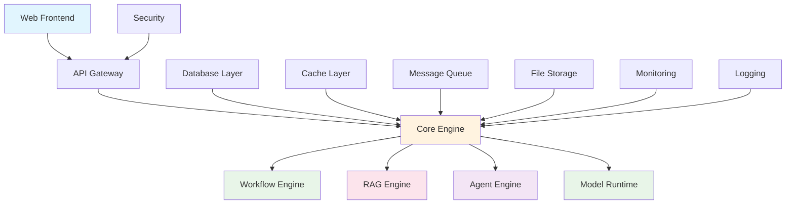

# Dify项目模块化分析总结

## 项目概述

Dify是一个开源的LLM应用开发平台，提供了完整的AI应用构建、部署和管理解决方案。通过深入分析Dify项目的架构设计和实现方式，我们可以学习到现代AI平台的最佳实践和设计模式。

## 模块化架构分析

### 1. 整体架构设计

Dify采用了典型的微服务架构，将系统分解为多个独立的模块，每个模块负责特定的功能领域：

### 2. 核心模块分析

#### 2.1 Web前端模块 (Next.js)
- **技术栈**: Next.js 14 + React 18 + TypeScript + Tailwind CSS
- **核心功能**: 
  - 可视化工作流编辑器
  - 应用管理界面
  - 实时监控面板
  - 响应式设计
- **设计亮点**:
  - 组件化设计，高度可复用
  - 状态管理采用Zustand，轻量且高效
  - 支持主题切换和国际化
  - 优秀的用户体验设计

#### 2.2 Core核心引擎模块 (Python/Flask)
- **核心职责**: 统一协调各个子系统的运行
- **关键组件**:
  - Provider Manager: 管理AI模型提供商
  - Model Manager: 模型生命周期管理
  - Execution Engine: 统一执行引擎
  - Plugin Manager: 插件系统
- **设计模式**:
  - 工厂模式: 创建不同类型的组件
  - 策略模式: 支持多种执行策略
  - 观察者模式: 事件驱动架构
  - 装饰器模式: 功能增强和监控

#### 2.3 Workflow工作流引擎模块
- **核心功能**: 可视化工作流编排和执行
- **技术特点**:
  - DAG (有向无环图) 执行引擎
  - 支持条件分支、循环、并行执行
  - 节点注册表和工厂模式
  - 变量管理和上下文传递
- **执行模式**:
  - 顺序执行
  - 并行执行
  - 条件执行
  - 错误处理和重试机制

#### 2.4 RAG检索增强生成模块
- **完整流程**: 文档处理 → 向量化 → 存储 → 检索 → 生成
- **核心组件**:
  - Document Processor: 支持多种文档格式
  - Embedding Service: 批量向量化处理
  - Vector Store: 向量数据库抽象层
  - Retrieval Engine: 多种检索策略
  - Rerank Service: 结果重排序
- **优化技术**:
  - 语义分割和递归分割
  - 混合检索 (向量+关键词)
  - 查询扩展和重写
  - 缓存和批处理优化

#### 2.5 Agent智能体引擎模块
- **支持架构**:
  - ReAct (Reasoning and Acting)
  - Function Calling
  - Plan-and-Execute
- **核心系统**:
  - Tool Registry: 工具注册和管理
  - Memory System: 多层记忆架构
  - Planning Engine: 任务规划和分解
  - Multi-Agent: 智能体协作
- **学习能力**:
  - 经验学习和模式提取
  - 策略优化
  - 持续改进

#### 2.6 模型运行时与提供商集成模块
- **统一抽象**: 支持多种AI模型提供商
- **核心功能**:
  - 请求路由和负载均衡
  - 故障转移和降级
  - 响应缓存和批处理
  - 成本跟踪和监控
- **支持提供商**:
  - OpenAI, Anthropic, Google
  - Azure OpenAI, AWS Bedrock
  - 本地模型和自定义提供商

#### 2.7 部署运维与监控模块
- **部署方式**:
  - Docker Compose (开发/测试)
  - Kubernetes (生产)
  - 云平台一键部署
- **监控体系**:
  - Prometheus + Grafana
  - ELK Stack日志管理
  - 应用性能监控 (APM)
  - 业务指标监控
- **运维功能**:
  - 自动扩缩容
  - 健康检查
  - 故障恢复
  - 性能优化

## 技术架构优势

### 1. 模块化设计
- **高内聚低耦合**: 每个模块职责明确，接口清晰
- **可扩展性**: 支持插件化扩展，易于添加新功能
- **可维护性**: 模块独立开发和测试，降低维护成本
- **可复用性**: 组件可在不同场景下复用

### 2. 微服务架构
- **服务独立**: 每个服务可独立部署和扩展
- **技术多样性**: 不同服务可选择最适合的技术栈
- **故障隔离**: 单个服务故障不影响整体系统
- **团队协作**: 支持多团队并行开发

### 3. 异步处理
- **任务队列**: 使用Celery处理长时间运行的任务
- **流式处理**: 支持实时数据流处理
- **事件驱动**: 基于事件的松耦合架构
- **响应式编程**: 提高系统并发能力

### 4. 数据层设计
- **多存储支持**: 关系型数据库、向量数据库、缓存
- **数据一致性**: 事务管理和数据同步
- **性能优化**: 连接池、查询优化、索引设计
- **扩展性**: 支持读写分离和分库分表

## 设计模式应用

### 1. 创建型模式
- **工厂模式**: 创建不同类型的组件和提供商
- **建造者模式**: 构建复杂的工作流和配置
- **单例模式**: 全局配置和资源管理

### 2. 结构型模式
- **适配器模式**: 不同AI提供商的接口适配
- **装饰器模式**: 功能增强和监控
- **外观模式**: 简化复杂子系统的接口

### 3. 行为型模式
- **策略模式**: 多种执行策略和算法选择
- **观察者模式**: 事件通知和状态变化
- **命令模式**: 操作封装和撤销重做
- **状态模式**: 工作流状态管理

## 性能优化策略

### 1. 缓存策略
- **多级缓存**: 内存缓存 + Redis缓存
- **缓存预热**: 预加载热点数据
- **缓存失效**: 智能缓存更新策略
- **缓存穿透**: 布隆过滤器防护

### 2. 数据库优化
- **连接池**: 数据库连接复用
- **查询优化**: 索引设计和查询重写
- **分页优化**: 游标分页和延迟加载
- **读写分离**: 主从架构和负载均衡

### 3. 并发处理
- **异步I/O**: 提高I/O密集型操作性能
- **批处理**: 减少网络调用次数
- **并行执行**: 充分利用多核资源
- **限流熔断**: 保护系统稳定性

### 4. 资源管理
- **内存管理**: 对象池和内存回收
- **文件管理**: 临时文件清理和存储优化
- **网络优化**: 连接复用和压缩传输
- **监控告警**: 实时监控和自动告警

## 安全设计

### 1. 认证授权
- **JWT Token**: 无状态认证
- **RBAC**: 基于角色的访问控制
- **API密钥**: 服务间认证
- **OAuth2**: 第三方集成

### 2. 数据安全
- **加密存储**: 敏感数据加密
- **传输安全**: HTTPS/TLS加密
- **数据脱敏**: 日志和监控数据脱敏
- **备份恢复**: 数据备份和灾难恢复

### 3. 系统安全
- **输入验证**: 防止注入攻击
- **速率限制**: 防止滥用和攻击
- **安全头**: HTTP安全头设置
- **漏洞扫描**: 定期安全检查

## 可观测性

### 1. 监控指标
- **业务指标**: 用户活跃度、应用使用量
- **技术指标**: 响应时间、错误率、吞吐量
- **基础设施**: CPU、内存、磁盘、网络
- **自定义指标**: 模型调用、成本统计

### 2. 日志管理
- **结构化日志**: JSON格式统一日志
- **日志聚合**: ELK Stack集中管理
- **日志分析**: 实时分析和告警
- **日志归档**: 长期存储和合规

### 3. 链路追踪
- **分布式追踪**: 请求在系统中的完整路径
- **性能分析**: 识别性能瓶颈
- **错误定位**: 快速定位问题根因
- **依赖分析**: 服务依赖关系图

## 学习价值与启示

### 1. 架构设计
- **领域驱动设计**: 按业务领域划分模块
- **微服务最佳实践**: 服务拆分和治理
- **API设计**: RESTful API和GraphQL
- **数据架构**: 多存储架构设计

### 2. 技术选型
- **前端技术**: Next.js全栈框架
- **后端技术**: Python Flask微服务
- **数据存储**: PostgreSQL + Redis + 向量数据库
- **基础设施**: Docker + Kubernetes

### 3. 开发流程
- **代码规范**: 统一的代码风格和规范
- **测试策略**: 单元测试、集成测试、E2E测试
- **CI/CD**: 自动化构建、测试、部署
- **文档管理**: API文档和架构文档

### 4. 运维实践
- **容器化**: Docker镜像和编排
- **监控告警**: 全方位监控体系
- **日志管理**: 集中化日志处理
- **性能优化**: 持续性能调优

## 对Sen-AiFlow的指导意义

### 1. 架构借鉴
- 采用类似的模块化架构设计
- 实现统一的核心引擎
- 支持多种AI能力集成
- 提供可视化编排界面

### 2. 技术选型
- Java生态系统的对应技术选择
- Spring Boot微服务架构
- 响应式编程支持
- 云原生部署方案

### 3. 功能实现
- 工作流引擎的Java实现
- RAG系统的优化策略
- 智能体框架设计
- 多模型提供商集成

### 4. 工程实践
- 代码组织和模块划分
- 配置管理和环境隔离
- 监控和可观测性
- 安全和性能优化

通过深入分析Dify项目，我们可以学习到构建现代AI平台的完整方法论，为Sen-AiFlow项目的设计和实现提供宝贵的参考和指导。 