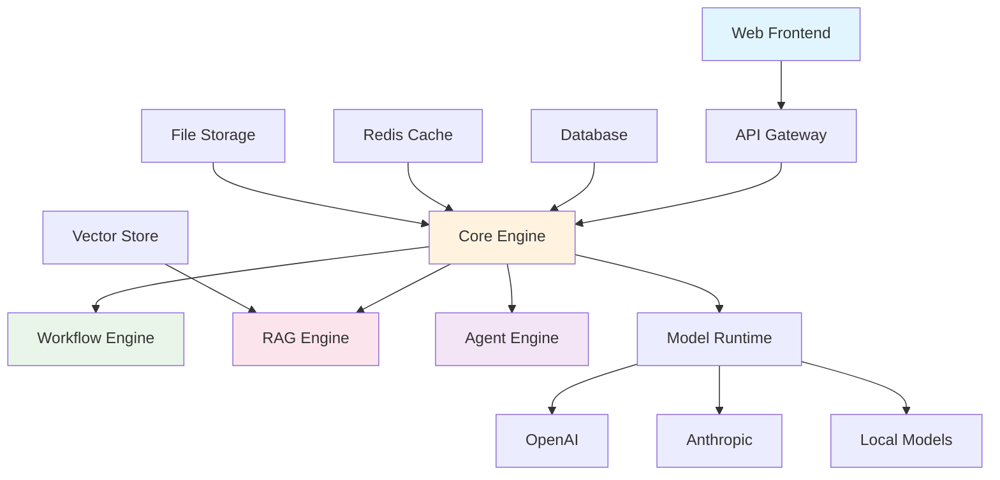
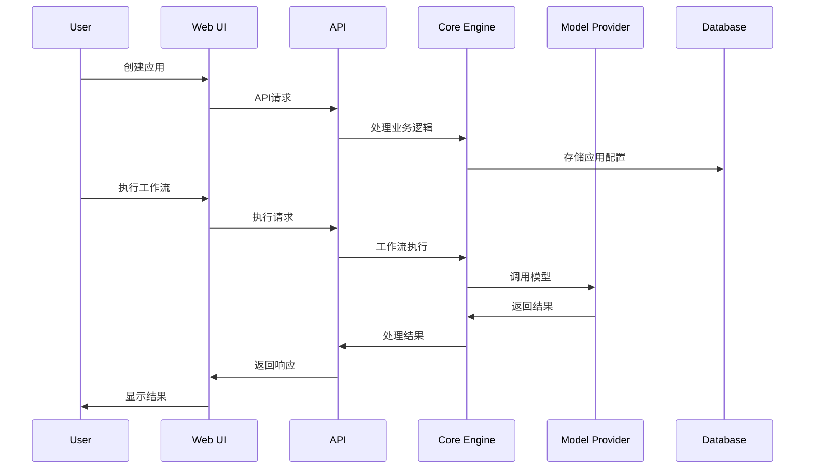

# Dify - 项目概述与架构设计

## 项目概述

**Dify** 是一个开源的LLM应用开发平台，提供直观的界面来构建AI工作流、RAG管道、智能体功能、模型管理、可观测性功能等，帮助开发者快速从原型到生产环境。

### 核心特性

1. **工作流 (Workflow)**
   - 在可视化画布上构建和测试强大的AI工作流
   - 支持复杂的业务逻辑编排

2. **全面的模型支持**
   - 无缝集成数百个专有/开源LLM
   - 支持GPT、Mistral、Llama3等主流模型
   - 兼容OpenAI API的模型

3. **提示词IDE**
   - 直观的提示词制作界面
   - 模型性能比较功能
   - 支持文本转语音等附加功能

4. **RAG管道**
   - 完整的RAG功能，从文档摄取到检索
   - 支持PDF、PPT等常见文档格式的文本提取

5. **智能体功能**
   - 基于LLM函数调用或ReAct定义智能体
   - 提供50+内置工具，如Google搜索、DALL·E等

6. **LLMOps**
   - 监控和分析应用日志和性能
   - 基于生产数据持续改进

7. **后端即服务**
   - 完整的API支持
   - 轻松集成到现有业务逻辑

## 技术架构

### 整体架构



### 核心模块

#### 1. Web Frontend (Next.js)
- **技术栈**: Next.js + React + TypeScript
- **功能**: 
  - 可视化工作流编辑器
  - 应用管理界面
  - 数据集管理
  - 模型配置
  - 监控面板

#### 2. API Backend (Flask)
- **技术栈**: Python + Flask + SQLAlchemy
- **功能**:
  - RESTful API服务
  - 用户认证与授权
  - 应用生命周期管理
  - 数据处理与存储

#### 3. Core Engine
- **工作流引擎**: 支持复杂的AI工作流编排
- **RAG引擎**: 检索增强生成功能
- **智能体引擎**: 智能体管理与执行
- **模型运行时**: 多模型提供商集成

### 数据流架构



## 部署架构

### Docker Compose部署

```yaml
services:
  # Web前端服务
  web:
    image: langgenius/dify-web
    ports:
      - "3000:3000"
    
  # API后端服务
  api:
    image: langgenius/dify-api
    ports:
      - "5001:5001"
    depends_on:
      - db
      - redis
      - weaviate
    
  # 数据库
  db:
    image: postgres:15-alpine
    
  # 缓存
  redis:
    image: redis:6-alpine
    
  # 向量数据库
  weaviate:
    image: semitechnologies/weaviate
```

### Kubernetes部署

支持多种Kubernetes部署方案：
- Helm Charts部署
- YAML文件部署
- 云平台一键部署（AWS、Azure、GCP）

## 扩展性设计

### 1. 插件系统
- 支持自定义工具插件
- 模型提供商插件
- 数据源连接器插件

### 2. API扩展
- 完整的RESTful API
- WebSocket支持实时通信
- Webhook集成

### 3. 多租户支持
- 工作空间隔离
- 资源配额管理
- 权限控制

## 性能优化

### 1. 缓存策略
- Redis缓存热点数据
- 模型响应缓存
- 静态资源CDN

### 2. 异步处理
- Celery任务队列
- 长时间运行任务异步化
- 实时状态更新

### 3. 负载均衡
- API服务水平扩展
- 数据库读写分离
- 向量数据库分片

## 安全设计

### 1. 认证授权
- JWT Token认证
- RBAC权限控制
- API密钥管理

### 2. 数据安全
- 数据加密存储
- 传输层安全(TLS)
- 敏感信息脱敏

### 3. 模型安全
- 内容审核机制
- 输入输出过滤
- 使用限制控制

## 监控与运维

### 1. 应用监控
- 性能指标收集
- 错误日志聚合
- 用户行为分析

### 2. 基础设施监控
- 资源使用监控
- 服务健康检查
- 告警机制

### 3. 业务监控
- 模型调用统计
- 成本分析
- 用户活跃度

## 开发规范

### 1. 代码规范
- Python: PEP 8 + Black格式化
- TypeScript: ESLint + Prettier
- 代码审查流程

### 2. 测试策略
- 单元测试覆盖
- 集成测试
- E2E测试

### 3. CI/CD流程
- 自动化构建
- 自动化测试
- 自动化部署

## 社区生态

### 1. 开源协议
- Dify Open Source License (基于Apache 2.0)
- 商业友好的开源协议

### 2. 社区支持
- GitHub讨论区
- Discord社区
- 技术文档

### 3. 贡献指南
- 代码贡献流程
- 文档贡献
- 国际化支持

这个架构设计体现了现代AI应用平台的最佳实践，具有良好的可扩展性、可维护性和安全性。 