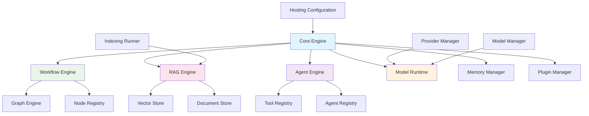

# Dify - Core核心引擎模块详解

## 模块概述

**Core核心引擎**是Dify平台的核心组件，负责统一管理和协调各个子系统的运行，包括工作流引擎、RAG引擎、智能体引擎、模型运行时等。它提供了统一的抽象层，使得上层应用可以通过一致的接口访问各种AI能力。

## 核心架构

### 1. 模块架构图



### 2. 核心组件

#### 2.1 Provider Manager (提供商管理器)
```python
class ProviderManager:
    """
    模型提供商管理器
    负责管理各种AI模型提供商的集成
    """
    
    def __init__(self):
        self.providers = {}
        self.configurations = {}
    
    def register_provider(self, provider_name: str, provider_class):
        """注册模型提供商"""
        self.providers[provider_name] = provider_class
    
    def get_provider(self, provider_name: str):
        """获取指定的模型提供商"""
        return self.providers.get(provider_name)
    
    def list_models(self, provider_name: str):
        """列出提供商支持的模型"""
        provider = self.get_provider(provider_name)
        return provider.list_models() if provider else []
    
    def validate_credentials(self, provider_name: str, credentials: dict):
        """验证提供商凭证"""
        provider = self.get_provider(provider_name)
        return provider.validate_credentials(credentials) if provider else False
```

#### 2.2 Model Manager (模型管理器)
```python
class ModelManager:
    """
    模型管理器
    负责模型的生命周期管理和调用
    """
    
    def __init__(self, provider_manager: ProviderManager):
        self.provider_manager = provider_manager
        self.model_instances = {}
        self.model_configs = {}
    
    def load_model(self, model_config: dict):
        """加载模型实例"""
        model_key = self._generate_model_key(model_config)
        if model_key not in self.model_instances:
            provider = self.provider_manager.get_provider(
                model_config['provider']
            )
            self.model_instances[model_key] = provider.create_model(
                model_config
            )
        return self.model_instances[model_key]
    
    def invoke_model(self, model_config: dict, prompt: str, **kwargs):
        """调用模型进行推理"""
        model = self.load_model(model_config)
        return model.invoke(prompt, **kwargs)
    
    def stream_invoke(self, model_config: dict, prompt: str, **kwargs):
        """流式调用模型"""
        model = self.load_model(model_config)
        return model.stream_invoke(prompt, **kwargs)
```

#### 2.3 Hosting Configuration (托管配置)
```python
class HostingConfiguration:
    """
    托管配置管理
    管理Dify平台的运行时配置
    """
    
    def __init__(self):
        self.config = {}
        self.load_configuration()
    
    def load_configuration(self):
        """加载配置"""
        self.config = {
            'database': self._load_database_config(),
            'redis': self._load_redis_config(),
            'storage': self._load_storage_config(),
            'security': self._load_security_config(),
            'features': self._load_feature_flags()
        }
    
    def get_config(self, key: str, default=None):
        """获取配置项"""
        return self.config.get(key, default)
    
    def update_config(self, key: str, value):
        """更新配置项"""
        self.config[key] = value
        self._persist_config()
```

## 核心功能实现

### 1. 统一的执行引擎

```python
class ExecutionEngine:
    """
    统一执行引擎
    协调各个子引擎的执行
    """
    
    def __init__(self):
        self.workflow_engine = WorkflowEngine()
        self.rag_engine = RAGEngine()
        self.agent_engine = AgentEngine()
        self.model_runtime = ModelRuntime()
    
    def execute(self, execution_context: ExecutionContext):
        """执行AI任务"""
        task_type = execution_context.task_type
        
        if task_type == TaskType.WORKFLOW:
            return self.workflow_engine.execute(execution_context)
        elif task_type == TaskType.RAG:
            return self.rag_engine.execute(execution_context)
        elif task_type == TaskType.AGENT:
            return self.agent_engine.execute(execution_context)
        elif task_type == TaskType.CHAT:
            return self.model_runtime.chat(execution_context)
        else:
            raise UnsupportedTaskTypeError(f"Unsupported task type: {task_type}")
```

### 2. 上下文管理

```python
class ExecutionContext:
    """
    执行上下文
    包含执行过程中的所有状态信息
    """
    
    def __init__(self):
        self.task_type = None
        self.user_id = None
        self.app_id = None
        self.conversation_id = None
        self.variables = {}
        self.inputs = {}
        self.outputs = {}
        self.metadata = {}
        self.trace_id = None
        self.created_at = datetime.utcnow()
    
    def set_variable(self, key: str, value):
        """设置变量"""
        self.variables[key] = value
    
    def get_variable(self, key: str, default=None):
        """获取变量"""
        return self.variables.get(key, default)
    
    def add_trace(self, step: str, data: dict):
        """添加执行跟踪"""
        if 'traces' not in self.metadata:
            self.metadata['traces'] = []
        
        self.metadata['traces'].append({
            'step': step,
            'data': data,
            'timestamp': datetime.utcnow().isoformat()
        })
```

### 3. 错误处理与恢复

```python
class ErrorHandler:
    """
    错误处理器
    统一处理各种异常情况
    """
    
    def __init__(self):
        self.error_handlers = {}
        self.retry_policies = {}
    
    def register_handler(self, error_type: type, handler_func):
        """注册错误处理器"""
        self.error_handlers[error_type] = handler_func
    
    def handle_error(self, error: Exception, context: ExecutionContext):
        """处理错误"""
        error_type = type(error)
        
        if error_type in self.error_handlers:
            return self.error_handlers[error_type](error, context)
        
        # 默认错误处理
        return self._default_error_handler(error, context)
    
    def _default_error_handler(self, error: Exception, context: ExecutionContext):
        """默认错误处理"""
        context.add_trace('error', {
            'error_type': type(error).__name__,
            'error_message': str(error),
            'stack_trace': traceback.format_exc()
        })
        
        return ExecutionResult(
            success=False,
            error=error,
            context=context
        )
```

## 扩展机制

### 1. 插件系统

```python
class PluginManager:
    """
    插件管理器
    支持动态加载和管理插件
    """
    
    def __init__(self):
        self.plugins = {}
        self.hooks = defaultdict(list)
    
    def register_plugin(self, plugin: Plugin):
        """注册插件"""
        self.plugins[plugin.name] = plugin
        
        # 注册插件的钩子
        for hook_name, hook_func in plugin.get_hooks().items():
            self.hooks[hook_name].append(hook_func)
    
    def execute_hook(self, hook_name: str, *args, **kwargs):
        """执行钩子"""
        results = []
        for hook_func in self.hooks[hook_name]:
            try:
                result = hook_func(*args, **kwargs)
                results.append(result)
            except Exception as e:
                logger.error(f"Hook {hook_name} execution failed: {e}")
        
        return results
    
    def get_plugin(self, plugin_name: str):
        """获取插件"""
        return self.plugins.get(plugin_name)
```

### 2. 事件系统

```python
class EventBus:
    """
    事件总线
    支持组件间的解耦通信
    """
    
    def __init__(self):
        self.subscribers = defaultdict(list)
    
    def subscribe(self, event_type: str, callback):
        """订阅事件"""
        self.subscribers[event_type].append(callback)
    
    def publish(self, event: Event):
        """发布事件"""
        for callback in self.subscribers[event.type]:
            try:
                callback(event)
            except Exception as e:
                logger.error(f"Event callback failed: {e}")
    
    def unsubscribe(self, event_type: str, callback):
        """取消订阅"""
        if callback in self.subscribers[event_type]:
            self.subscribers[event_type].remove(callback)

class Event:
    """事件基类"""
    
    def __init__(self, event_type: str, data: dict = None):
        self.type = event_type
        self.data = data or {}
        self.timestamp = datetime.utcnow()
        self.id = str(uuid.uuid4())
```

## 性能优化

### 1. 缓存机制

```python
class CacheManager:
    """
    缓存管理器
    提供多级缓存支持
    """
    
    def __init__(self, redis_client):
        self.redis_client = redis_client
        self.local_cache = {}
        self.cache_policies = {}
    
    def get(self, key: str, cache_level: str = 'redis'):
        """获取缓存"""
        if cache_level == 'local' and key in self.local_cache:
            return self.local_cache[key]
        
        if cache_level in ['redis', 'both']:
            value = self.redis_client.get(key)
            if value:
                if cache_level == 'both':
                    self.local_cache[key] = value
                return value
        
        return None
    
    def set(self, key: str, value, ttl: int = 3600, cache_level: str = 'redis'):
        """设置缓存"""
        if cache_level in ['local', 'both']:
            self.local_cache[key] = value
        
        if cache_level in ['redis', 'both']:
            self.redis_client.setex(key, ttl, value)
```

### 2. 连接池管理

```python
class ConnectionPoolManager:
    """
    连接池管理器
    管理数据库和外部服务的连接池
    """
    
    def __init__(self):
        self.pools = {}
    
    def create_pool(self, pool_name: str, pool_config: dict):
        """创建连接池"""
        pool_type = pool_config.get('type')
        
        if pool_type == 'database':
            self.pools[pool_name] = self._create_db_pool(pool_config)
        elif pool_type == 'redis':
            self.pools[pool_name] = self._create_redis_pool(pool_config)
        elif pool_type == 'http':
            self.pools[pool_name] = self._create_http_pool(pool_config)
    
    def get_connection(self, pool_name: str):
        """获取连接"""
        pool = self.pools.get(pool_name)
        if pool:
            return pool.get_connection()
        raise ConnectionPoolNotFoundError(f"Pool {pool_name} not found")
```

## 监控与观测

### 1. 指标收集

```python
class MetricsCollector:
    """
    指标收集器
    收集系统运行指标
    """
    
    def __init__(self):
        self.metrics = {}
        self.counters = defaultdict(int)
        self.gauges = defaultdict(float)
        self.histograms = defaultdict(list)
    
    def increment_counter(self, name: str, value: int = 1, tags: dict = None):
        """增加计数器"""
        key = self._build_key(name, tags)
        self.counters[key] += value
    
    def set_gauge(self, name: str, value: float, tags: dict = None):
        """设置仪表盘"""
        key = self._build_key(name, tags)
        self.gauges[key] = value
    
    def record_histogram(self, name: str, value: float, tags: dict = None):
        """记录直方图"""
        key = self._build_key(name, tags)
        self.histograms[key].append(value)
    
    def get_metrics(self):
        """获取所有指标"""
        return {
            'counters': dict(self.counters),
            'gauges': dict(self.gauges),
            'histograms': dict(self.histograms)
        }
```

### 2. 链路追踪

```python
class TraceManager:
    """
    链路追踪管理器
    跟踪请求在系统中的执行路径
    """
    
    def __init__(self):
        self.active_traces = {}
    
    def start_trace(self, trace_id: str, operation: str):
        """开始追踪"""
        trace = Trace(trace_id, operation)
        self.active_traces[trace_id] = trace
        return trace
    
    def add_span(self, trace_id: str, span_name: str, **kwargs):
        """添加跨度"""
        trace = self.active_traces.get(trace_id)
        if trace:
            span = Span(span_name, **kwargs)
            trace.add_span(span)
            return span
    
    def finish_trace(self, trace_id: str):
        """结束追踪"""
        trace = self.active_traces.pop(trace_id, None)
        if trace:
            trace.finish()
            self._export_trace(trace)
        return trace

class Trace:
    """追踪对象"""
    
    def __init__(self, trace_id: str, operation: str):
        self.trace_id = trace_id
        self.operation = operation
        self.spans = []
        self.start_time = time.time()
        self.end_time = None
    
    def add_span(self, span: 'Span'):
        """添加跨度"""
        self.spans.append(span)
    
    def finish(self):
        """结束追踪"""
        self.end_time = time.time()
```

## 配置管理

### 1. 动态配置

```python
class ConfigurationManager:
    """
    配置管理器
    支持动态配置更新
    """
    
    def __init__(self):
        self.config = {}
        self.watchers = defaultdict(list)
        self.config_sources = []
    
    def add_source(self, source: ConfigSource):
        """添加配置源"""
        self.config_sources.append(source)
        self._reload_config()
    
    def watch(self, key: str, callback):
        """监听配置变化"""
        self.watchers[key].append(callback)
    
    def get(self, key: str, default=None):
        """获取配置"""
        return self.config.get(key, default)
    
    def set(self, key: str, value):
        """设置配置"""
        old_value = self.config.get(key)
        self.config[key] = value
        
        # 通知监听器
        if old_value != value:
            for callback in self.watchers[key]:
                callback(key, old_value, value)
```

## 最佳实践

### 1. 模块化设计
- 每个子引擎独立开发和测试
- 通过接口进行模块间通信
- 支持插件化扩展

### 2. 异步处理
- 使用异步I/O提高性能
- 支持流式处理
- 合理使用任务队列

### 3. 错误处理
- 统一的错误处理机制
- 支持重试和降级
- 详细的错误日志和追踪

### 4. 性能优化
- 多级缓存策略
- 连接池复用
- 资源预加载

这个核心引擎设计提供了强大的扩展性和可维护性，是Dify平台稳定运行的基础。 