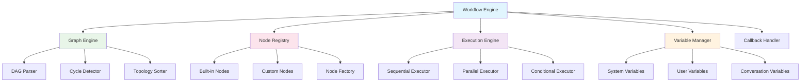

# Dify - Workflow工作流引擎模块详解

## 模块概述

**Workflow工作流引擎**是Dify平台的核心组件之一，提供可视化的工作流编排能力。它允许用户通过拖拽的方式构建复杂的AI工作流，支持条件分支、循环、并行执行等高级功能，是实现复杂AI应用逻辑的关键模块。

## 核心架构

### 1. 模块架构图



### 2. 核心组件

#### 2.1 Graph Engine (图引擎)
```python
class GraphEngine:
    """
    图引擎
    负责工作流图的解析、验证和优化
    """
    
    def __init__(self):
        self.dag_parser = DAGParser()
        self.cycle_detector = CycleDetector()
        self.topology_sorter = TopologySorter()
    
    def parse_workflow(self, workflow_config: dict) -> WorkflowGraph:
        """解析工作流配置"""
        # 解析节点和边
        nodes = self._parse_nodes(workflow_config.get('nodes', []))
        edges = self._parse_edges(workflow_config.get('edges', []))
        
        # 构建图
        graph = WorkflowGraph(nodes, edges)
        
        # 验证图的有效性
        self._validate_graph(graph)
        
        return graph
    
    def _validate_graph(self, graph: WorkflowGraph):
        """验证图的有效性"""
        # 检查循环依赖
        if self.cycle_detector.has_cycle(graph):
            raise WorkflowValidationError("Workflow contains cycles")
        
        # 检查节点连接
        self._validate_node_connections(graph)
        
        # 检查变量依赖
        self._validate_variable_dependencies(graph)
    
    def optimize_graph(self, graph: WorkflowGraph) -> WorkflowGraph:
        """优化工作流图"""
        # 拓扑排序
        sorted_nodes = self.topology_sorter.sort(graph)
        
        # 并行化分析
        parallel_groups = self._analyze_parallelism(graph, sorted_nodes)
        
        # 创建优化后的图
        optimized_graph = self._create_optimized_graph(
            graph, sorted_nodes, parallel_groups
        )
        
        return optimized_graph
```

#### 2.2 Node Registry (节点注册表)
```python
class NodeRegistry:
    """
    节点注册表
    管理所有可用的工作流节点类型
    """
    
    def __init__(self):
        self.node_types = {}
        self.node_factory = NodeFactory()
        self._register_builtin_nodes()
    
    def register_node(self, node_type: str, node_class: type):
        """注册节点类型"""
        if not issubclass(node_class, BaseNode):
            raise ValueError(f"Node class must inherit from BaseNode")
        
        self.node_types[node_type] = node_class
    
    def create_node(self, node_config: dict) -> BaseNode:
        """创建节点实例"""
        node_type = node_config.get('type')
        if node_type not in self.node_types:
            raise UnknownNodeTypeError(f"Unknown node type: {node_type}")
        
        node_class = self.node_types[node_type]
        return self.node_factory.create(node_class, node_config)
    
    def get_node_schema(self, node_type: str) -> dict:
        """获取节点配置模式"""
        if node_type not in self.node_types:
            raise UnknownNodeTypeError(f"Unknown node type: {node_type}")
        
        node_class = self.node_types[node_type]
        return node_class.get_schema()
    
    def list_node_types(self) -> list:
        """列出所有节点类型"""
        return list(self.node_types.keys())
```

#### 2.3 Execution Engine (执行引擎)
```python
class ExecutionEngine:
    """
    执行引擎
    负责工作流的实际执行
    """
    
    def __init__(self):
        self.executors = {
            ExecutionMode.SEQUENTIAL: SequentialExecutor(),
            ExecutionMode.PARALLEL: ParallelExecutor(),
            ExecutionMode.CONDITIONAL: ConditionalExecutor()
        }
    
    async def execute_workflow(
        self, 
        graph: WorkflowGraph, 
        context: ExecutionContext
    ) -> ExecutionResult:
        """执行工作流"""
        try:
            # 初始化执行状态
            execution_state = ExecutionState(graph, context)
            
            # 开始执行
            result = await self._execute_graph(graph, execution_state)
            
            # 构建执行结果
            return ExecutionResult(
                success=True,
                outputs=result,
                execution_state=execution_state,
                traces=execution_state.get_traces()
            )
            
        except Exception as e:
            return ExecutionResult(
                success=False,
                error=e,
                execution_state=execution_state,
                traces=execution_state.get_traces()
            )
    
    async def _execute_graph(
        self, 
        graph: WorkflowGraph, 
        state: ExecutionState
    ) -> dict:
        """执行图"""
        # 获取执行顺序
        execution_plan = self._create_execution_plan(graph)
        
        # 按计划执行
        for step in execution_plan:
            await self._execute_step(step, state)
        
        return state.get_outputs()
    
    async def _execute_step(self, step: ExecutionStep, state: ExecutionState):
        """执行单个步骤"""
        executor = self.executors[step.execution_mode]
        await executor.execute(step, state)
```

## 节点系统

### 1. 基础节点类

```python
class BaseNode:
    """
    基础节点类
    所有工作流节点的基类
    """
    
    def __init__(self, node_id: str, config: dict):
        self.node_id = node_id
        self.config = config
        self.inputs = {}
        self.outputs = {}
        self.metadata = {}
    
    async def execute(self, context: ExecutionContext) -> NodeResult:
        """执行节点"""
        try:
            # 验证输入
            self._validate_inputs(context)
            
            # 执行具体逻辑
            result = await self._execute_impl(context)
            
            # 验证输出
            self._validate_outputs(result)
            
            return NodeResult(
                success=True,
                outputs=result,
                node_id=self.node_id
            )
            
        except Exception as e:
            return NodeResult(
                success=False,
                error=e,
                node_id=self.node_id
            )
    
    async def _execute_impl(self, context: ExecutionContext) -> dict:
        """具体执行逻辑，由子类实现"""
        raise NotImplementedError
    
    def _validate_inputs(self, context: ExecutionContext):
        """验证输入参数"""
        schema = self.get_input_schema()
        inputs = context.get_node_inputs(self.node_id)
        
        for field, field_schema in schema.items():
            if field_schema.get('required', False) and field not in inputs:
                raise ValidationError(f"Required input '{field}' is missing")
    
    @classmethod
    def get_schema(cls) -> dict:
        """获取节点配置模式"""
        return {
            'type': cls.__name__.lower(),
            'inputs': cls.get_input_schema(),
            'outputs': cls.get_output_schema(),
            'properties': cls.get_properties_schema()
        }
    
    @classmethod
    def get_input_schema(cls) -> dict:
        """获取输入模式"""
        return {}
    
    @classmethod
    def get_output_schema(cls) -> dict:
        """获取输出模式"""
        return {}
```

### 2. 内置节点类型

#### 2.1 LLM节点
```python
class LLMNode(BaseNode):
    """
    LLM节点
    调用大语言模型进行文本生成
    """
    
    async def _execute_impl(self, context: ExecutionContext) -> dict:
        inputs = context.get_node_inputs(self.node_id)
        
        # 获取模型配置
        model_config = self.config.get('model', {})
        
        # 构建提示词
        prompt = self._build_prompt(inputs)
        
        # 调用模型
        model_manager = context.get_model_manager()
        response = await model_manager.invoke_model(
            model_config, 
            prompt,
            **self.config.get('parameters', {})
        )
        
        return {
            'text': response.text,
            'usage': response.usage,
            'model': response.model
        }
    
    def _build_prompt(self, inputs: dict) -> str:
        """构建提示词"""
        template = self.config.get('prompt_template', '')
        return template.format(**inputs)
    
    @classmethod
    def get_input_schema(cls) -> dict:
        return {
            'prompt': {'type': 'string', 'required': True},
            'variables': {'type': 'object', 'required': False}
        }
    
    @classmethod
    def get_output_schema(cls) -> dict:
        return {
            'text': {'type': 'string'},
            'usage': {'type': 'object'},
            'model': {'type': 'string'}
        }
```

#### 2.2 条件节点
```python
class ConditionNode(BaseNode):
    """
    条件节点
    根据条件决定执行路径
    """
    
    async def _execute_impl(self, context: ExecutionContext) -> dict:
        inputs = context.get_node_inputs(self.node_id)
        
        # 评估条件
        condition_result = self._evaluate_condition(inputs)
        
        # 设置下一个执行路径
        next_node = self._get_next_node(condition_result)
        
        return {
            'condition_result': condition_result,
            'next_node': next_node
        }
    
    def _evaluate_condition(self, inputs: dict) -> bool:
        """评估条件"""
        condition_type = self.config.get('condition_type', 'simple')
        
        if condition_type == 'simple':
            return self._evaluate_simple_condition(inputs)
        elif condition_type == 'expression':
            return self._evaluate_expression_condition(inputs)
        else:
            raise ValueError(f"Unknown condition type: {condition_type}")
    
    def _evaluate_simple_condition(self, inputs: dict) -> bool:
        """评估简单条件"""
        left_value = inputs.get(self.config['left_variable'])
        right_value = self.config.get('right_value')
        operator = self.config.get('operator', '==')
        
        if operator == '==':
            return left_value == right_value
        elif operator == '!=':
            return left_value != right_value
        elif operator == '>':
            return left_value > right_value
        elif operator == '<':
            return left_value < right_value
        # ... 其他操作符
        
        return False
```

#### 2.3 循环节点
```python
class LoopNode(BaseNode):
    """
    循环节点
    支持for循环和while循环
    """
    
    async def _execute_impl(self, context: ExecutionContext) -> dict:
        inputs = context.get_node_inputs(self.node_id)
        loop_type = self.config.get('loop_type', 'for')
        
        results = []
        
        if loop_type == 'for':
            results = await self._execute_for_loop(inputs, context)
        elif loop_type == 'while':
            results = await self._execute_while_loop(inputs, context)
        
        return {
            'results': results,
            'iteration_count': len(results)
        }
    
    async def _execute_for_loop(self, inputs: dict, context: ExecutionContext) -> list:
        """执行for循环"""
        items = inputs.get('items', [])
        results = []
        
        for i, item in enumerate(items):
            # 设置循环变量
            loop_context = context.create_child_context()
            loop_context.set_variable('loop_item', item)
            loop_context.set_variable('loop_index', i)
            
            # 执行循环体
            loop_result = await self._execute_loop_body(loop_context)
            results.append(loop_result)
            
            # 检查是否需要中断
            if self._should_break(loop_result):
                break
        
        return results
```

## 变量管理

### 1. 变量管理器

```python
class VariableManager:
    """
    变量管理器
    管理工作流中的各种变量
    """
    
    def __init__(self):
        self.system_variables = {}
        self.user_variables = {}
        self.conversation_variables = {}
        self.node_variables = {}
    
    def set_system_variable(self, key: str, value):
        """设置系统变量"""
        self.system_variables[key] = value
    
    def set_user_variable(self, key: str, value):
        """设置用户变量"""
        self.user_variables[key] = value
    
    def set_conversation_variable(self, key: str, value):
        """设置对话变量"""
        self.conversation_variables[key] = value
    
    def set_node_variable(self, node_id: str, key: str, value):
        """设置节点变量"""
        if node_id not in self.node_variables:
            self.node_variables[node_id] = {}
        self.node_variables[node_id][key] = value
    
    def get_variable(self, key: str, scope: str = 'auto'):
        """获取变量"""
        if scope == 'system' or scope == 'auto':
            if key in self.system_variables:
                return self.system_variables[key]
        
        if scope == 'user' or scope == 'auto':
            if key in self.user_variables:
                return self.user_variables[key]
        
        if scope == 'conversation' or scope == 'auto':
            if key in self.conversation_variables:
                return self.conversation_variables[key]
        
        return None
    
    def resolve_template(self, template: str, context: dict = None) -> str:
        """解析模板变量"""
        import re
        
        def replace_var(match):
            var_name = match.group(1)
            value = self.get_variable(var_name)
            if context and var_name in context:
                value = context[var_name]
            return str(value) if value is not None else match.group(0)
        
        return re.sub(r'\{\{(\w+)\}\}', replace_var, template)
```

### 2. 系统变量

```python
class SystemVariables:
    """
    系统变量
    提供系统级别的变量
    """
    
    @staticmethod
    def get_system_variables() -> dict:
        """获取系统变量"""
        return {
            'sys.time': datetime.now().isoformat(),
            'sys.date': datetime.now().date().isoformat(),
            'sys.timestamp': int(time.time()),
            'sys.random': random.random(),
            'sys.uuid': str(uuid.uuid4())
        }
    
    @staticmethod
    def get_conversation_variables(conversation_id: str) -> dict:
        """获取对话变量"""
        # 从数据库或缓存中获取对话变量
        return {
            'conversation.id': conversation_id,
            'conversation.created_at': '2024-01-01T00:00:00Z',
            'conversation.message_count': 10
        }
```

## 执行控制

### 1. 执行状态管理

```python
class ExecutionState:
    """
    执行状态
    跟踪工作流的执行状态
    """
    
    def __init__(self, graph: WorkflowGraph, context: ExecutionContext):
        self.graph = graph
        self.context = context
        self.node_states = {}
        self.execution_traces = []
        self.start_time = time.time()
        self.end_time = None
        self.current_node = None
    
    def set_node_state(self, node_id: str, state: NodeState):
        """设置节点状态"""
        self.node_states[node_id] = state
        self._add_trace('node_state_changed', {
            'node_id': node_id,
            'state': state.value
        })
    
    def get_node_state(self, node_id: str) -> NodeState:
        """获取节点状态"""
        return self.node_states.get(node_id, NodeState.PENDING)
    
    def add_trace(self, event: str, data: dict):
        """添加执行跟踪"""
        self.execution_traces.append({
            'timestamp': time.time(),
            'event': event,
            'data': data,
            'current_node': self.current_node
        })
    
    def get_outputs(self) -> dict:
        """获取输出结果"""
        outputs = {}
        for node_id, node in self.graph.nodes.items():
            if hasattr(node, 'outputs') and node.outputs:
                outputs[node_id] = node.outputs
        return outputs

class NodeState(Enum):
    """节点状态枚举"""
    PENDING = "pending"
    RUNNING = "running"
    COMPLETED = "completed"
    FAILED = "failed"
    SKIPPED = "skipped"
```

### 2. 并行执行

```python
class ParallelExecutor:
    """
    并行执行器
    支持节点的并行执行
    """
    
    def __init__(self, max_concurrency: int = 10):
        self.max_concurrency = max_concurrency
        self.semaphore = asyncio.Semaphore(max_concurrency)
    
    async def execute(self, step: ExecutionStep, state: ExecutionState):
        """并行执行步骤"""
        if not step.parallel_nodes:
            return
        
        # 创建并行任务
        tasks = []
        for node_id in step.parallel_nodes:
            task = self._execute_node_with_semaphore(node_id, state)
            tasks.append(task)
        
        # 等待所有任务完成
        results = await asyncio.gather(*tasks, return_exceptions=True)
        
        # 处理结果
        for i, result in enumerate(results):
            node_id = step.parallel_nodes[i]
            if isinstance(result, Exception):
                state.set_node_state(node_id, NodeState.FAILED)
                state.add_trace('node_failed', {
                    'node_id': node_id,
                    'error': str(result)
                })
            else:
                state.set_node_state(node_id, NodeState.COMPLETED)
    
    async def _execute_node_with_semaphore(self, node_id: str, state: ExecutionState):
        """使用信号量执行节点"""
        async with self.semaphore:
            return await self._execute_single_node(node_id, state)
```

## 错误处理与恢复

### 1. 错误处理策略

```python
class WorkflowErrorHandler:
    """
    工作流错误处理器
    """
    
    def __init__(self):
        self.error_strategies = {
            'retry': RetryStrategy(),
            'skip': SkipStrategy(),
            'fallback': FallbackStrategy(),
            'abort': AbortStrategy()
        }
    
    async def handle_node_error(
        self, 
        node_id: str, 
        error: Exception, 
        state: ExecutionState
    ) -> ErrorHandlingResult:
        """处理节点错误"""
        node = state.graph.get_node(node_id)
        error_config = node.config.get('error_handling', {})
        strategy_name = error_config.get('strategy', 'abort')
        
        strategy = self.error_strategies.get(strategy_name)
        if not strategy:
            strategy = self.error_strategies['abort']
        
        return await strategy.handle(node_id, error, state, error_config)

class RetryStrategy:
    """重试策略"""
    
    async def handle(
        self, 
        node_id: str, 
        error: Exception, 
        state: ExecutionState, 
        config: dict
    ) -> ErrorHandlingResult:
        max_retries = config.get('max_retries', 3)
        retry_delay = config.get('retry_delay', 1.0)
        
        current_retries = state.get_node_retry_count(node_id)
        
        if current_retries < max_retries:
            # 等待后重试
            await asyncio.sleep(retry_delay)
            state.increment_node_retry_count(node_id)
            
            return ErrorHandlingResult(
                action=ErrorAction.RETRY,
                message=f"Retrying node {node_id} (attempt {current_retries + 1})"
            )
        else:
            return ErrorHandlingResult(
                action=ErrorAction.ABORT,
                message=f"Max retries exceeded for node {node_id}"
            )
```

## 工作流模板

### 1. 模板系统

```python
class WorkflowTemplate:
    """
    工作流模板
    提供预定义的工作流模板
    """
    
    def __init__(self, template_id: str, name: str, description: str):
        self.template_id = template_id
        self.name = name
        self.description = description
        self.nodes = []
        self.edges = []
        self.variables = {}
        self.metadata = {}
    
    def add_node(self, node_config: dict):
        """添加节点"""
        self.nodes.append(node_config)
    
    def add_edge(self, source: str, target: str, condition: str = None):
        """添加边"""
        edge = {
            'source': source,
            'target': target
        }
        if condition:
            edge['condition'] = condition
        self.edges.append(edge)
    
    def to_workflow_config(self) -> dict:
        """转换为工作流配置"""
        return {
            'template_id': self.template_id,
            'name': self.name,
            'description': self.description,
            'nodes': self.nodes,
            'edges': self.edges,
            'variables': self.variables,
            'metadata': self.metadata
        }

class TemplateLibrary:
    """模板库"""
    
    def __init__(self):
        self.templates = {}
        self._load_builtin_templates()
    
    def register_template(self, template: WorkflowTemplate):
        """注册模板"""
        self.templates[template.template_id] = template
    
    def get_template(self, template_id: str) -> WorkflowTemplate:
        """获取模板"""
        return self.templates.get(template_id)
    
    def list_templates(self) -> list:
        """列出所有模板"""
        return list(self.templates.values())
    
    def _load_builtin_templates(self):
        """加载内置模板"""
        # 简单问答模板
        qa_template = WorkflowTemplate(
            'simple_qa',
            'Simple Q&A',
            'Simple question answering workflow'
        )
        qa_template.add_node({
            'id': 'start',
            'type': 'start',
            'config': {}
        })
        qa_template.add_node({
            'id': 'llm',
            'type': 'llm',
            'config': {
                'model': {'provider': 'openai', 'name': 'gpt-3.5-turbo'},
                'prompt_template': 'Answer the following question: {{question}}'
            }
        })
        qa_template.add_node({
            'id': 'end',
            'type': 'end',
            'config': {}
        })
        qa_template.add_edge('start', 'llm')
        qa_template.add_edge('llm', 'end')
        
        self.register_template(qa_template)
```

## 性能优化

### 1. 执行优化

```python
class WorkflowOptimizer:
    """
    工作流优化器
    优化工作流的执行性能
    """
    
    def optimize(self, graph: WorkflowGraph) -> WorkflowGraph:
        """优化工作流"""
        optimized_graph = graph.copy()
        
        # 节点合并优化
        optimized_graph = self._merge_nodes(optimized_graph)
        
        # 并行化优化
        optimized_graph = self._optimize_parallelism(optimized_graph)
        
        # 缓存优化
        optimized_graph = self._add_caching(optimized_graph)
        
        return optimized_graph
    
    def _merge_nodes(self, graph: WorkflowGraph) -> WorkflowGraph:
        """合并可以合并的节点"""
        # 识别可以合并的节点序列
        mergeable_sequences = self._find_mergeable_sequences(graph)
        
        for sequence in mergeable_sequences:
            # 创建合并后的节点
            merged_node = self._create_merged_node(sequence)
            
            # 替换原有节点
            graph.replace_nodes(sequence, merged_node)
        
        return graph
    
    def _optimize_parallelism(self, graph: WorkflowGraph) -> WorkflowGraph:
        """优化并行执行"""
        # 分析节点依赖关系
        dependency_graph = self._build_dependency_graph(graph)
        
        # 识别可以并行执行的节点组
        parallel_groups = self._find_parallel_groups(dependency_graph)
        
        # 标记并行执行
        for group in parallel_groups:
            graph.mark_parallel_group(group)
        
        return graph
```

## 监控与调试

### 1. 执行监控

```python
class WorkflowMonitor:
    """
    工作流监控器
    监控工作流的执行状态和性能
    """
    
    def __init__(self):
        self.metrics_collector = MetricsCollector()
        self.event_listeners = []
    
    def start_monitoring(self, execution_id: str):
        """开始监控"""
        self.metrics_collector.start_timer(f"workflow.execution.{execution_id}")
    
    def on_node_start(self, node_id: str, execution_id: str):
        """节点开始执行"""
        self.metrics_collector.increment_counter("workflow.node.started")
        self.metrics_collector.start_timer(f"workflow.node.{node_id}.{execution_id}")
        
        event = WorkflowEvent(
            type="node_started",
            data={"node_id": node_id, "execution_id": execution_id}
        )
        self._notify_listeners(event)
    
    def on_node_complete(self, node_id: str, execution_id: str, result: NodeResult):
        """节点执行完成"""
        self.metrics_collector.increment_counter("workflow.node.completed")
        self.metrics_collector.stop_timer(f"workflow.node.{node_id}.{execution_id}")
        
        if not result.success:
            self.metrics_collector.increment_counter("workflow.node.failed")
        
        event = WorkflowEvent(
            type="node_completed",
            data={
                "node_id": node_id, 
                "execution_id": execution_id,
                "success": result.success
            }
        )
        self._notify_listeners(event)
```

这个工作流引擎设计提供了强大的可视化编排能力，支持复杂的业务逻辑实现，是构建AI应用的核心基础设施。 