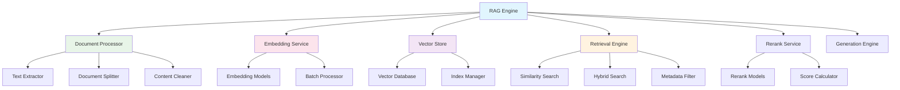

# Dify - RAG检索增强生成模块详解

## 模块概述

**RAG (Retrieval-Augmented Generation) 检索增强生成模块**是Dify平台的核心功能之一，它将外部知识库与大语言模型相结合，通过检索相关文档来增强模型的生成能力。该模块提供了完整的文档处理、向量化、检索和生成流程。

## 核心架构

### 1. 模块架构图



### 2. 核心组件

#### 2.1 Document Processor (文档处理器)
```python
class DocumentProcessor:
    """
    文档处理器
    负责文档的解析、清理和分割
    """
    
    def __init__(self):
        self.extractors = {
            'pdf': PDFExtractor(),
            'docx': DocxExtractor(),
            'txt': TextExtractor(),
            'html': HTMLExtractor(),
            'markdown': MarkdownExtractor()
        }
        self.splitters = {
            'recursive': RecursiveCharacterTextSplitter(),
            'token': TokenTextSplitter(),
            'semantic': SemanticTextSplitter()
        }
        self.cleaners = [
            WhitespaceNormalizer(),
            HTMLTagRemover(),
            SpecialCharacterCleaner()
        ]
    
    async def process_document(self, document: Document) -> List[DocumentChunk]:
        """处理文档"""
        # 1. 提取文本内容
        content = await self._extract_content(document)
        
        # 2. 清理内容
        cleaned_content = self._clean_content(content)
        
        # 3. 分割文档
        chunks = await self._split_document(cleaned_content, document.metadata)
        
        # 4. 后处理
        processed_chunks = self._post_process_chunks(chunks)
        
        return processed_chunks
    
    async def _extract_content(self, document: Document) -> str:
        """提取文档内容"""
        file_type = document.get_file_type()
        extractor = self.extractors.get(file_type)
        
        if not extractor:
            raise UnsupportedFileTypeError(f"Unsupported file type: {file_type}")
        
        return await extractor.extract(document)
    
    def _clean_content(self, content: str) -> str:
        """清理内容"""
        for cleaner in self.cleaners:
            content = cleaner.clean(content)
        return content
    
    async def _split_document(self, content: str, metadata: dict) -> List[DocumentChunk]:
        """分割文档"""
        splitter_type = metadata.get('splitter_type', 'recursive')
        splitter = self.splitters.get(splitter_type)
        
        if not splitter:
            splitter = self.splitters['recursive']
        
        return await splitter.split(content, metadata)
```

#### 2.2 Embedding Service (嵌入服务)
```python
class EmbeddingService:
    """
    嵌入服务
    负责文本的向量化处理
    """
    
    def __init__(self):
        self.embedding_models = {}
        self.batch_processor = BatchProcessor()
        self.cache = EmbeddingCache()
    
    def register_model(self, model_name: str, model_instance):
        """注册嵌入模型"""
        self.embedding_models[model_name] = model_instance
    
    async def embed_texts(
        self, 
        texts: List[str], 
        model_name: str = 'default'
    ) -> List[List[float]]:
        """批量嵌入文本"""
        # 检查缓存
        cached_embeddings = {}
        uncached_texts = []
        
        for i, text in enumerate(texts):
            cache_key = self._generate_cache_key(text, model_name)
            cached_embedding = await self.cache.get(cache_key)
            
            if cached_embedding:
                cached_embeddings[i] = cached_embedding
            else:
                uncached_texts.append((i, text))
        
        # 批量处理未缓存的文本
        if uncached_texts:
            indices, texts_to_embed = zip(*uncached_texts)
            embeddings = await self._batch_embed(texts_to_embed, model_name)
            
            # 缓存结果
            for idx, embedding in zip(indices, embeddings):
                cache_key = self._generate_cache_key(texts[idx], model_name)
                await self.cache.set(cache_key, embedding)
                cached_embeddings[idx] = embedding
        
        # 按原始顺序返回结果
        return [cached_embeddings[i] for i in range(len(texts))]
    
    async def _batch_embed(
        self, 
        texts: List[str], 
        model_name: str
    ) -> List[List[float]]:
        """批量嵌入"""
        model = self.embedding_models.get(model_name)
        if not model:
            raise ModelNotFoundError(f"Embedding model not found: {model_name}")
        
        return await self.batch_processor.process(
            texts, 
            model.embed,
            batch_size=model.max_batch_size
        )
    
    def _generate_cache_key(self, text: str, model_name: str) -> str:
        """生成缓存键"""
        import hashlib
        content = f"{model_name}:{text}"
        return hashlib.md5(content.encode()).hexdigest()
```

#### 2.3 Vector Store (向量存储)
```python
class VectorStore:
    """
    向量存储
    管理文档向量的存储和检索
    """
    
    def __init__(self, config: dict):
        self.config = config
        self.client = self._create_client(config)
        self.index_manager = IndexManager(self.client)
    
    async def add_documents(
        self, 
        documents: List[DocumentChunk], 
        embeddings: List[List[float]],
        collection_name: str
    ):
        """添加文档向量"""
        # 准备数据
        vectors = []
        for i, (doc, embedding) in enumerate(zip(documents, embeddings)):
            vector = {
                'id': doc.id,
                'vector': embedding,
                'metadata': {
                    'content': doc.content,
                    'source': doc.source,
                    'chunk_index': doc.chunk_index,
                    'created_at': doc.created_at.isoformat(),
                    **doc.metadata
                }
            }
            vectors.append(vector)
        
        # 批量插入
        await self._batch_insert(collection_name, vectors)
    
    async def search(
        self, 
        query_embedding: List[float],
        collection_name: str,
        top_k: int = 10,
        filters: dict = None
    ) -> List[SearchResult]:
        """搜索相似文档"""
        search_params = {
            'vector': query_embedding,
            'top_k': top_k,
            'include_metadata': True
        }
        
        if filters:
            search_params['filter'] = self._build_filter(filters)
        
        results = await self.client.search(collection_name, **search_params)
        
        return [
            SearchResult(
                id=result['id'],
                content=result['metadata']['content'],
                score=result['score'],
                metadata=result['metadata']
            )
            for result in results
        ]
    
    async def delete_documents(
        self, 
        document_ids: List[str], 
        collection_name: str
    ):
        """删除文档"""
        await self.client.delete(
            collection_name,
            filter={'id': {'$in': document_ids}}
        )
    
    def _create_client(self, config: dict):
        """创建向量数据库客户端"""
        provider = config.get('provider', 'weaviate')
        
        if provider == 'weaviate':
            return WeaviateClient(config)
        elif provider == 'pinecone':
            return PineconeClient(config)
        elif provider == 'qdrant':
            return QdrantClient(config)
        else:
            raise UnsupportedVectorStoreError(f"Unsupported provider: {provider}")
```

#### 2.4 Retrieval Engine (检索引擎)
```python
class RetrievalEngine:
    """
    检索引擎
    实现多种检索策略
    """
    
    def __init__(self, vector_store: VectorStore, embedding_service: EmbeddingService):
        self.vector_store = vector_store
        self.embedding_service = embedding_service
        self.retrievers = {
            'similarity': SimilarityRetriever(vector_store),
            'hybrid': HybridRetriever(vector_store),
            'keyword': KeywordRetriever(),
            'semantic': SemanticRetriever(vector_store, embedding_service)
        }
    
    async def retrieve(
        self, 
        query: str,
        collection_name: str,
        retrieval_config: dict
    ) -> List[RetrievalResult]:
        """检索相关文档"""
        retrieval_type = retrieval_config.get('type', 'similarity')
        retriever = self.retrievers.get(retrieval_type)
        
        if not retriever:
            raise UnsupportedRetrievalTypeError(f"Unsupported type: {retrieval_type}")
        
        # 执行检索
        results = await retriever.retrieve(query, collection_name, retrieval_config)
        
        # 后处理
        processed_results = await self._post_process_results(results, retrieval_config)
        
        return processed_results
    
    async def _post_process_results(
        self, 
        results: List[RetrievalResult], 
        config: dict
    ) -> List[RetrievalResult]:
        """后处理检索结果"""
        # 去重
        if config.get('deduplicate', True):
            results = self._deduplicate_results(results)
        
        # 重排序
        if config.get('rerank', False):
            results = await self._rerank_results(results, config)
        
        # 过滤
        if config.get('min_score'):
            results = [r for r in results if r.score >= config['min_score']]
        
        # 限制数量
        max_results = config.get('max_results', 10)
        return results[:max_results]

class SimilarityRetriever:
    """相似度检索器"""
    
    def __init__(self, vector_store: VectorStore):
        self.vector_store = vector_store
    
    async def retrieve(
        self, 
        query: str, 
        collection_name: str, 
        config: dict
    ) -> List[RetrievalResult]:
        """基于向量相似度检索"""
        # 获取查询向量
        embedding_model = config.get('embedding_model', 'default')
        query_embedding = await self.embedding_service.embed_texts([query], embedding_model)
        
        # 执行相似度搜索
        search_results = await self.vector_store.search(
            query_embedding[0],
            collection_name,
            top_k=config.get('top_k', 10),
            filters=config.get('filters')
        )
        
        return [
            RetrievalResult(
                content=result.content,
                score=result.score,
                metadata=result.metadata,
                source='similarity_search'
            )
            for result in search_results
        ]

class HybridRetriever:
    """混合检索器"""
    
    def __init__(self, vector_store: VectorStore):
        self.vector_store = vector_store
        self.keyword_retriever = KeywordRetriever()
    
    async def retrieve(
        self, 
        query: str, 
        collection_name: str, 
        config: dict
    ) -> List[RetrievalResult]:
        """混合检索（向量+关键词）"""
        # 并行执行向量检索和关键词检索
        vector_task = self._vector_retrieve(query, collection_name, config)
        keyword_task = self._keyword_retrieve(query, collection_name, config)
        
        vector_results, keyword_results = await asyncio.gather(
            vector_task, keyword_task
        )
        
        # 合并和重排序结果
        merged_results = self._merge_results(
            vector_results, 
            keyword_results, 
            config
        )
        
        return merged_results
    
    def _merge_results(
        self, 
        vector_results: List[RetrievalResult],
        keyword_results: List[RetrievalResult],
        config: dict
    ) -> List[RetrievalResult]:
        """合并检索结果"""
        vector_weight = config.get('vector_weight', 0.7)
        keyword_weight = config.get('keyword_weight', 0.3)
        
        # 创建结果映射
        result_map = {}
        
        # 添加向量检索结果
        for result in vector_results:
            key = self._get_result_key(result)
            result_map[key] = result
            result.score = result.score * vector_weight
        
        # 添加关键词检索结果
        for result in keyword_results:
            key = self._get_result_key(result)
            if key in result_map:
                # 合并分数
                result_map[key].score += result.score * keyword_weight
            else:
                result.score = result.score * keyword_weight
                result_map[key] = result
        
        # 按分数排序
        merged_results = list(result_map.values())
        merged_results.sort(key=lambda x: x.score, reverse=True)
        
        return merged_results
```

## 文档处理

### 1. 文本提取器

```python
class PDFExtractor:
    """PDF文本提取器"""
    
    def __init__(self):
        self.ocr_enabled = True
        self.ocr_engine = OCREngine()
    
    async def extract(self, document: Document) -> str:
        """提取PDF文本"""
        import PyPDF2
        
        text_content = []
        
        with open(document.file_path, 'rb') as file:
            pdf_reader = PyPDF2.PdfReader(file)
            
            for page_num, page in enumerate(pdf_reader.pages):
                # 尝试提取文本
                text = page.extract_text()
                
                # 如果文本提取失败且启用了OCR
                if not text.strip() and self.ocr_enabled:
                    text = await self._ocr_extract_page(document.file_path, page_num)
                
                if text.strip():
                    text_content.append(text)
        
        return '\n\n'.join(text_content)
    
    async def _ocr_extract_page(self, file_path: str, page_num: int) -> str:
        """OCR提取页面文本"""
        return await self.ocr_engine.extract_text(file_path, page_num)

class DocxExtractor:
    """Word文档提取器"""
    
    async def extract(self, document: Document) -> str:
        """提取Word文档文本"""
        import docx
        
        doc = docx.Document(document.file_path)
        text_content = []
        
        # 提取段落文本
        for paragraph in doc.paragraphs:
            if paragraph.text.strip():
                text_content.append(paragraph.text)
        
        # 提取表格文本
        for table in doc.tables:
            table_text = self._extract_table_text(table)
            if table_text:
                text_content.append(table_text)
        
        return '\n\n'.join(text_content)
    
    def _extract_table_text(self, table) -> str:
        """提取表格文本"""
        table_data = []
        for row in table.rows:
            row_data = []
            for cell in row.cells:
                row_data.append(cell.text.strip())
            table_data.append(' | '.join(row_data))
        
        return '\n'.join(table_data)
```

### 2. 文档分割器

```python
class RecursiveCharacterTextSplitter:
    """递归字符文本分割器"""
    
    def __init__(self, chunk_size: int = 1000, chunk_overlap: int = 200):
        self.chunk_size = chunk_size
        self.chunk_overlap = chunk_overlap
        self.separators = ['\n\n', '\n', ' ', '']
    
    async def split(self, text: str, metadata: dict) -> List[DocumentChunk]:
        """分割文本"""
        chunks = []
        current_chunks = [text]
        
        for separator in self.separators:
            new_chunks = []
            for chunk in current_chunks:
                if len(chunk) <= self.chunk_size:
                    new_chunks.append(chunk)
                else:
                    new_chunks.extend(self._split_by_separator(chunk, separator))
            current_chunks = new_chunks
        
        # 创建文档块
        for i, chunk_text in enumerate(current_chunks):
            if chunk_text.strip():
                chunk = DocumentChunk(
                    id=f"{metadata.get('document_id', 'unknown')}_{i}",
                    content=chunk_text.strip(),
                    chunk_index=i,
                    source=metadata.get('source', ''),
                    metadata=metadata.copy()
                )
                chunks.append(chunk)
        
        return chunks
    
    def _split_by_separator(self, text: str, separator: str) -> List[str]:
        """按分隔符分割"""
        if not separator:
            return [text[i:i+self.chunk_size] for i in range(0, len(text), self.chunk_size)]
        
        parts = text.split(separator)
        chunks = []
        current_chunk = ''
        
        for part in parts:
            if len(current_chunk) + len(part) + len(separator) <= self.chunk_size:
                current_chunk += part + separator
            else:
                if current_chunk:
                    chunks.append(current_chunk.rstrip(separator))
                current_chunk = part + separator
        
        if current_chunk:
            chunks.append(current_chunk.rstrip(separator))
        
        return chunks

class SemanticTextSplitter:
    """语义文本分割器"""
    
    def __init__(self, embedding_service: EmbeddingService):
        self.embedding_service = embedding_service
        self.similarity_threshold = 0.8
    
    async def split(self, text: str, metadata: dict) -> List[DocumentChunk]:
        """基于语义相似度分割文本"""
        # 先按句子分割
        sentences = self._split_into_sentences(text)
        
        # 计算句子嵌入
        embeddings = await self.embedding_service.embed_texts(sentences)
        
        # 基于相似度聚类
        clusters = self._cluster_sentences(sentences, embeddings)
        
        # 创建文档块
        chunks = []
        for i, cluster in enumerate(clusters):
            chunk_text = ' '.join(cluster)
            chunk = DocumentChunk(
                id=f"{metadata.get('document_id', 'unknown')}_{i}",
                content=chunk_text,
                chunk_index=i,
                source=metadata.get('source', ''),
                metadata=metadata.copy()
            )
            chunks.append(chunk)
        
        return chunks
```

## 检索优化

### 1. 重排序服务

```python
class RerankService:
    """重排序服务"""
    
    def __init__(self):
        self.rerank_models = {}
        self.default_model = 'cross_encoder'
    
    def register_model(self, model_name: str, model_instance):
        """注册重排序模型"""
        self.rerank_models[model_name] = model_instance
    
    async def rerank(
        self, 
        query: str,
        documents: List[RetrievalResult],
        model_name: str = None
    ) -> List[RetrievalResult]:
        """重排序文档"""
        if not documents:
            return documents
        
        model_name = model_name or self.default_model
        model = self.rerank_models.get(model_name)
        
        if not model:
            return documents  # 如果没有模型，返回原始结果
        
        # 准备输入
        query_doc_pairs = [(query, doc.content) for doc in documents]
        
        # 计算重排序分数
        rerank_scores = await model.score(query_doc_pairs)
        
        # 更新分数并排序
        for doc, score in zip(documents, rerank_scores):
            doc.rerank_score = score
        
        # 按重排序分数排序
        documents.sort(key=lambda x: x.rerank_score, reverse=True)
        
        return documents

class CrossEncoderReranker:
    """交叉编码器重排序模型"""
    
    def __init__(self, model_name: str = 'cross-encoder/ms-marco-MiniLM-L-6-v2'):
        from sentence_transformers import CrossEncoder
        self.model = CrossEncoder(model_name)
    
    async def score(self, query_doc_pairs: List[Tuple[str, str]]) -> List[float]:
        """计算查询-文档对的相关性分数"""
        scores = self.model.predict(query_doc_pairs)
        return scores.tolist()
```

### 2. 查询扩展

```python
class QueryExpansion:
    """查询扩展"""
    
    def __init__(self, llm_service):
        self.llm_service = llm_service
        self.expansion_strategies = {
            'synonym': SynonymExpansion(),
            'llm': LLMExpansion(llm_service),
            'embedding': EmbeddingExpansion()
        }
    
    async def expand_query(
        self, 
        query: str, 
        strategy: str = 'llm'
    ) -> List[str]:
        """扩展查询"""
        expander = self.expansion_strategies.get(strategy)
        if not expander:
            return [query]
        
        expanded_queries = await expander.expand(query)
        return [query] + expanded_queries

class LLMExpansion:
    """基于LLM的查询扩展"""
    
    def __init__(self, llm_service):
        self.llm_service = llm_service
    
    async def expand(self, query: str) -> List[str]:
        """使用LLM扩展查询"""
        prompt = f"""
        Given the following query, generate 3 alternative ways to ask the same question:
        
        Original query: {query}
        
        Alternative queries:
        1.
        2.
        3.
        """
        
        response = await self.llm_service.generate(prompt)
        
        # 解析响应，提取扩展查询
        expanded_queries = self._parse_expanded_queries(response.text)
        
        return expanded_queries
    
    def _parse_expanded_queries(self, response: str) -> List[str]:
        """解析扩展查询"""
        lines = response.strip().split('\n')
        queries = []
        
        for line in lines:
            line = line.strip()
            if line and (line.startswith('1.') or line.startswith('2.') or line.startswith('3.')):
                query = line[2:].strip()
                if query:
                    queries.append(query)
        
        return queries
```

## 生成增强

### 1. 上下文构建

```python
class ContextBuilder:
    """上下文构建器"""
    
    def __init__(self):
        self.max_context_length = 4000
        self.context_templates = {
            'default': "Based on the following information:\n\n{context}\n\nAnswer: {query}",
            'qa': "Context:\n{context}\n\nQuestion: {query}\nAnswer:",
            'summarize': "Please summarize the following information:\n\n{context}"
        }
    
    def build_context(
        self, 
        query: str,
        retrieved_docs: List[RetrievalResult],
        template_type: str = 'default'
    ) -> str:
        """构建上下文"""
        # 选择文档
        selected_docs = self._select_documents(retrieved_docs)
        
        # 构建上下文文本
        context_text = self._build_context_text(selected_docs)
        
        # 应用模板
        template = self.context_templates.get(template_type, self.context_templates['default'])
        
        return template.format(context=context_text, query=query)
    
    def _select_documents(self, docs: List[RetrievalResult]) -> List[RetrievalResult]:
        """选择文档"""
        selected = []
        total_length = 0
        
        for doc in docs:
            doc_length = len(doc.content)
            if total_length + doc_length <= self.max_context_length:
                selected.append(doc)
                total_length += doc_length
            else:
                break
        
        return selected
    
    def _build_context_text(self, docs: List[RetrievalResult]) -> str:
        """构建上下文文本"""
        context_parts = []
        
        for i, doc in enumerate(docs, 1):
            context_part = f"Document {i}:\n{doc.content}\n"
            context_parts.append(context_part)
        
        return '\n'.join(context_parts)
```

### 2. RAG生成器

```python
class RAGGenerator:
    """RAG生成器"""
    
    def __init__(
        self, 
        retrieval_engine: RetrievalEngine,
        llm_service,
        context_builder: ContextBuilder
    ):
        self.retrieval_engine = retrieval_engine
        self.llm_service = llm_service
        self.context_builder = context_builder
    
    async def generate(
        self, 
        query: str,
        collection_name: str,
        generation_config: dict
    ) -> RAGResult:
        """RAG生成"""
        # 1. 检索相关文档
        retrieval_config = generation_config.get('retrieval', {})
        retrieved_docs = await self.retrieval_engine.retrieve(
            query, collection_name, retrieval_config
        )
        
        # 2. 构建上下文
        context = self.context_builder.build_context(
            query, 
            retrieved_docs,
            generation_config.get('template_type', 'default')
        )
        
        # 3. 生成回答
        llm_config = generation_config.get('llm', {})
        response = await self.llm_service.generate(
            context,
            **llm_config
        )
        
        # 4. 构建结果
        return RAGResult(
            query=query,
            answer=response.text,
            retrieved_documents=retrieved_docs,
            context=context,
            metadata={
                'model': response.model,
                'usage': response.usage,
                'retrieval_count': len(retrieved_docs)
            }
        )
    
    async def stream_generate(
        self, 
        query: str,
        collection_name: str,
        generation_config: dict
    ) -> AsyncIterator[RAGStreamChunk]:
        """流式RAG生成"""
        # 检索文档
        retrieval_config = generation_config.get('retrieval', {})
        retrieved_docs = await self.retrieval_engine.retrieve(
            query, collection_name, retrieval_config
        )
        
        # 构建上下文
        context = self.context_builder.build_context(
            query, retrieved_docs
        )
        
        # 流式生成
        async for chunk in self.llm_service.stream_generate(context):
            yield RAGStreamChunk(
                text=chunk.text,
                retrieved_documents=retrieved_docs if chunk.is_first else None,
                is_final=chunk.is_final
            )
```

## 性能优化

### 1. 缓存策略

```python
class RAGCache:
    """RAG缓存"""
    
    def __init__(self, redis_client):
        self.redis_client = redis_client
        self.embedding_cache = EmbeddingCache(redis_client)
        self.retrieval_cache = RetrievalCache(redis_client)
        self.generation_cache = GenerationCache(redis_client)
    
    async def get_cached_result(self, query: str, config: dict) -> RAGResult:
        """获取缓存的结果"""
        cache_key = self._generate_cache_key(query, config)
        cached_data = await self.redis_client.get(cache_key)
        
        if cached_data:
            return RAGResult.from_dict(json.loads(cached_data))
        
        return None
    
    async def cache_result(self, query: str, config: dict, result: RAGResult):
        """缓存结果"""
        cache_key = self._generate_cache_key(query, config)
        cache_data = json.dumps(result.to_dict())
        
        # 设置过期时间
        ttl = config.get('cache_ttl', 3600)
        await self.redis_client.setex(cache_key, ttl, cache_data)
```

### 2. 批量处理

```python
class BatchProcessor:
    """批量处理器"""
    
    def __init__(self, batch_size: int = 32):
        self.batch_size = batch_size
    
    async def process_batch(
        self, 
        items: List[Any], 
        process_func: Callable,
        **kwargs
    ) -> List[Any]:
        """批量处理"""
        results = []
        
        for i in range(0, len(items), self.batch_size):
            batch = items[i:i + self.batch_size]
            batch_results = await process_func(batch, **kwargs)
            results.extend(batch_results)
        
        return results
```

## 监控与分析

### 1. RAG指标

```python
class RAGMetrics:
    """RAG指标收集"""
    
    def __init__(self):
        self.metrics = {
            'retrieval_latency': [],
            'generation_latency': [],
            'retrieval_accuracy': [],
            'answer_quality': []
        }
    
    def record_retrieval_latency(self, latency: float):
        """记录检索延迟"""
        self.metrics['retrieval_latency'].append(latency)
    
    def record_generation_latency(self, latency: float):
        """记录生成延迟"""
        self.metrics['generation_latency'].append(latency)
    
    def get_average_latency(self) -> dict:
        """获取平均延迟"""
        return {
            'retrieval': np.mean(self.metrics['retrieval_latency']),
            'generation': np.mean(self.metrics['generation_latency'])
        }
```

这个RAG模块设计提供了完整的检索增强生成能力，支持多种文档格式、检索策略和优化技术，是构建知识密集型AI应用的核心基础。 