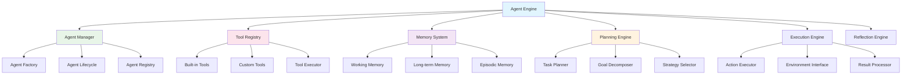

# Dify - Agent智能体引擎模块详解

## 模块概述

**Agent智能体引擎**是Dify平台的高级功能模块，它基于大语言模型的推理能力，结合工具调用和环境交互，实现了能够自主完成复杂任务的智能体系统。该模块支持多种智能体架构，包括ReAct、Function Calling、Plan-and-Execute等模式。

## 核心架构

### 1. 模块架构图



### 2. 核心组件

#### 2.1 Agent Manager (智能体管理器)
```python
class AgentManager:
    """
    智能体管理器
    负责智能体的创建、管理和生命周期控制
    """
    
    def __init__(self):
        self.agent_factory = AgentFactory()
        self.agent_registry = AgentRegistry()
        self.active_agents = {}
        self.agent_configs = {}
    
    async def create_agent(self, agent_config: dict) -> Agent:
        """创建智能体"""
        agent_type = agent_config.get('type', 'react')
        agent_id = agent_config.get('id', str(uuid.uuid4()))
        
        # 验证配置
        self._validate_agent_config(agent_config)
        
        # 创建智能体实例
        agent = await self.agent_factory.create(agent_type, agent_config)
        
        # 注册智能体
        self.agent_registry.register(agent_id, agent)
        self.active_agents[agent_id] = agent
        self.agent_configs[agent_id] = agent_config
        
        return agent
    
    async def get_agent(self, agent_id: str) -> Agent:
        """获取智能体"""
        if agent_id in self.active_agents:
            return self.active_agents[agent_id]
        
        # 从注册表中恢复
        agent_config = self.agent_configs.get(agent_id)
        if agent_config:
            agent = await self.create_agent(agent_config)
            return agent
        
        raise AgentNotFoundError(f"Agent not found: {agent_id}")
    
    async def execute_task(
        self, 
        agent_id: str, 
        task: Task,
        context: ExecutionContext
    ) -> TaskResult:
        """执行任务"""
        agent = await self.get_agent(agent_id)
        
        try:
            # 设置执行上下文
            agent.set_context(context)
            
            # 执行任务
            result = await agent.execute(task)
            
            # 记录执行历史
            self._record_execution(agent_id, task, result)
            
            return result
            
        except Exception as e:
            error_result = TaskResult(
                success=False,
                error=e,
                agent_id=agent_id,
                task_id=task.id
            )
            self._record_execution(agent_id, task, error_result)
            return error_result
    
    def _validate_agent_config(self, config: dict):
        """验证智能体配置"""
        required_fields = ['type', 'name', 'llm_config']
        for field in required_fields:
            if field not in config:
                raise ConfigValidationError(f"Missing required field: {field}")
```

#### 2.2 Tool Registry (工具注册表)
```python
class ToolRegistry:
    """
    工具注册表
    管理所有可用的工具
    """
    
    def __init__(self):
        self.tools = {}
        self.tool_categories = defaultdict(list)
        self.tool_executor = ToolExecutor()
        self._register_builtin_tools()
    
    def register_tool(self, tool: Tool):
        """注册工具"""
        self.tools[tool.name] = tool
        self.tool_categories[tool.category].append(tool.name)
    
    def get_tool(self, tool_name: str) -> Tool:
        """获取工具"""
        return self.tools.get(tool_name)
    
    def list_tools(self, category: str = None) -> List[Tool]:
        """列出工具"""
        if category:
            tool_names = self.tool_categories.get(category, [])
            return [self.tools[name] for name in tool_names]
        return list(self.tools.values())
    
    async def execute_tool(
        self, 
        tool_name: str, 
        parameters: dict,
        context: ExecutionContext
    ) -> ToolResult:
        """执行工具"""
        tool = self.get_tool(tool_name)
        if not tool:
            raise ToolNotFoundError(f"Tool not found: {tool_name}")
        
        return await self.tool_executor.execute(tool, parameters, context)
    
    def _register_builtin_tools(self):
        """注册内置工具"""
        builtin_tools = [
            WebSearchTool(),
            CalculatorTool(),
            FileReadTool(),
            FileWriteTool(),
            EmailTool(),
            DatabaseQueryTool(),
            APICallTool(),
            ImageGenerationTool(),
            CodeExecutorTool()
        ]
        
        for tool in builtin_tools:
            self.register_tool(tool)

class Tool:
    """工具基类"""
    
    def __init__(self, name: str, description: str, category: str = 'general'):
        self.name = name
        self.description = description
        self.category = category
        self.parameters_schema = {}
    
    async def execute(self, parameters: dict, context: ExecutionContext) -> ToolResult:
        """执行工具"""
        # 验证参数
        self._validate_parameters(parameters)
        
        try:
            # 执行具体逻辑
            result = await self._execute_impl(parameters, context)
            
            return ToolResult(
                success=True,
                result=result,
                tool_name=self.name
            )
            
        except Exception as e:
            return ToolResult(
                success=False,
                error=e,
                tool_name=self.name
            )
    
    async def _execute_impl(self, parameters: dict, context: ExecutionContext):
        """具体执行逻辑，由子类实现"""
        raise NotImplementedError
    
    def _validate_parameters(self, parameters: dict):
        """验证参数"""
        for param_name, param_schema in self.parameters_schema.items():
            if param_schema.get('required', False) and param_name not in parameters:
                raise ParameterValidationError(f"Required parameter missing: {param_name}")
```

#### 2.3 Memory System (记忆系统)
```python
class MemorySystem:
    """
    记忆系统
    管理智能体的各种记忆
    """
    
    def __init__(self):
        self.working_memory = WorkingMemory()
        self.long_term_memory = LongTermMemory()
        self.episodic_memory = EpisodicMemory()
        self.semantic_memory = SemanticMemory()
    
    async def store_experience(self, experience: Experience):
        """存储经验"""
        # 存储到工作记忆
        await self.working_memory.add(experience)
        
        # 根据重要性决定是否存储到长期记忆
        if self._is_important(experience):
            await self.long_term_memory.store(experience)
        
        # 存储到情节记忆
        await self.episodic_memory.add_episode(experience)
        
        # 提取语义信息
        semantic_info = self._extract_semantic_info(experience)
        if semantic_info:
            await self.semantic_memory.update(semantic_info)
    
    async def retrieve_relevant_memories(
        self, 
        query: str, 
        memory_types: List[str] = None
    ) -> List[Memory]:
        """检索相关记忆"""
        memories = []
        
        if not memory_types or 'working' in memory_types:
            working_memories = await self.working_memory.search(query)
            memories.extend(working_memories)
        
        if not memory_types or 'long_term' in memory_types:
            long_term_memories = await self.long_term_memory.search(query)
            memories.extend(long_term_memories)
        
        if not memory_types or 'episodic' in memory_types:
            episodic_memories = await self.episodic_memory.search(query)
            memories.extend(episodic_memories)
        
        # 按相关性排序
        memories.sort(key=lambda m: m.relevance_score, reverse=True)
        
        return memories
    
    def _is_important(self, experience: Experience) -> bool:
        """判断经验是否重要"""
        # 基于多个因素判断重要性
        importance_score = 0
        
        # 任务成功/失败
        if experience.task_result:
            if experience.task_result.success:
                importance_score += 0.3
            else:
                importance_score += 0.5  # 失败经验更重要
        
        # 新颖性
        if experience.novelty_score > 0.7:
            importance_score += 0.4
        
        # 用户反馈
        if experience.user_feedback:
            importance_score += 0.3
        
        return importance_score > 0.6

class WorkingMemory:
    """工作记忆"""
    
    def __init__(self, capacity: int = 10):
        self.capacity = capacity
        self.memories = deque(maxlen=capacity)
        self.memory_index = {}
    
    async def add(self, experience: Experience):
        """添加经验到工作记忆"""
        memory = Memory(
            content=experience.to_dict(),
            timestamp=datetime.utcnow(),
            memory_type='working'
        )
        
        self.memories.append(memory)
        self._update_index(memory)
    
    async def search(self, query: str) -> List[Memory]:
        """搜索工作记忆"""
        # 简单的关键词匹配
        relevant_memories = []
        query_words = set(query.lower().split())
        
        for memory in self.memories:
            memory_words = set(str(memory.content).lower().split())
            overlap = len(query_words.intersection(memory_words))
            
            if overlap > 0:
                memory.relevance_score = overlap / len(query_words)
                relevant_memories.append(memory)
        
        return relevant_memories
```

## 智能体架构

### 1. ReAct智能体

```python
class ReActAgent(Agent):
    """
    ReAct (Reasoning and Acting) 智能体
    基于推理-行动循环的智能体架构
    """
    
    def __init__(self, config: dict):
        super().__init__(config)
        self.max_iterations = config.get('max_iterations', 10)
        self.thought_pattern = r"Thought: (.*?)(?=\n(?:Action|Final Answer))"
        self.action_pattern = r"Action: (.*?)\nAction Input: (.*?)(?=\n(?:Observation|Thought|Final Answer))"
        self.final_answer_pattern = r"Final Answer: (.*)"
    
    async def execute(self, task: Task) -> TaskResult:
        """执行任务"""
        conversation_history = []
        iteration = 0
        
        # 构建初始提示
        initial_prompt = self._build_initial_prompt(task)
        conversation_history.append({"role": "user", "content": initial_prompt})
        
        while iteration < self.max_iterations:
            iteration += 1
            
            # 生成响应
            response = await self.llm_service.chat(
                conversation_history,
                **self.llm_config
            )
            
            response_text = response.text
            conversation_history.append({"role": "assistant", "content": response_text})
            
            # 解析响应
            parsed_response = self._parse_response(response_text)
            
            if parsed_response['type'] == 'final_answer':
                # 任务完成
                return TaskResult(
                    success=True,
                    result=parsed_response['content'],
                    iterations=iteration,
                    conversation_history=conversation_history
                )
            
            elif parsed_response['type'] == 'action':
                # 执行动作
                action_result = await self._execute_action(
                    parsed_response['action'],
                    parsed_response['action_input']
                )
                
                # 添加观察结果
                observation = f"Observation: {action_result.result}"
                conversation_history.append({"role": "user", "content": observation})
            
            else:
                # 继续思考
                continue
        
        # 达到最大迭代次数
        return TaskResult(
            success=False,
            error="Maximum iterations reached without final answer",
            iterations=iteration,
            conversation_history=conversation_history
        )
    
    def _build_initial_prompt(self, task: Task) -> str:
        """构建初始提示"""
        tools_description = self._get_tools_description()
        
        prompt = f"""
You are a helpful assistant that can use tools to complete tasks.

Available tools:
{tools_description}

Use the following format:

Thought: you should always think about what to do
Action: the action to take, should be one of [{', '.join(self.available_tools)}]
Action Input: the input to the action
Observation: the result of the action
... (this Thought/Action/Action Input/Observation can repeat N times)
Thought: I now know the final answer
Final Answer: the final answer to the original input question

Task: {task.description}

Begin!
"""
        return prompt
    
    def _parse_response(self, response: str) -> dict:
        """解析响应"""
        # 检查是否是最终答案
        final_answer_match = re.search(self.final_answer_pattern, response, re.DOTALL)
        if final_answer_match:
            return {
                'type': 'final_answer',
                'content': final_answer_match.group(1).strip()
            }
        
        # 检查是否是动作
        action_match = re.search(self.action_pattern, response, re.DOTALL)
        if action_match:
            return {
                'type': 'action',
                'action': action_match.group(1).strip(),
                'action_input': action_match.group(2).strip()
            }
        
        # 默认为思考
        return {'type': 'thought'}

class FunctionCallingAgent(Agent):
    """
    Function Calling 智能体
    基于函数调用的智能体架构
    """
    
    async def execute(self, task: Task) -> TaskResult:
        """执行任务"""
        # 构建函数定义
        functions = self._build_function_definitions()
        
        # 构建消息
        messages = [
            {"role": "system", "content": self._build_system_prompt()},
            {"role": "user", "content": task.description}
        ]
        
        conversation_history = messages.copy()
        max_iterations = 10
        iteration = 0
        
        while iteration < max_iterations:
            iteration += 1
            
            # 调用LLM
            response = await self.llm_service.chat(
                conversation_history,
                functions=functions,
                function_call="auto",
                **self.llm_config
            )
            
            conversation_history.append({
                "role": "assistant",
                "content": response.text,
                "function_call": response.function_call
            })
            
            # 检查是否有函数调用
            if response.function_call:
                # 执行函数
                function_result = await self._execute_function(
                    response.function_call['name'],
                    json.loads(response.function_call['arguments'])
                )
                
                # 添加函数结果
                conversation_history.append({
                    "role": "function",
                    "name": response.function_call['name'],
                    "content": json.dumps(function_result.to_dict())
                })
            else:
                # 没有函数调用，返回结果
                return TaskResult(
                    success=True,
                    result=response.text,
                    iterations=iteration,
                    conversation_history=conversation_history
                )
        
        return TaskResult(
            success=False,
            error="Maximum iterations reached",
            iterations=iteration,
            conversation_history=conversation_history
        )
```

### 2. 规划执行智能体

```python
class PlanAndExecuteAgent(Agent):
    """
    Plan-and-Execute 智能体
    先制定计划，然后逐步执行
    """
    
    def __init__(self, config: dict):
        super().__init__(config)
        self.planner = TaskPlanner(self.llm_service)
        self.executor = StepExecutor(self.tool_registry)
    
    async def execute(self, task: Task) -> TaskResult:
        """执行任务"""
        try:
            # 1. 制定计划
            plan = await self.planner.create_plan(task)
            
            # 2. 执行计划
            execution_results = []
            for step in plan.steps:
                step_result = await self.executor.execute_step(step, self.context)
                execution_results.append(step_result)
                
                # 如果步骤失败，尝试重新规划
                if not step_result.success:
                    revised_plan = await self.planner.revise_plan(
                        plan, step, step_result.error
                    )
                    if revised_plan:
                        plan = revised_plan
                        continue
                    else:
                        break
            
            # 3. 整合结果
            final_result = self._integrate_results(execution_results)
            
            return TaskResult(
                success=True,
                result=final_result,
                plan=plan,
                execution_results=execution_results
            )
            
        except Exception as e:
            return TaskResult(
                success=False,
                error=e
            )

class TaskPlanner:
    """任务规划器"""
    
    def __init__(self, llm_service):
        self.llm_service = llm_service
    
    async def create_plan(self, task: Task) -> Plan:
        """创建执行计划"""
        planning_prompt = f"""
        Create a step-by-step plan to complete the following task:
        
        Task: {task.description}
        
        Available tools: {', '.join(task.available_tools)}
        
        Please provide a detailed plan with the following format:
        Step 1: [description] - Tool: [tool_name]
        Step 2: [description] - Tool: [tool_name]
        ...
        
        Plan:
        """
        
        response = await self.llm_service.generate(planning_prompt)
        
        # 解析计划
        steps = self._parse_plan(response.text)
        
        return Plan(
            task_id=task.id,
            steps=steps,
            created_at=datetime.utcnow()
        )
    
    def _parse_plan(self, plan_text: str) -> List[PlanStep]:
        """解析计划文本"""
        steps = []
        lines = plan_text.strip().split('\n')
        
        for line in lines:
            if line.strip().startswith('Step'):
                # 解析步骤
                step_match = re.match(r'Step (\d+): (.*?) - Tool: (.*)', line)
                if step_match:
                    step_number = int(step_match.group(1))
                    description = step_match.group(2).strip()
                    tool_name = step_match.group(3).strip()
                    
                    step = PlanStep(
                        step_number=step_number,
                        description=description,
                        tool_name=tool_name
                    )
                    steps.append(step)
        
        return steps
```

## 工具系统

### 1. 内置工具

```python
class WebSearchTool(Tool):
    """网络搜索工具"""
    
    def __init__(self):
        super().__init__(
            name="web_search",
            description="Search the web for information",
            category="information"
        )
        self.parameters_schema = {
            'query': {'type': 'string', 'required': True, 'description': 'Search query'},
            'num_results': {'type': 'integer', 'required': False, 'default': 5}
        }
        self.search_engine = SearchEngine()
    
    async def _execute_impl(self, parameters: dict, context: ExecutionContext):
        """执行网络搜索"""
        query = parameters['query']
        num_results = parameters.get('num_results', 5)
        
        search_results = await self.search_engine.search(query, num_results)
        
        return {
            'query': query,
            'results': [
                {
                    'title': result.title,
                    'url': result.url,
                    'snippet': result.snippet
                }
                for result in search_results
            ]
        }

class CalculatorTool(Tool):
    """计算器工具"""
    
    def __init__(self):
        super().__init__(
            name="calculator",
            description="Perform mathematical calculations",
            category="computation"
        )
        self.parameters_schema = {
            'expression': {'type': 'string', 'required': True, 'description': 'Mathematical expression'}
        }
    
    async def _execute_impl(self, parameters: dict, context: ExecutionContext):
        """执行数学计算"""
        expression = parameters['expression']
        
        # 安全的数学表达式求值
        try:
            # 只允许安全的数学操作
            allowed_names = {
                k: v for k, v in math.__dict__.items() if not k.startswith("__")
            }
            allowed_names.update({"abs": abs, "round": round})
            
            result = eval(expression, {"__builtins__": {}}, allowed_names)
            
            return {
                'expression': expression,
                'result': result
            }
            
        except Exception as e:
            raise ToolExecutionError(f"Calculation error: {str(e)}")

class CodeExecutorTool(Tool):
    """代码执行工具"""
    
    def __init__(self):
        super().__init__(
            name="code_executor",
            description="Execute Python code in a safe environment",
            category="computation"
        )
        self.parameters_schema = {
            'code': {'type': 'string', 'required': True, 'description': 'Python code to execute'},
            'timeout': {'type': 'integer', 'required': False, 'default': 30}
        }
        self.sandbox = CodeSandbox()
    
    async def _execute_impl(self, parameters: dict, context: ExecutionContext):
        """执行代码"""
        code = parameters['code']
        timeout = parameters.get('timeout', 30)
        
        execution_result = await self.sandbox.execute(
            code, 
            timeout=timeout,
            allowed_imports=['math', 'json', 'datetime', 'random']
        )
        
        return {
            'code': code,
            'output': execution_result.output,
            'error': execution_result.error,
            'execution_time': execution_result.execution_time
        }
```

### 2. 自定义工具

```python
class CustomToolBuilder:
    """自定义工具构建器"""
    
    def __init__(self):
        self.tool_templates = {
            'api_call': APICallToolTemplate(),
            'database_query': DatabaseQueryToolTemplate(),
            'file_operation': FileOperationToolTemplate()
        }
    
    def build_tool(self, tool_config: dict) -> Tool:
        """构建自定义工具"""
        template_type = tool_config.get('template_type')
        template = self.tool_templates.get(template_type)
        
        if not template:
            raise UnsupportedToolTemplateError(f"Unknown template: {template_type}")
        
        return template.build(tool_config)

class APICallToolTemplate:
    """API调用工具模板"""
    
    def build(self, config: dict) -> Tool:
        """构建API调用工具"""
        class CustomAPITool(Tool):
            def __init__(self, config):
                super().__init__(
                    name=config['name'],
                    description=config['description'],
                    category=config.get('category', 'api')
                )
                self.api_config = config['api_config']
                self.parameters_schema = config.get('parameters_schema', {})
            
            async def _execute_impl(self, parameters: dict, context: ExecutionContext):
                import aiohttp
                
                async with aiohttp.ClientSession() as session:
                    # 构建请求
                    url = self.api_config['url'].format(**parameters)
                    method = self.api_config.get('method', 'GET')
                    headers = self.api_config.get('headers', {})
                    
                    # 发送请求
                    async with session.request(
                        method, url, headers=headers, json=parameters
                    ) as response:
                        result = await response.json()
                        
                        return {
                            'status_code': response.status,
                            'response': result
                        }
        
        return CustomAPITool(config)
```

## 多智能体协作

### 1. 智能体团队

```python
class AgentTeam:
    """智能体团队"""
    
    def __init__(self, team_config: dict):
        self.team_id = team_config['team_id']
        self.agents = {}
        self.communication_protocol = CommunicationProtocol()
        self.task_coordinator = TaskCoordinator()
        self.shared_memory = SharedMemory()
    
    def add_agent(self, agent: Agent, role: str):
        """添加智能体到团队"""
        self.agents[agent.id] = {
            'agent': agent,
            'role': role,
            'status': 'idle'
        }
    
    async def execute_collaborative_task(self, task: Task) -> TaskResult:
        """执行协作任务"""
        # 1. 任务分解
        subtasks = await self.task_coordinator.decompose_task(task, self.agents)
        
        # 2. 任务分配
        task_assignments = await self.task_coordinator.assign_tasks(
            subtasks, self.agents
        )
        
        # 3. 并行执行
        execution_tasks = []
        for assignment in task_assignments:
            agent = self.agents[assignment.agent_id]['agent']
            execution_task = self._execute_agent_task(agent, assignment.subtask)
            execution_tasks.append(execution_task)
        
        # 4. 等待所有任务完成
        results = await asyncio.gather(*execution_tasks, return_exceptions=True)
        
        # 5. 结果整合
        final_result = await self.task_coordinator.integrate_results(
            task, results
        )
        
        return final_result
    
    async def _execute_agent_task(self, agent: Agent, subtask: Task) -> TaskResult:
        """执行单个智能体任务"""
        # 设置共享内存访问
        agent.set_shared_memory(self.shared_memory)
        
        # 执行任务
        result = await agent.execute(subtask)
        
        # 更新共享内存
        await self.shared_memory.update_from_result(result)
        
        return result

class CommunicationProtocol:
    """智能体间通信协议"""
    
    def __init__(self):
        self.message_queue = asyncio.Queue()
        self.subscribers = defaultdict(list)
    
    async def send_message(self, sender_id: str, recipient_id: str, message: dict):
        """发送消息"""
        communication_message = {
            'sender_id': sender_id,
            'recipient_id': recipient_id,
            'message': message,
            'timestamp': datetime.utcnow().isoformat()
        }
        
        await self.message_queue.put(communication_message)
        
        # 通知订阅者
        for callback in self.subscribers[recipient_id]:
            await callback(communication_message)
    
    async def broadcast_message(self, sender_id: str, message: dict):
        """广播消息"""
        broadcast_message = {
            'sender_id': sender_id,
            'message': message,
            'timestamp': datetime.utcnow().isoformat(),
            'type': 'broadcast'
        }
        
        # 通知所有订阅者
        for recipient_id, callbacks in self.subscribers.items():
            if recipient_id != sender_id:
                for callback in callbacks:
                    await callback(broadcast_message)
```

## 学习与适应

### 1. 经验学习

```python
class ExperienceLearner:
    """经验学习器"""
    
    def __init__(self):
        self.experience_database = ExperienceDatabase()
        self.pattern_extractor = PatternExtractor()
        self.strategy_optimizer = StrategyOptimizer()
    
    async def learn_from_experience(self, experience: Experience):
        """从经验中学习"""
        # 1. 存储经验
        await self.experience_database.store(experience)
        
        # 2. 提取模式
        patterns = await self.pattern_extractor.extract(experience)
        
        # 3. 更新策略
        for pattern in patterns:
            await self.strategy_optimizer.update_strategy(pattern)
    
    async def get_similar_experiences(
        self, 
        current_situation: dict
    ) -> List[Experience]:
        """获取相似经验"""
        return await self.experience_database.find_similar(current_situation)

class StrategyOptimizer:
    """策略优化器"""
    
    def __init__(self):
        self.strategies = {}
        self.performance_tracker = PerformanceTracker()
    
    async def update_strategy(self, pattern: Pattern):
        """更新策略"""
        strategy_key = pattern.get_strategy_key()
        
        if strategy_key in self.strategies:
            # 更新现有策略
            strategy = self.strategies[strategy_key]
            strategy.update_from_pattern(pattern)
        else:
            # 创建新策略
            strategy = Strategy.from_pattern(pattern)
            self.strategies[strategy_key] = strategy
        
        # 评估策略性能
        performance = await self.performance_tracker.evaluate_strategy(strategy)
        strategy.performance_score = performance
```

## 监控与调试

### 1. 智能体监控

```python
class AgentMonitor:
    """智能体监控器"""
    
    def __init__(self):
        self.metrics_collector = MetricsCollector()
        self.event_tracker = EventTracker()
        self.performance_analyzer = PerformanceAnalyzer()
    
    def start_monitoring(self, agent_id: str):
        """开始监控智能体"""
        self.metrics_collector.start_agent_metrics(agent_id)
        self.event_tracker.start_tracking(agent_id)
    
    def on_agent_action(self, agent_id: str, action: dict):
        """记录智能体动作"""
        self.event_tracker.record_event(agent_id, 'action', action)
        self.metrics_collector.increment_counter(f"agent.{agent_id}.actions")
    
    def on_tool_execution(self, agent_id: str, tool_name: str, duration: float):
        """记录工具执行"""
        self.metrics_collector.record_histogram(
            f"agent.{agent_id}.tool.{tool_name}.duration", 
            duration
        )
    
    async def generate_report(self, agent_id: str) -> dict:
        """生成监控报告"""
        metrics = self.metrics_collector.get_agent_metrics(agent_id)
        events = self.event_tracker.get_agent_events(agent_id)
        performance = await self.performance_analyzer.analyze(agent_id)
        
        return {
            'agent_id': agent_id,
            'metrics': metrics,
            'events': events,
            'performance': performance,
            'generated_at': datetime.utcnow().isoformat()
        }
```

这个智能体引擎设计提供了完整的智能体开发和运行框架，支持多种架构模式、工具集成、多智能体协作和持续学习能力，是构建复杂AI应用的强大基础。 