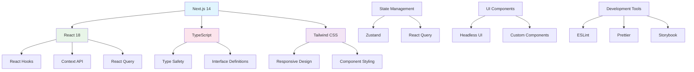

# Dify - Web前端界面模块详解

## 模块概述

**Web前端界面模块**是Dify平台的用户交互层，基于Next.js框架构建，提供了直观的可视化界面来管理AI应用、设计工作流、配置模型、监控性能等功能。该模块采用现代化的前端技术栈，提供了优秀的用户体验。

## 技术架构

### 1. 技术栈



### 2. 项目结构

```
web/
├── app/                    # Next.js App Router
│   ├── (commonLayout)/    # 通用布局
│   ├── (dashboard)/       # 仪表板页面
│   ├── api/              # API路由
│   └── globals.css       # 全局样式
├── components/           # 组件库
│   ├── base/            # 基础组件
│   ├── app/             # 应用相关组件
│   ├── workflow/        # 工作流组件
│   └── datasets/        # 数据集组件
├── context/             # React Context
├── hooks/               # 自定义Hooks
├── service/             # API服务
├── types/               # TypeScript类型定义
├── utils/               # 工具函数
└── i18n/                # 国际化
```

## 核心组件系统

### 1. 基础组件库

```typescript
// components/base/Button/index.tsx
interface ButtonProps {
  variant?: 'primary' | 'secondary' | 'danger' | 'ghost'
  size?: 'sm' | 'md' | 'lg'
  loading?: boolean
  disabled?: boolean
  children: React.ReactNode
  onClick?: () => void
  className?: string
}

export const Button: React.FC<ButtonProps> = ({
  variant = 'primary',
  size = 'md',
  loading = false,
  disabled = false,
  children,
  onClick,
  className = ''
}) => {
  const baseClasses = 'inline-flex items-center justify-center font-medium rounded-lg transition-colors focus:outline-none focus:ring-2 focus:ring-offset-2'
  
  const variantClasses = {
    primary: 'bg-blue-600 text-white hover:bg-blue-700 focus:ring-blue-500',
    secondary: 'bg-gray-200 text-gray-900 hover:bg-gray-300 focus:ring-gray-500',
    danger: 'bg-red-600 text-white hover:bg-red-700 focus:ring-red-500',
    ghost: 'text-gray-700 hover:bg-gray-100 focus:ring-gray-500'
  }
  
  const sizeClasses = {
    sm: 'px-3 py-1.5 text-sm',
    md: 'px-4 py-2 text-sm',
    lg: 'px-6 py-3 text-base'
  }
  
  return (
    <button
      className={`${baseClasses} ${variantClasses[variant]} ${sizeClasses[size]} ${className} ${
        disabled || loading ? 'opacity-50 cursor-not-allowed' : ''
      }`}
      onClick={onClick}
      disabled={disabled || loading}
    >
      {loading && (
        <svg className="animate-spin -ml-1 mr-2 h-4 w-4" fill="none" viewBox="0 0 24 24">
          <circle className="opacity-25" cx="12" cy="12" r="10" stroke="currentColor" strokeWidth="4" />
          <path className="opacity-75" fill="currentColor" d="M4 12a8 8 0 018-8V0C5.373 0 0 5.373 0 12h4zm2 5.291A7.962 7.962 0 014 12H0c0 3.042 1.135 5.824 3 7.938l3-2.647z" />
        </svg>
      )}
      {children}
    </button>
  )
}
```

### 2. 表单组件

```typescript
// components/base/Input/index.tsx
interface InputProps {
  type?: 'text' | 'email' | 'password' | 'number'
  placeholder?: string
  value?: string
  defaultValue?: string
  onChange?: (value: string) => void
  onBlur?: () => void
  error?: string
  disabled?: boolean
  required?: boolean
  className?: string
}

export const Input: React.FC<InputProps> = ({
  type = 'text',
  placeholder,
  value,
  defaultValue,
  onChange,
  onBlur,
  error,
  disabled = false,
  required = false,
  className = ''
}) => {
  const baseClasses = 'block w-full px-3 py-2 border border-gray-300 rounded-md shadow-sm placeholder-gray-400 focus:outline-none focus:ring-blue-500 focus:border-blue-500'
  const errorClasses = error ? 'border-red-300 focus:ring-red-500 focus:border-red-500' : ''
  
  return (
    <div className="space-y-1">
      <input
        type={type}
        placeholder={placeholder}
        value={value}
        defaultValue={defaultValue}
        onChange={(e) => onChange?.(e.target.value)}
        onBlur={onBlur}
        disabled={disabled}
        required={required}
        className={`${baseClasses} ${errorClasses} ${className} ${
          disabled ? 'bg-gray-50 cursor-not-allowed' : ''
        }`}
      />
      {error && (
        <p className="text-sm text-red-600">{error}</p>
      )}
    </div>
  )
}

// components/base/Select/index.tsx
interface SelectOption {
  value: string
  label: string
  disabled?: boolean
}

interface SelectProps {
  options: SelectOption[]
  value?: string
  defaultValue?: string
  placeholder?: string
  onChange?: (value: string) => void
  error?: string
  disabled?: boolean
  className?: string
}

export const Select: React.FC<SelectProps> = ({
  options,
  value,
  defaultValue,
  placeholder,
  onChange,
  error,
  disabled = false,
  className = ''
}) => {
  const [isOpen, setIsOpen] = useState(false)
  const [selectedValue, setSelectedValue] = useState(value || defaultValue || '')
  
  const selectedOption = options.find(option => option.value === selectedValue)
  
  const handleSelect = (optionValue: string) => {
    setSelectedValue(optionValue)
    onChange?.(optionValue)
    setIsOpen(false)
  }
  
  return (
    <div className="relative">
      <button
        type="button"
        className={`relative w-full bg-white border border-gray-300 rounded-md shadow-sm pl-3 pr-10 py-2 text-left cursor-default focus:outline-none focus:ring-1 focus:ring-blue-500 focus:border-blue-500 ${className} ${
          disabled ? 'bg-gray-50 cursor-not-allowed' : ''
        } ${error ? 'border-red-300 focus:ring-red-500 focus:border-red-500' : ''}`}
        onClick={() => !disabled && setIsOpen(!isOpen)}
        disabled={disabled}
      >
        <span className="block truncate">
          {selectedOption?.label || placeholder || 'Select an option'}
        </span>
        <span className="absolute inset-y-0 right-0 flex items-center pr-2 pointer-events-none">
          <ChevronDownIcon className="h-5 w-5 text-gray-400" />
        </span>
      </button>
      
      {isOpen && !disabled && (
        <div className="absolute z-10 mt-1 w-full bg-white shadow-lg max-h-60 rounded-md py-1 text-base ring-1 ring-black ring-opacity-5 overflow-auto focus:outline-none">
          {options.map((option) => (
            <button
              key={option.value}
              className={`w-full text-left px-4 py-2 hover:bg-gray-100 ${
                option.disabled ? 'text-gray-400 cursor-not-allowed' : 'text-gray-900 cursor-pointer'
              } ${selectedValue === option.value ? 'bg-blue-50 text-blue-600' : ''}`}
              onClick={() => !option.disabled && handleSelect(option.value)}
              disabled={option.disabled}
            >
              {option.label}
            </button>
          ))}
        </div>
      )}
      
      {error && (
        <p className="mt-1 text-sm text-red-600">{error}</p>
      )}
    </div>
  )
}
```

## 应用管理界面

### 1. 应用列表组件

```typescript
// components/app/AppList/index.tsx
interface App {
  id: string
  name: string
  description: string
  type: 'chatbot' | 'workflow' | 'agent'
  status: 'active' | 'inactive' | 'draft'
  created_at: string
  updated_at: string
  usage_count: number
}

interface AppListProps {
  apps: App[]
  loading?: boolean
  onCreateApp: () => void
  onEditApp: (app: App) => void
  onDeleteApp: (app: App) => void
  onDuplicateApp: (app: App) => void
}

export const AppList: React.FC<AppListProps> = ({
  apps,
  loading = false,
  onCreateApp,
  onEditApp,
  onDeleteApp,
  onDuplicateApp
}) => {
  const [searchTerm, setSearchTerm] = useState('')
  const [filterType, setFilterType] = useState<string>('all')
  const [sortBy, setSortBy] = useState<'name' | 'created_at' | 'usage_count'>('created_at')
  
  const filteredApps = useMemo(() => {
    return apps
      .filter(app => {
        const matchesSearch = app.name.toLowerCase().includes(searchTerm.toLowerCase()) ||
                            app.description.toLowerCase().includes(searchTerm.toLowerCase())
        const matchesType = filterType === 'all' || app.type === filterType
        return matchesSearch && matchesType
      })
      .sort((a, b) => {
        switch (sortBy) {
          case 'name':
            return a.name.localeCompare(b.name)
          case 'usage_count':
            return b.usage_count - a.usage_count
          case 'created_at':
          default:
            return new Date(b.created_at).getTime() - new Date(a.created_at).getTime()
        }
      })
  }, [apps, searchTerm, filterType, sortBy])
  
  if (loading) {
    return <AppListSkeleton />
  }
  
  return (
    <div className="space-y-6">
      {/* 头部操作栏 */}
      <div className="flex flex-col sm:flex-row sm:items-center sm:justify-between gap-4">
        <div className="flex-1 max-w-md">
          <Input
            type="text"
            placeholder="Search applications..."
            value={searchTerm}
            onChange={setSearchTerm}
            className="w-full"
          />
        </div>
        
        <div className="flex items-center gap-3">
          <Select
            options={[
              { value: 'all', label: 'All Types' },
              { value: 'chatbot', label: 'Chatbot' },
              { value: 'workflow', label: 'Workflow' },
              { value: 'agent', label: 'Agent' }
            ]}
            value={filterType}
            onChange={setFilterType}
            className="w-32"
          />
          
          <Select
            options={[
              { value: 'created_at', label: 'Created Date' },
              { value: 'name', label: 'Name' },
              { value: 'usage_count', label: 'Usage' }
            ]}
            value={sortBy}
            onChange={(value) => setSortBy(value as any)}
            className="w-32"
          />
          
          <Button onClick={onCreateApp}>
            <PlusIcon className="h-4 w-4 mr-2" />
            Create App
          </Button>
        </div>
      </div>
      
      {/* 应用网格 */}
      <div className="grid grid-cols-1 md:grid-cols-2 lg:grid-cols-3 gap-6">
        {filteredApps.map((app) => (
          <AppCard
            key={app.id}
            app={app}
            onEdit={() => onEditApp(app)}
            onDelete={() => onDeleteApp(app)}
            onDuplicate={() => onDuplicateApp(app)}
          />
        ))}
      </div>
      
      {filteredApps.length === 0 && (
        <div className="text-center py-12">
          <div className="text-gray-400 text-lg mb-2">No applications found</div>
          <p className="text-gray-500 mb-4">
            {searchTerm || filterType !== 'all' 
              ? 'Try adjusting your search or filters'
              : 'Create your first application to get started'
            }
          </p>
          {!searchTerm && filterType === 'all' && (
            <Button onClick={onCreateApp}>Create Your First App</Button>
          )}
        </div>
      )}
    </div>
  )
}

// components/app/AppCard/index.tsx
interface AppCardProps {
  app: App
  onEdit: () => void
  onDelete: () => void
  onDuplicate: () => void
}

export const AppCard: React.FC<AppCardProps> = ({
  app,
  onEdit,
  onDelete,
  onDuplicate
}) => {
  const [showMenu, setShowMenu] = useState(false)
  
  const getTypeIcon = (type: string) => {
    switch (type) {
      case 'chatbot':
        return <ChatBubbleLeftIcon className="h-5 w-5" />
      case 'workflow':
        return <Cog6ToothIcon className="h-5 w-5" />
      case 'agent':
        return <UserIcon className="h-5 w-5" />
      default:
        return <DocumentIcon className="h-5 w-5" />
    }
  }
  
  const getStatusBadge = (status: string) => {
    const statusConfig = {
      active: { color: 'bg-green-100 text-green-800', label: 'Active' },
      inactive: { color: 'bg-gray-100 text-gray-800', label: 'Inactive' },
      draft: { color: 'bg-yellow-100 text-yellow-800', label: 'Draft' }
    }
    
    const config = statusConfig[status as keyof typeof statusConfig]
    
    return (
      <span className={`inline-flex items-center px-2.5 py-0.5 rounded-full text-xs font-medium ${config.color}`}>
        {config.label}
      </span>
    )
  }
  
  return (
    <div className="bg-white rounded-lg border border-gray-200 hover:border-gray-300 transition-colors">
      <div className="p-6">
        <div className="flex items-start justify-between mb-4">
          <div className="flex items-center space-x-3">
            <div className="flex-shrink-0 text-gray-400">
              {getTypeIcon(app.type)}
            </div>
            <div className="flex-1 min-w-0">
              <h3 className="text-lg font-medium text-gray-900 truncate">
                {app.name}
              </h3>
              <p className="text-sm text-gray-500 capitalize">{app.type}</p>
            </div>
          </div>
          
          <div className="relative">
            <button
              onClick={() => setShowMenu(!showMenu)}
              className="text-gray-400 hover:text-gray-600 p-1"
            >
              <EllipsisVerticalIcon className="h-5 w-5" />
            </button>
            
            {showMenu && (
              <div className="absolute right-0 mt-2 w-48 bg-white rounded-md shadow-lg ring-1 ring-black ring-opacity-5 z-10">
                <div className="py-1">
                  <button
                    onClick={() => { onEdit(); setShowMenu(false) }}
                    className="block w-full text-left px-4 py-2 text-sm text-gray-700 hover:bg-gray-100"
                  >
                    Edit
                  </button>
                  <button
                    onClick={() => { onDuplicate(); setShowMenu(false) }}
                    className="block w-full text-left px-4 py-2 text-sm text-gray-700 hover:bg-gray-100"
                  >
                    Duplicate
                  </button>
                  <button
                    onClick={() => { onDelete(); setShowMenu(false) }}
                    className="block w-full text-left px-4 py-2 text-sm text-red-700 hover:bg-red-50"
                  >
                    Delete
                  </button>
                </div>
              </div>
            )}
          </div>
        </div>
        
        <p className="text-gray-600 text-sm mb-4 line-clamp-2">
          {app.description || 'No description provided'}
        </p>
        
        <div className="flex items-center justify-between">
          <div className="flex items-center space-x-4 text-sm text-gray-500">
            <span>{app.usage_count} uses</span>
            <span>Updated {formatDistanceToNow(new Date(app.updated_at))} ago</span>
          </div>
          {getStatusBadge(app.status)}
        </div>
      </div>
      
      <div className="px-6 py-3 bg-gray-50 border-t border-gray-200 rounded-b-lg">
        <button
          onClick={onEdit}
          className="text-blue-600 hover:text-blue-800 text-sm font-medium"
        >
          Configure →
        </button>
      </div>
    </div>
  )
}
```

## 工作流可视化编辑器

### 1. 工作流画布组件

```typescript
// components/workflow/WorkflowCanvas/index.tsx
interface Node {
  id: string
  type: string
  position: { x: number; y: number }
  data: any
}

interface Edge {
  id: string
  source: string
  target: string
  type?: string
}

interface WorkflowCanvasProps {
  nodes: Node[]
  edges: Edge[]
  onNodesChange: (nodes: Node[]) => void
  onEdgesChange: (edges: Edge[]) => void
  onNodeAdd: (nodeType: string, position: { x: number; y: number }) => void
  onNodeSelect: (node: Node | null) => void
  selectedNode: Node | null
  readonly?: boolean
}

export const WorkflowCanvas: React.FC<WorkflowCanvasProps> = ({
  nodes,
  edges,
  onNodesChange,
  onEdgesChange,
  onNodeAdd,
  onNodeSelect,
  selectedNode,
  readonly = false
}) => {
  const canvasRef = useRef<HTMLDivElement>(null)
  const [draggedNode, setDraggedNode] = useState<Node | null>(null)
  const [dragOffset, setDragOffset] = useState({ x: 0, y: 0 })
  const [scale, setScale] = useState(1)
  const [pan, setPan] = useState({ x: 0, y: 0 })
  
  // 处理节点拖拽
  const handleNodeMouseDown = (node: Node, event: React.MouseEvent) => {
    if (readonly) return
    
    event.preventDefault()
    event.stopPropagation()
    
    const rect = canvasRef.current?.getBoundingClientRect()
    if (!rect) return
    
    setDraggedNode(node)
    setDragOffset({
      x: event.clientX - rect.left - node.position.x * scale - pan.x,
      y: event.clientY - rect.top - node.position.y * scale - pan.y
    })
    
    onNodeSelect(node)
  }
  
  // 处理鼠标移动
  const handleMouseMove = useCallback((event: MouseEvent) => {
    if (!draggedNode || readonly) return
    
    const rect = canvasRef.current?.getBoundingClientRect()
    if (!rect) return
    
    const newPosition = {
      x: (event.clientX - rect.left - pan.x - dragOffset.x) / scale,
      y: (event.clientY - rect.top - pan.y - dragOffset.y) / scale
    }
    
    const updatedNodes = nodes.map(node =>
      node.id === draggedNode.id
        ? { ...node, position: newPosition }
        : node
    )
    
    onNodesChange(updatedNodes)
  }, [draggedNode, nodes, onNodesChange, dragOffset, scale, pan, readonly])
  
  // 处理鼠标释放
  const handleMouseUp = useCallback(() => {
    setDraggedNode(null)
    setDragOffset({ x: 0, y: 0 })
  }, [])
  
  // 绑定全局鼠标事件
  useEffect(() => {
    if (draggedNode) {
      document.addEventListener('mousemove', handleMouseMove)
      document.addEventListener('mouseup', handleMouseUp)
      
      return () => {
        document.removeEventListener('mousemove', handleMouseMove)
        document.removeEventListener('mouseup', handleMouseUp)
      }
    }
  }, [draggedNode, handleMouseMove, handleMouseUp])
  
  // 处理画布点击
  const handleCanvasClick = (event: React.MouseEvent) => {
    if (event.target === event.currentTarget) {
      onNodeSelect(null)
    }
  }
  
  // 处理缩放
  const handleWheel = (event: React.WheelEvent) => {
    event.preventDefault()
    
    const delta = event.deltaY > 0 ? 0.9 : 1.1
    const newScale = Math.max(0.1, Math.min(2, scale * delta))
    
    setScale(newScale)
  }
  
  return (
    <div className="relative w-full h-full overflow-hidden bg-gray-50">
      <div
        ref={canvasRef}
        className="w-full h-full cursor-grab active:cursor-grabbing"
        onClick={handleCanvasClick}
        onWheel={handleWheel}
        style={{
          transform: `translate(${pan.x}px, ${pan.y}px) scale(${scale})`
        }}
      >
        {/* 网格背景 */}
        <div className="absolute inset-0 opacity-20">
          <svg width="100%" height="100%">
            <defs>
              <pattern id="grid" width="20" height="20" patternUnits="userSpaceOnUse">
                <path d="M 20 0 L 0 0 0 20" fill="none" stroke="#e5e7eb" strokeWidth="1" />
              </pattern>
            </defs>
            <rect width="100%" height="100%" fill="url(#grid)" />
          </svg>
        </div>
        
        {/* 连接线 */}
        <svg className="absolute inset-0 pointer-events-none">
          {edges.map((edge) => {
            const sourceNode = nodes.find(n => n.id === edge.source)
            const targetNode = nodes.find(n => n.id === edge.target)
            
            if (!sourceNode || !targetNode) return null
            
            return (
              <WorkflowEdge
                key={edge.id}
                edge={edge}
                sourcePosition={sourceNode.position}
                targetPosition={targetNode.position}
              />
            )
          })}
        </svg>
        
        {/* 节点 */}
        {nodes.map((node) => (
          <WorkflowNode
            key={node.id}
            node={node}
            selected={selectedNode?.id === node.id}
            onMouseDown={(event) => handleNodeMouseDown(node, event)}
            readonly={readonly}
          />
        ))}
      </div>
      
      {/* 工具栏 */}
      {!readonly && (
        <div className="absolute top-4 right-4 bg-white rounded-lg shadow-lg border border-gray-200 p-2">
          <div className="flex items-center space-x-2">
            <button
              onClick={() => setScale(Math.min(2, scale * 1.2))}
              className="p-2 hover:bg-gray-100 rounded"
              title="Zoom In"
            >
              <PlusIcon className="h-4 w-4" />
            </button>
            <button
              onClick={() => setScale(Math.max(0.1, scale * 0.8))}
              className="p-2 hover:bg-gray-100 rounded"
              title="Zoom Out"
            >
              <MinusIcon className="h-4 w-4" />
            </button>
            <button
              onClick={() => { setScale(1); setPan({ x: 0, y: 0 }) }}
              className="p-2 hover:bg-gray-100 rounded"
              title="Reset View"
            >
              <ArrowsPointingOutIcon className="h-4 w-4" />
            </button>
          </div>
        </div>
      )}
    </div>
  )
}
```

### 2. 工作流节点组件

```typescript
// components/workflow/WorkflowNode/index.tsx
interface WorkflowNodeProps {
  node: Node
  selected: boolean
  onMouseDown: (event: React.MouseEvent) => void
  readonly?: boolean
}

export const WorkflowNode: React.FC<WorkflowNodeProps> = ({
  node,
  selected,
  onMouseDown,
  readonly = false
}) => {
  const getNodeConfig = (type: string) => {
    const configs = {
      start: {
        icon: PlayIcon,
        color: 'bg-green-500',
        label: 'Start'
      },
      llm: {
        icon: ChatBubbleLeftIcon,
        color: 'bg-blue-500',
        label: 'LLM'
      },
      condition: {
        icon: QuestionMarkCircleIcon,
        color: 'bg-yellow-500',
        label: 'Condition'
      },
      tool: {
        icon: WrenchScrewdriverIcon,
        color: 'bg-purple-500',
        label: 'Tool'
      },
      end: {
        icon: StopIcon,
        color: 'bg-red-500',
        label: 'End'
      }
    }
    
    return configs[type as keyof typeof configs] || configs.start
  }
  
  const config = getNodeConfig(node.type)
  const Icon = config.icon
  
  return (
    <div
      className={`absolute cursor-pointer transition-all duration-200 ${
        selected ? 'z-10' : 'z-0'
      }`}
      style={{
        left: node.position.x,
        top: node.position.y,
        transform: selected ? 'scale(1.05)' : 'scale(1)'
      }}
      onMouseDown={onMouseDown}
    >
      <div
        className={`relative bg-white rounded-lg border-2 shadow-lg min-w-[120px] ${
          selected ? 'border-blue-500 shadow-blue-200' : 'border-gray-200'
        } ${readonly ? 'cursor-default' : 'cursor-grab active:cursor-grabbing'}`}
      >
        {/* 节点头部 */}
        <div className={`${config.color} text-white px-3 py-2 rounded-t-lg flex items-center space-x-2`}>
          <Icon className="h-4 w-4" />
          <span className="text-sm font-medium">{config.label}</span>
        </div>
        
        {/* 节点内容 */}
        <div className="p-3">
          <div className="text-sm font-medium text-gray-900 mb-1">
            {node.data.title || node.data.name || 'Untitled'}
          </div>
          {node.data.description && (
            <div className="text-xs text-gray-500 line-clamp-2">
              {node.data.description}
            </div>
          )}
        </div>
        
        {/* 连接点 */}
        <div className="absolute -left-2 top-1/2 transform -translate-y-1/2">
          <div className="w-4 h-4 bg-gray-400 rounded-full border-2 border-white shadow-sm" />
        </div>
        <div className="absolute -right-2 top-1/2 transform -translate-y-1/2">
          <div className="w-4 h-4 bg-gray-400 rounded-full border-2 border-white shadow-sm" />
        </div>
        
        {/* 状态指示器 */}
        {node.data.status && (
          <div className="absolute -top-1 -right-1">
            <div
              className={`w-3 h-3 rounded-full ${
                node.data.status === 'running'
                  ? 'bg-blue-500 animate-pulse'
                  : node.data.status === 'success'
                  ? 'bg-green-500'
                  : node.data.status === 'error'
                  ? 'bg-red-500'
                  : 'bg-gray-400'
              }`}
            />
          </div>
        )}
      </div>
    </div>
  )
}
```

## 状态管理

### 1. 应用状态管理

```typescript
// store/appStore.ts
import { create } from 'zustand'
import { persist } from 'zustand/middleware'

interface AppState {
  // 当前用户
  user: User | null
  
  // 应用列表
  apps: App[]
  currentApp: App | null
  
  // UI状态
  sidebarCollapsed: boolean
  theme: 'light' | 'dark'
  
  // 操作方法
  setUser: (user: User | null) => void
  setApps: (apps: App[]) => void
  setCurrentApp: (app: App | null) => void
  addApp: (app: App) => void
  updateApp: (id: string, updates: Partial<App>) => void
  deleteApp: (id: string) => void
  toggleSidebar: () => void
  setTheme: (theme: 'light' | 'dark') => void
}

export const useAppStore = create<AppState>()(
  persist(
    (set, get) => ({
      user: null,
      apps: [],
      currentApp: null,
      sidebarCollapsed: false,
      theme: 'light',
      
      setUser: (user) => set({ user }),
      
      setApps: (apps) => set({ apps }),
      
      setCurrentApp: (app) => set({ currentApp: app }),
      
      addApp: (app) => set((state) => ({
        apps: [...state.apps, app]
      })),
      
      updateApp: (id, updates) => set((state) => ({
        apps: state.apps.map(app =>
          app.id === id ? { ...app, ...updates } : app
        ),
        currentApp: state.currentApp?.id === id
          ? { ...state.currentApp, ...updates }
          : state.currentApp
      })),
      
      deleteApp: (id) => set((state) => ({
        apps: state.apps.filter(app => app.id !== id),
        currentApp: state.currentApp?.id === id ? null : state.currentApp
      })),
      
      toggleSidebar: () => set((state) => ({
        sidebarCollapsed: !state.sidebarCollapsed
      })),
      
      setTheme: (theme) => set({ theme })
    }),
    {
      name: 'dify-app-store',
      partialize: (state) => ({
        sidebarCollapsed: state.sidebarCollapsed,
        theme: state.theme
      })
    }
  )
)
```

### 2. 工作流状态管理

```typescript
// store/workflowStore.ts
interface WorkflowState {
  // 工作流数据
  nodes: Node[]
  edges: Edge[]
  selectedNode: Node | null
  
  // 执行状态
  isRunning: boolean
  executionHistory: ExecutionRecord[]
  
  // UI状态
  showNodePanel: boolean
  showExecutionPanel: boolean
  
  // 操作方法
  setNodes: (nodes: Node[]) => void
  setEdges: (edges: Edge[]) => void
  addNode: (node: Node) => void
  updateNode: (id: string, updates: Partial<Node>) => void
  deleteNode: (id: string) => void
  selectNode: (node: Node | null) => void
  addEdge: (edge: Edge) => void
  deleteEdge: (id: string) => void
  
  // 执行相关
  startExecution: () => void
  stopExecution: () => void
  addExecutionRecord: (record: ExecutionRecord) => void
  
  // UI控制
  toggleNodePanel: () => void
  toggleExecutionPanel: () => void
}

export const useWorkflowStore = create<WorkflowState>((set, get) => ({
  nodes: [],
  edges: [],
  selectedNode: null,
  isRunning: false,
  executionHistory: [],
  showNodePanel: true,
  showExecutionPanel: false,
  
  setNodes: (nodes) => set({ nodes }),
  setEdges: (edges) => set({ edges }),
  
  addNode: (node) => set((state) => ({
    nodes: [...state.nodes, node]
  })),
  
  updateNode: (id, updates) => set((state) => ({
    nodes: state.nodes.map(node =>
      node.id === id ? { ...node, ...updates } : node
    ),
    selectedNode: state.selectedNode?.id === id
      ? { ...state.selectedNode, ...updates }
      : state.selectedNode
  })),
  
  deleteNode: (id) => set((state) => ({
    nodes: state.nodes.filter(node => node.id !== id),
    edges: state.edges.filter(edge => 
      edge.source !== id && edge.target !== id
    ),
    selectedNode: state.selectedNode?.id === id ? null : state.selectedNode
  })),
  
  selectNode: (node) => set({ selectedNode: node }),
  
  addEdge: (edge) => set((state) => ({
    edges: [...state.edges, edge]
  })),
  
  deleteEdge: (id) => set((state) => ({
    edges: state.edges.filter(edge => edge.id !== id)
  })),
  
  startExecution: () => set({ isRunning: true }),
  stopExecution: () => set({ isRunning: false }),
  
  addExecutionRecord: (record) => set((state) => ({
    executionHistory: [record, ...state.executionHistory.slice(0, 99)]
  })),
  
  toggleNodePanel: () => set((state) => ({
    showNodePanel: !state.showNodePanel
  })),
  
  toggleExecutionPanel: () => set((state) => ({
    showExecutionPanel: !state.showExecutionPanel
  }))
}))
```

## API服务层

### 1. HTTP客户端封装

```typescript
// service/base.ts
class APIClient {
  private baseURL: string
  private defaultHeaders: Record<string, string>
  
  constructor(baseURL: string) {
    this.baseURL = baseURL
    this.defaultHeaders = {
      'Content-Type': 'application/json'
    }
  }
  
  private async request<T>(
    endpoint: string,
    options: RequestInit = {}
  ): Promise<T> {
    const url = `${this.baseURL}${endpoint}`
    
    // 获取认证token
    const token = localStorage.getItem('auth_token')
    
    const config: RequestInit = {
      ...options,
      headers: {
        ...this.defaultHeaders,
        ...(token && { Authorization: `Bearer ${token}` }),
        ...options.headers
      }
    }
    
    try {
      const response = await fetch(url, config)
      
      if (!response.ok) {
        const errorData = await response.json().catch(() => ({}))
        throw new APIError(
          errorData.message || 'Request failed',
          response.status,
          errorData
        )
      }
      
      return await response.json()
    } catch (error) {
      if (error instanceof APIError) {
        throw error
      }
      
      throw new APIError('Network error', 0, { originalError: error })
    }
  }
  
  async get<T>(endpoint: string, params?: Record<string, any>): Promise<T> {
    const url = params 
      ? `${endpoint}?${new URLSearchParams(params).toString()}`
      : endpoint
    
    return this.request<T>(url, { method: 'GET' })
  }
  
  async post<T>(endpoint: string, data?: any): Promise<T> {
    return this.request<T>(endpoint, {
      method: 'POST',
      body: data ? JSON.stringify(data) : undefined
    })
  }
  
  async put<T>(endpoint: string, data?: any): Promise<T> {
    return this.request<T>(endpoint, {
      method: 'PUT',
      body: data ? JSON.stringify(data) : undefined
    })
  }
  
  async delete<T>(endpoint: string): Promise<T> {
    return this.request<T>(endpoint, { method: 'DELETE' })
  }
}

class APIError extends Error {
  constructor(
    message: string,
    public status: number,
    public data?: any
  ) {
    super(message)
    this.name = 'APIError'
  }
}

export const apiClient = new APIClient(
  process.env.NEXT_PUBLIC_API_PREFIX || '/api'
)
```

### 2. 应用API服务

```typescript
// service/apps.ts
export interface CreateAppRequest {
  name: string
  description?: string
  type: 'chatbot' | 'workflow' | 'agent'
  config?: any
}

export interface UpdateAppRequest {
  name?: string
  description?: string
  config?: any
  status?: 'active' | 'inactive' | 'draft'
}

export class AppsService {
  static async getApps(): Promise<App[]> {
    return apiClient.get<App[]>('/apps')
  }
  
  static async getApp(id: string): Promise<App> {
    return apiClient.get<App>(`/apps/${id}`)
  }
  
  static async createApp(data: CreateAppRequest): Promise<App> {
    return apiClient.post<App>('/apps', data)
  }
  
  static async updateApp(id: string, data: UpdateAppRequest): Promise<App> {
    return apiClient.put<App>(`/apps/${id}`, data)
  }
  
  static async deleteApp(id: string): Promise<void> {
    return apiClient.delete(`/apps/${id}`)
  }
  
  static async duplicateApp(id: string): Promise<App> {
    return apiClient.post<App>(`/apps/${id}/duplicate`)
  }
  
  static async executeApp(id: string, inputs: any): Promise<any> {
    return apiClient.post(`/apps/${id}/execute`, { inputs })
  }
  
  static async getAppMetrics(id: string, timeRange: string): Promise<any> {
    return apiClient.get(`/apps/${id}/metrics`, { time_range: timeRange })
  }
}
```

## 响应式设计与主题

### 1. 响应式布局

```typescript
// hooks/useResponsive.ts
export const useResponsive = () => {
  const [screenSize, setScreenSize] = useState<'sm' | 'md' | 'lg' | 'xl'>('lg')
  
  useEffect(() => {
    const updateScreenSize = () => {
      const width = window.innerWidth
      if (width < 640) setScreenSize('sm')
      else if (width < 768) setScreenSize('md')
      else if (width < 1024) setScreenSize('lg')
      else setScreenSize('xl')
    }
    
    updateScreenSize()
    window.addEventListener('resize', updateScreenSize)
    
    return () => window.removeEventListener('resize', updateScreenSize)
  }, [])
  
  return {
    screenSize,
    isMobile: screenSize === 'sm',
    isTablet: screenSize === 'md',
    isDesktop: screenSize === 'lg' || screenSize === 'xl'
  }
}
```

### 2. 主题系统

```typescript
// context/ThemeContext.tsx
interface ThemeContextType {
  theme: 'light' | 'dark'
  toggleTheme: () => void
}

const ThemeContext = createContext<ThemeContextType | undefined>(undefined)

export const ThemeProvider: React.FC<{ children: React.ReactNode }> = ({ children }) => {
  const { theme, setTheme } = useAppStore()
  
  const toggleTheme = useCallback(() => {
    const newTheme = theme === 'light' ? 'dark' : 'light'
    setTheme(newTheme)
  }, [theme, setTheme])
  
  useEffect(() => {
    document.documentElement.classList.toggle('dark', theme === 'dark')
  }, [theme])
  
  return (
    <ThemeContext.Provider value={{ theme, toggleTheme }}>
      {children}
    </ThemeContext.Provider>
  )
}

export const useTheme = () => {
  const context = useContext(ThemeContext)
  if (!context) {
    throw new Error('useTheme must be used within a ThemeProvider')
  }
  return context
}
```

这个Web前端模块设计提供了完整的用户界面解决方案，采用现代化的技术栈和设计模式，提供了优秀的用户体验和开发体验。 