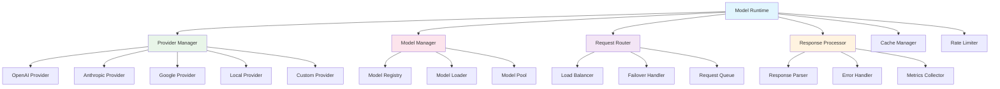

# Dify - 模型运行时与提供商集成模块详解

## 模块概述

**模型运行时与提供商集成模块**是Dify平台的核心基础设施，负责统一管理和调用各种AI模型提供商的服务。该模块提供了标准化的接口，支持OpenAI、Anthropic、Google、本地模型等多种提供商，实现了模型的无缝切换和统一管理。

## 核心架构

### 1. 模块架构图



### 2. 核心组件

#### 2.1 Provider Manager (提供商管理器)
```python
class ProviderManager:
    """
    提供商管理器
    统一管理所有AI模型提供商
    """
    
    def __init__(self):
        self.providers = {}
        self.provider_configs = {}
        self.default_provider = None
        self._register_builtin_providers()
    
    def register_provider(self, provider_name: str, provider_class: type):
        """注册模型提供商"""
        if not issubclass(provider_class, BaseProvider):
            raise ValueError("Provider must inherit from BaseProvider")
        
        self.providers[provider_name] = provider_class
        logger.info(f"Registered provider: {provider_name}")
    
    def get_provider(self, provider_name: str) -> BaseProvider:
        """获取提供商实例"""
        if provider_name not in self.providers:
            raise ProviderNotFoundError(f"Provider not found: {provider_name}")
        
        provider_class = self.providers[provider_name]
        config = self.provider_configs.get(provider_name, {})
        
        return provider_class(config)
    
    def list_providers(self) -> List[str]:
        """列出所有可用的提供商"""
        return list(self.providers.keys())
    
    def configure_provider(self, provider_name: str, config: dict):
        """配置提供商"""
        if provider_name not in self.providers:
            raise ProviderNotFoundError(f"Provider not found: {provider_name}")
        
        # 验证配置
        provider_class = self.providers[provider_name]
        provider_class.validate_config(config)
        
        self.provider_configs[provider_name] = config
        logger.info(f"Configured provider: {provider_name}")
    
    def _register_builtin_providers(self):
        """注册内置提供商"""
        builtin_providers = [
            ('openai', OpenAIProvider),
            ('anthropic', AnthropicProvider),
            ('google', GoogleProvider),
            ('azure_openai', AzureOpenAIProvider),
            ('local', LocalProvider),
            ('huggingface', HuggingFaceProvider)
        ]
        
        for name, provider_class in builtin_providers:
            self.register_provider(name, provider_class)

class BaseProvider:
    """提供商基类"""
    
    def __init__(self, config: dict):
        self.config = config
        self.client = None
        self.rate_limiter = None
        self._initialize()
    
    def _initialize(self):
        """初始化提供商"""
        self.client = self._create_client()
        self.rate_limiter = self._create_rate_limiter()
    
    def _create_client(self):
        """创建客户端，由子类实现"""
        raise NotImplementedError
    
    def _create_rate_limiter(self):
        """创建速率限制器"""
        return RateLimiter(
            requests_per_minute=self.config.get('rate_limit', 60),
            tokens_per_minute=self.config.get('token_limit', 100000)
        )
    
    async def chat_completion(
        self, 
        messages: List[dict], 
        model: str,
        **kwargs
    ) -> ChatCompletionResponse:
        """聊天完成接口"""
        raise NotImplementedError
    
    async def text_completion(
        self, 
        prompt: str, 
        model: str,
        **kwargs
    ) -> TextCompletionResponse:
        """文本完成接口"""
        raise NotImplementedError
    
    async def embedding(
        self, 
        texts: List[str], 
        model: str,
        **kwargs
    ) -> EmbeddingResponse:
        """文本嵌入接口"""
        raise NotImplementedError
    
    def list_models(self) -> List[ModelInfo]:
        """列出支持的模型"""
        raise NotImplementedError
    
    @classmethod
    def validate_config(cls, config: dict):
        """验证配置"""
        required_fields = cls.get_required_config_fields()
        for field in required_fields:
            if field not in config:
                raise ConfigValidationError(f"Missing required field: {field}")
    
    @classmethod
    def get_required_config_fields(cls) -> List[str]:
        """获取必需的配置字段"""
        return []
```

#### 2.2 OpenAI Provider (OpenAI提供商)
```python
class OpenAIProvider(BaseProvider):
    """OpenAI提供商实现"""
    
    def _create_client(self):
        """创建OpenAI客户端"""
        import openai
        
        return openai.AsyncOpenAI(
            api_key=self.config['api_key'],
            base_url=self.config.get('base_url'),
            timeout=self.config.get('timeout', 60)
        )
    
    async def chat_completion(
        self, 
        messages: List[dict], 
        model: str,
        **kwargs
    ) -> ChatCompletionResponse:
        """OpenAI聊天完成"""
        # 应用速率限制
        await self.rate_limiter.acquire()
        
        try:
            response = await self.client.chat.completions.create(
                model=model,
                messages=messages,
                temperature=kwargs.get('temperature', 0.7),
                max_tokens=kwargs.get('max_tokens'),
                top_p=kwargs.get('top_p', 1.0),
                frequency_penalty=kwargs.get('frequency_penalty', 0),
                presence_penalty=kwargs.get('presence_penalty', 0),
                stop=kwargs.get('stop'),
                stream=kwargs.get('stream', False)
            )
            
            if kwargs.get('stream', False):
                return self._handle_stream_response(response)
            else:
                return self._parse_chat_response(response)
                
        except Exception as e:
            raise ProviderAPIError(f"OpenAI API error: {str(e)}")
    
    async def text_completion(
        self, 
        prompt: str, 
        model: str,
        **kwargs
    ) -> TextCompletionResponse:
        """OpenAI文本完成"""
        await self.rate_limiter.acquire()
        
        try:
            response = await self.client.completions.create(
                model=model,
                prompt=prompt,
                temperature=kwargs.get('temperature', 0.7),
                max_tokens=kwargs.get('max_tokens', 100),
                top_p=kwargs.get('top_p', 1.0),
                frequency_penalty=kwargs.get('frequency_penalty', 0),
                presence_penalty=kwargs.get('presence_penalty', 0),
                stop=kwargs.get('stop')
            )
            
            return self._parse_completion_response(response)
            
        except Exception as e:
            raise ProviderAPIError(f"OpenAI API error: {str(e)}")
    
    async def embedding(
        self, 
        texts: List[str], 
        model: str,
        **kwargs
    ) -> EmbeddingResponse:
        """OpenAI文本嵌入"""
        await self.rate_limiter.acquire()
        
        try:
            response = await self.client.embeddings.create(
                model=model,
                input=texts
            )
            
            return EmbeddingResponse(
                embeddings=[data.embedding for data in response.data],
                model=response.model,
                usage=TokenUsage(
                    prompt_tokens=response.usage.prompt_tokens,
                    total_tokens=response.usage.total_tokens
                )
            )
            
        except Exception as e:
            raise ProviderAPIError(f"OpenAI API error: {str(e)}")
    
    def list_models(self) -> List[ModelInfo]:
        """列出OpenAI支持的模型"""
        return [
            ModelInfo(
                id="gpt-4",
                name="GPT-4",
                type="chat",
                max_tokens=8192,
                supports_streaming=True
            ),
            ModelInfo(
                id="gpt-4-turbo",
                name="GPT-4 Turbo",
                type="chat",
                max_tokens=128000,
                supports_streaming=True
            ),
            ModelInfo(
                id="gpt-3.5-turbo",
                name="GPT-3.5 Turbo",
                type="chat",
                max_tokens=4096,
                supports_streaming=True
            ),
            ModelInfo(
                id="text-embedding-ada-002",
                name="Text Embedding Ada 002",
                type="embedding",
                max_tokens=8191
            )
        ]
    
    @classmethod
    def get_required_config_fields(cls) -> List[str]:
        return ['api_key']
    
    def _parse_chat_response(self, response) -> ChatCompletionResponse:
        """解析聊天响应"""
        choice = response.choices[0]
        
        return ChatCompletionResponse(
            id=response.id,
            model=response.model,
            content=choice.message.content,
            role=choice.message.role,
            finish_reason=choice.finish_reason,
            usage=TokenUsage(
                prompt_tokens=response.usage.prompt_tokens,
                completion_tokens=response.usage.completion_tokens,
                total_tokens=response.usage.total_tokens
            ),
            created=response.created
        )
    
    async def _handle_stream_response(self, response):
        """处理流式响应"""
        async for chunk in response:
            if chunk.choices:
                choice = chunk.choices[0]
                if choice.delta.content:
                    yield StreamChunk(
                        id=chunk.id,
                        model=chunk.model,
                        content=choice.delta.content,
                        finish_reason=choice.finish_reason
                    )
```

#### 2.3 Model Manager (模型管理器)
```python
class ModelManager:
    """
    模型管理器
    管理模型的生命周期和调用
    """
    
    def __init__(self, provider_manager: ProviderManager):
        self.provider_manager = provider_manager
        self.model_registry = ModelRegistry()
        self.model_pool = ModelPool()
        self.request_router = RequestRouter()
    
    async def chat_completion(
        self, 
        model_config: dict,
        messages: List[dict],
        **kwargs
    ) -> ChatCompletionResponse:
        """统一的聊天完成接口"""
        # 解析模型配置
        provider_name = model_config['provider']
        model_name = model_config['model']
        
        # 获取提供商
        provider = self.provider_manager.get_provider(provider_name)
        
        # 路由请求
        routed_config = await self.request_router.route_request(
            provider_name, model_name, 'chat_completion'
        )
        
        # 调用提供商
        try:
            response = await provider.chat_completion(
                messages=messages,
                model=routed_config.get('model', model_name),
                **kwargs
            )
            
            # 记录使用情况
            await self._record_usage(provider_name, model_name, response.usage)
            
            return response
            
        except Exception as e:
            # 尝试故障转移
            fallback_response = await self._handle_fallback(
                model_config, messages, e, **kwargs
            )
            if fallback_response:
                return fallback_response
            
            raise e
    
    async def text_completion(
        self, 
        model_config: dict,
        prompt: str,
        **kwargs
    ) -> TextCompletionResponse:
        """统一的文本完成接口"""
        provider_name = model_config['provider']
        model_name = model_config['model']
        
        provider = self.provider_manager.get_provider(provider_name)
        
        try:
            response = await provider.text_completion(
                prompt=prompt,
                model=model_name,
                **kwargs
            )
            
            await self._record_usage(provider_name, model_name, response.usage)
            return response
            
        except Exception as e:
            fallback_response = await self._handle_fallback(
                model_config, prompt, e, **kwargs
            )
            if fallback_response:
                return fallback_response
            
            raise e
    
    async def embedding(
        self, 
        model_config: dict,
        texts: List[str],
        **kwargs
    ) -> EmbeddingResponse:
        """统一的嵌入接口"""
        provider_name = model_config['provider']
        model_name = model_config['model']
        
        provider = self.provider_manager.get_provider(provider_name)
        
        try:
            response = await provider.embedding(
                texts=texts,
                model=model_name,
                **kwargs
            )
            
            await self._record_usage(provider_name, model_name, response.usage)
            return response
            
        except Exception as e:
            raise ProviderAPIError(f"Embedding failed: {str(e)}")
    
    async def stream_chat_completion(
        self, 
        model_config: dict,
        messages: List[dict],
        **kwargs
    ) -> AsyncIterator[StreamChunk]:
        """流式聊天完成"""
        provider_name = model_config['provider']
        model_name = model_config['model']
        
        provider = self.provider_manager.get_provider(provider_name)
        
        kwargs['stream'] = True
        
        try:
            async for chunk in provider.chat_completion(
                messages=messages,
                model=model_name,
                **kwargs
            ):
                yield chunk
                
        except Exception as e:
            raise ProviderAPIError(f"Stream completion failed: {str(e)}")
    
    def list_available_models(self, provider_name: str = None) -> List[ModelInfo]:
        """列出可用模型"""
        if provider_name:
            provider = self.provider_manager.get_provider(provider_name)
            return provider.list_models()
        
        all_models = []
        for provider_name in self.provider_manager.list_providers():
            try:
                provider = self.provider_manager.get_provider(provider_name)
                models = provider.list_models()
                for model in models:
                    model.provider = provider_name
                all_models.extend(models)
            except Exception as e:
                logger.warning(f"Failed to list models for {provider_name}: {e}")
        
        return all_models
    
    async def _handle_fallback(
        self, 
        model_config: dict, 
        input_data, 
        error: Exception,
        **kwargs
    ):
        """处理故障转移"""
        fallback_config = model_config.get('fallback')
        if not fallback_config:
            return None
        
        logger.warning(f"Primary model failed, trying fallback: {error}")
        
        try:
            if isinstance(input_data, list):  # chat completion
                return await self.chat_completion(
                    fallback_config, input_data, **kwargs
                )
            else:  # text completion
                return await self.text_completion(
                    fallback_config, input_data, **kwargs
                )
        except Exception as fallback_error:
            logger.error(f"Fallback also failed: {fallback_error}")
            return None
    
    async def _record_usage(
        self, 
        provider: str, 
        model: str, 
        usage: TokenUsage
    ):
        """记录使用情况"""
        usage_record = {
            'provider': provider,
            'model': model,
            'prompt_tokens': usage.prompt_tokens,
            'completion_tokens': usage.completion_tokens,
            'total_tokens': usage.total_tokens,
            'timestamp': datetime.utcnow()
        }
        
        # 异步记录到数据库
        asyncio.create_task(self._save_usage_record(usage_record))
```

## 请求路由与负载均衡

### 1. 请求路由器

```python
class RequestRouter:
    """
    请求路由器
    实现负载均衡和故障转移
    """
    
    def __init__(self):
        self.routing_rules = {}
        self.load_balancer = LoadBalancer()
        self.health_checker = HealthChecker()
    
    async def route_request(
        self, 
        provider: str, 
        model: str, 
        request_type: str
    ) -> dict:
        """路由请求到最佳实例"""
        # 获取路由规则
        rule_key = f"{provider}:{model}:{request_type}"
        routing_rule = self.routing_rules.get(rule_key, {})
        
        # 检查健康状态
        healthy_instances = await self.health_checker.get_healthy_instances(
            provider, model
        )
        
        if not healthy_instances:
            raise NoHealthyInstanceError(f"No healthy instances for {provider}:{model}")
        
        # 负载均衡选择实例
        selected_instance = self.load_balancer.select_instance(
            healthy_instances, routing_rule.get('strategy', 'round_robin')
        )
        
        return {
            'instance': selected_instance,
            'model': selected_instance.get('model_mapping', {}).get(model, model)
        }
    
    def add_routing_rule(
        self, 
        provider: str, 
        model: str, 
        request_type: str,
        rule: dict
    ):
        """添加路由规则"""
        rule_key = f"{provider}:{model}:{request_type}"
        self.routing_rules[rule_key] = rule

class LoadBalancer:
    """负载均衡器"""
    
    def __init__(self):
        self.round_robin_counters = {}
        self.weighted_counters = {}
    
    def select_instance(self, instances: List[dict], strategy: str) -> dict:
        """选择实例"""
        if not instances:
            raise ValueError("No instances available")
        
        if len(instances) == 1:
            return instances[0]
        
        if strategy == 'round_robin':
            return self._round_robin_select(instances)
        elif strategy == 'weighted':
            return self._weighted_select(instances)
        elif strategy == 'least_connections':
            return self._least_connections_select(instances)
        elif strategy == 'random':
            return random.choice(instances)
        else:
            return instances[0]
    
    def _round_robin_select(self, instances: List[dict]) -> dict:
        """轮询选择"""
        instance_key = hash(tuple(sorted([i['id'] for i in instances])))
        
        if instance_key not in self.round_robin_counters:
            self.round_robin_counters[instance_key] = 0
        
        index = self.round_robin_counters[instance_key] % len(instances)
        self.round_robin_counters[instance_key] += 1
        
        return instances[index]
    
    def _weighted_select(self, instances: List[dict]) -> dict:
        """加权选择"""
        total_weight = sum(instance.get('weight', 1) for instance in instances)
        random_weight = random.uniform(0, total_weight)
        
        current_weight = 0
        for instance in instances:
            current_weight += instance.get('weight', 1)
            if random_weight <= current_weight:
                return instance
        
        return instances[-1]
    
    def _least_connections_select(self, instances: List[dict]) -> dict:
        """最少连接选择"""
        return min(instances, key=lambda x: x.get('active_connections', 0))

class HealthChecker:
    """健康检查器"""
    
    def __init__(self):
        self.health_status = {}
        self.check_interval = 30  # 秒
        self._start_health_check_task()
    
    async def get_healthy_instances(
        self, 
        provider: str, 
        model: str
    ) -> List[dict]:
        """获取健康的实例"""
        key = f"{provider}:{model}"
        instances = self.health_status.get(key, [])
        
        return [
            instance for instance in instances 
            if instance.get('healthy', True)
        ]
    
    async def check_instance_health(self, instance: dict) -> bool:
        """检查实例健康状态"""
        try:
            # 发送健康检查请求
            health_check_url = instance.get('health_check_url')
            if health_check_url:
                async with aiohttp.ClientSession() as session:
                    async with session.get(
                        health_check_url, 
                        timeout=aiohttp.ClientTimeout(total=5)
                    ) as response:
                        return response.status == 200
            
            # 如果没有健康检查URL，尝试简单的模型调用
            provider_name = instance['provider']
            provider = self.provider_manager.get_provider(provider_name)
            
            test_response = await provider.chat_completion(
                messages=[{"role": "user", "content": "test"}],
                model=instance['model'],
                max_tokens=1
            )
            
            return True
            
        except Exception as e:
            logger.warning(f"Health check failed for {instance['id']}: {e}")
            return False
    
    def _start_health_check_task(self):
        """启动健康检查任务"""
        asyncio.create_task(self._periodic_health_check())
    
    async def _periodic_health_check(self):
        """定期健康检查"""
        while True:
            try:
                for key, instances in self.health_status.items():
                    for instance in instances:
                        healthy = await self.check_instance_health(instance)
                        instance['healthy'] = healthy
                        instance['last_check'] = datetime.utcnow()
                
                await asyncio.sleep(self.check_interval)
                
            except Exception as e:
                logger.error(f"Health check error: {e}")
                await asyncio.sleep(self.check_interval)
```

## 缓存与性能优化

### 1. 响应缓存

```python
class ResponseCache:
    """响应缓存"""
    
    def __init__(self, redis_client):
        self.redis_client = redis_client
        self.default_ttl = 3600  # 1小时
        self.cache_strategies = {
            'chat_completion': self._chat_completion_cache_key,
            'text_completion': self._text_completion_cache_key,
            'embedding': self._embedding_cache_key
        }
    
    async def get_cached_response(
        self, 
        request_type: str,
        model_config: dict,
        input_data: any,
        **kwargs
    ) -> Optional[any]:
        """获取缓存的响应"""
        cache_key = self._generate_cache_key(
            request_type, model_config, input_data, **kwargs
        )
        
        cached_data = await self.redis_client.get(cache_key)
        if cached_data:
            return json.loads(cached_data)
        
        return None
    
    async def cache_response(
        self, 
        request_type: str,
        model_config: dict,
        input_data: any,
        response: any,
        ttl: int = None,
        **kwargs
    ):
        """缓存响应"""
        cache_key = self._generate_cache_key(
            request_type, model_config, input_data, **kwargs
        )
        
        cache_data = json.dumps(response.to_dict())
        ttl = ttl or self.default_ttl
        
        await self.redis_client.setex(cache_key, ttl, cache_data)
    
    def _generate_cache_key(
        self, 
        request_type: str,
        model_config: dict,
        input_data: any,
        **kwargs
    ) -> str:
        """生成缓存键"""
        strategy = self.cache_strategies.get(request_type)
        if not strategy:
            return None
        
        return strategy(model_config, input_data, **kwargs)
    
    def _chat_completion_cache_key(
        self, 
        model_config: dict, 
        messages: List[dict],
        **kwargs
    ) -> str:
        """聊天完成缓存键"""
        # 只缓存确定性参数的请求
        if kwargs.get('temperature', 0.7) > 0:
            return None
        
        key_data = {
            'type': 'chat_completion',
            'provider': model_config['provider'],
            'model': model_config['model'],
            'messages': messages,
            'max_tokens': kwargs.get('max_tokens'),
            'top_p': kwargs.get('top_p', 1.0)
        }
        
        key_string = json.dumps(key_data, sort_keys=True)
        return f"model_cache:{hashlib.md5(key_string.encode()).hexdigest()}"
    
    def _embedding_cache_key(
        self, 
        model_config: dict, 
        texts: List[str],
        **kwargs
    ) -> str:
        """嵌入缓存键"""
        key_data = {
            'type': 'embedding',
            'provider': model_config['provider'],
            'model': model_config['model'],
            'texts': texts
        }
        
        key_string = json.dumps(key_data, sort_keys=True)
        return f"embedding_cache:{hashlib.md5(key_string.encode()).hexdigest()}"

class BatchProcessor:
    """批处理器"""
    
    def __init__(self, max_batch_size: int = 20, max_wait_time: float = 0.1):
        self.max_batch_size = max_batch_size
        self.max_wait_time = max_wait_time
        self.pending_requests = {}
        self.batch_processors = {}
    
    async def process_request(
        self, 
        request_type: str,
        model_config: dict,
        input_data: any,
        **kwargs
    ) -> any:
        """处理请求（可能批处理）"""
        batch_key = self._get_batch_key(request_type, model_config)
        
        # 检查是否支持批处理
        if not self._supports_batching(request_type):
            return await self._process_single_request(
                request_type, model_config, input_data, **kwargs
            )
        
        # 添加到批处理队列
        request_future = asyncio.Future()
        
        if batch_key not in self.pending_requests:
            self.pending_requests[batch_key] = []
            # 启动批处理任务
            asyncio.create_task(self._process_batch(batch_key, request_type, model_config))
        
        self.pending_requests[batch_key].append({
            'input_data': input_data,
            'kwargs': kwargs,
            'future': request_future
        })
        
        # 如果达到批处理大小，立即处理
        if len(self.pending_requests[batch_key]) >= self.max_batch_size:
            asyncio.create_task(self._flush_batch(batch_key, request_type, model_config))
        
        return await request_future
    
    async def _process_batch(self, batch_key: str, request_type: str, model_config: dict):
        """处理批次"""
        await asyncio.sleep(self.max_wait_time)
        await self._flush_batch(batch_key, request_type, model_config)
    
    async def _flush_batch(self, batch_key: str, request_type: str, model_config: dict):
        """刷新批次"""
        if batch_key not in self.pending_requests:
            return
        
        requests = self.pending_requests.pop(batch_key)
        if not requests:
            return
        
        try:
            if request_type == 'embedding':
                await self._process_embedding_batch(model_config, requests)
            else:
                # 其他类型暂不支持批处理
                for request in requests:
                    result = await self._process_single_request(
                        request_type, model_config, 
                        request['input_data'], **request['kwargs']
                    )
                    request['future'].set_result(result)
                    
        except Exception as e:
            for request in requests:
                request['future'].set_exception(e)
    
    async def _process_embedding_batch(self, model_config: dict, requests: List[dict]):
        """处理嵌入批次"""
        # 合并所有文本
        all_texts = []
        request_indices = []
        
        for i, request in enumerate(requests):
            texts = request['input_data']
            request_indices.extend([i] * len(texts))
            all_texts.extend(texts)
        
        # 批量调用嵌入API
        provider = self.provider_manager.get_provider(model_config['provider'])
        batch_response = await provider.embedding(
            texts=all_texts,
            model=model_config['model']
        )
        
        # 分发结果
        current_index = 0
        for i, request in enumerate(requests):
            text_count = len(request['input_data'])
            embeddings = batch_response.embeddings[current_index:current_index + text_count]
            
            response = EmbeddingResponse(
                embeddings=embeddings,
                model=batch_response.model,
                usage=TokenUsage(
                    prompt_tokens=batch_response.usage.prompt_tokens // len(requests),
                    total_tokens=batch_response.usage.total_tokens // len(requests)
                )
            )
            
            request['future'].set_result(response)
            current_index += text_count
```

## 监控与指标

### 1. 性能监控

```python
class ModelMetricsCollector:
    """模型指标收集器"""
    
    def __init__(self):
        self.metrics = defaultdict(list)
        self.counters = defaultdict(int)
        self.gauges = defaultdict(float)
    
    def record_request(
        self, 
        provider: str, 
        model: str, 
        request_type: str,
        latency: float,
        tokens_used: int,
        success: bool
    ):
        """记录请求指标"""
        base_key = f"{provider}.{model}.{request_type}"
        
        # 记录延迟
        self.metrics[f"{base_key}.latency"].append(latency)
        
        # 记录token使用量
        self.metrics[f"{base_key}.tokens"].append(tokens_used)
        
        # 记录请求计数
        self.counters[f"{base_key}.requests"] += 1
        
        # 记录成功/失败
        if success:
            self.counters[f"{base_key}.success"] += 1
        else:
            self.counters[f"{base_key}.errors"] += 1
        
        # 计算成功率
        total_requests = self.counters[f"{base_key}.requests"]
        success_count = self.counters[f"{base_key}.success"]
        self.gauges[f"{base_key}.success_rate"] = success_count / total_requests
    
    def get_metrics_summary(self, time_window: int = 3600) -> dict:
        """获取指标摘要"""
        summary = {}
        
        for key, values in self.metrics.items():
            if not values:
                continue
            
            # 过滤时间窗口内的数据
            recent_values = values[-time_window:] if len(values) > time_window else values
            
            summary[key] = {
                'count': len(recent_values),
                'avg': sum(recent_values) / len(recent_values),
                'min': min(recent_values),
                'max': max(recent_values),
                'p50': self._percentile(recent_values, 50),
                'p95': self._percentile(recent_values, 95),
                'p99': self._percentile(recent_values, 99)
            }
        
        # 添加计数器和仪表盘
        summary.update({
            'counters': dict(self.counters),
            'gauges': dict(self.gauges)
        })
        
        return summary
    
    def _percentile(self, values: List[float], percentile: int) -> float:
        """计算百分位数"""
        sorted_values = sorted(values)
        index = int(len(sorted_values) * percentile / 100)
        return sorted_values[min(index, len(sorted_values) - 1)]

class CostTracker:
    """成本跟踪器"""
    
    def __init__(self):
        self.pricing_config = self._load_pricing_config()
        self.usage_records = []
    
    def record_usage(
        self, 
        provider: str, 
        model: str,
        usage: TokenUsage,
        timestamp: datetime = None
    ):
        """记录使用情况"""
        timestamp = timestamp or datetime.utcnow()
        
        # 计算成本
        cost = self._calculate_cost(provider, model, usage)
        
        record = {
            'provider': provider,
            'model': model,
            'prompt_tokens': usage.prompt_tokens,
            'completion_tokens': usage.completion_tokens,
            'total_tokens': usage.total_tokens,
            'cost': cost,
            'timestamp': timestamp
        }
        
        self.usage_records.append(record)
    
    def get_cost_summary(
        self, 
        start_time: datetime = None,
        end_time: datetime = None,
        group_by: str = 'provider'
    ) -> dict:
        """获取成本摘要"""
        # 过滤时间范围
        filtered_records = self.usage_records
        if start_time:
            filtered_records = [r for r in filtered_records if r['timestamp'] >= start_time]
        if end_time:
            filtered_records = [r for r in filtered_records if r['timestamp'] <= end_time]
        
        # 按指定字段分组
        grouped_costs = defaultdict(float)
        grouped_tokens = defaultdict(int)
        
        for record in filtered_records:
            key = record[group_by]
            grouped_costs[key] += record['cost']
            grouped_tokens[key] += record['total_tokens']
        
        return {
            'total_cost': sum(grouped_costs.values()),
            'total_tokens': sum(grouped_tokens.values()),
            'breakdown': {
                'costs': dict(grouped_costs),
                'tokens': dict(grouped_tokens)
            }
        }
    
    def _calculate_cost(self, provider: str, model: str, usage: TokenUsage) -> float:
        """计算成本"""
        pricing = self.pricing_config.get(provider, {}).get(model, {})
        
        if not pricing:
            return 0.0
        
        prompt_cost = usage.prompt_tokens * pricing.get('prompt_price_per_token', 0)
        completion_cost = usage.completion_tokens * pricing.get('completion_price_per_token', 0)
        
        return prompt_cost + completion_cost
    
    def _load_pricing_config(self) -> dict:
        """加载定价配置"""
        return {
            'openai': {
                'gpt-4': {
                    'prompt_price_per_token': 0.00003,
                    'completion_price_per_token': 0.00006
                },
                'gpt-3.5-turbo': {
                    'prompt_price_per_token': 0.0000015,
                    'completion_price_per_token': 0.000002
                }
            },
            'anthropic': {
                'claude-3-opus': {
                    'prompt_price_per_token': 0.000015,
                    'completion_price_per_token': 0.000075
                }
            }
        }
```

这个模型运行时与提供商集成模块设计提供了完整的多提供商支持、负载均衡、缓存优化、监控指标等功能，是构建可扩展AI应用的核心基础设施。 