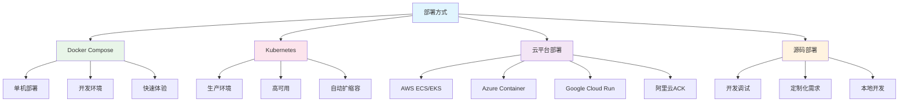

# Dify - 部署运维与监控模块详解

## 模块概述

**部署运维与监控模块**是Dify平台的基础设施管理层，负责应用的部署、运维、监控、日志管理、性能优化等关键功能。该模块确保Dify平台能够稳定、高效地运行在各种环境中，并提供完整的可观测性支持。

## 部署架构

### 1. 部署方式对比



### 2. Docker Compose部署

```yaml
# docker-compose.yaml
version: '3.8'

services:
  # Web前端服务
  web:
    image: langgenius/dify-web:latest
    restart: always
    environment:
      - NEXT_PUBLIC_API_PREFIX=http://api:5001/console/api
      - NEXT_PUBLIC_PUBLIC_API_PREFIX=http://api:5001/api
    ports:
      - "3000:3000"
    depends_on:
      - api
    networks:
      - dify-network
    volumes:
      - web_data:/app/data
    healthcheck:
      test: ["CMD", "curl", "-f", "http://localhost:3000/health"]
      interval: 30s
      timeout: 10s
      retries: 3

  # API后端服务
  api:
    image: langgenius/dify-api:latest
    restart: always
    environment:
      # 数据库配置
      - DB_USERNAME=dify
      - DB_PASSWORD=${DB_PASSWORD}
      - DB_HOST=db
      - DB_PORT=5432
      - DB_DATABASE=dify
      
      # Redis配置
      - REDIS_HOST=redis
      - REDIS_PORT=6379
      - REDIS_PASSWORD=${REDIS_PASSWORD}
      
      # 向量数据库配置
      - VECTOR_STORE=weaviate
      - WEAVIATE_ENDPOINT=http://weaviate:8080
      
      # 应用配置
      - SECRET_KEY=${SECRET_KEY}
      - APP_WEB_URL=http://localhost:3000
      - SERVICE_API_URL=http://localhost:5001
      
      # 文件存储配置
      - STORAGE_TYPE=local
      - STORAGE_LOCAL_PATH=/app/storage
      
      # 日志配置
      - LOG_LEVEL=INFO
      - LOG_FILE=/app/logs/api.log
    ports:
      - "5001:5001"
    depends_on:
      - db
      - redis
      - weaviate
    networks:
      - dify-network
    volumes:
      - api_storage:/app/storage
      - api_logs:/app/logs
    healthcheck:
      test: ["CMD", "curl", "-f", "http://localhost:5001/health"]
      interval: 30s
      timeout: 10s
      retries: 3

  # Worker服务（处理异步任务）
  worker:
    image: langgenius/dify-api:latest
    restart: always
    command: celery -A app.celery worker -P gevent -c 1 --loglevel INFO -Q dataset,generation,mail
    environment:
      - DB_USERNAME=dify
      - DB_PASSWORD=${DB_PASSWORD}
      - DB_HOST=db
      - DB_PORT=5432
      - DB_DATABASE=dify
      - REDIS_HOST=redis
      - REDIS_PORT=6379
      - REDIS_PASSWORD=${REDIS_PASSWORD}
      - VECTOR_STORE=weaviate
      - WEAVIATE_ENDPOINT=http://weaviate:8080
    depends_on:
      - db
      - redis
      - weaviate
    networks:
      - dify-network
    volumes:
      - api_storage:/app/storage
      - worker_logs:/app/logs

  # 数据库服务
  db:
    image: postgres:15-alpine
    restart: always
    environment:
      - POSTGRES_USER=dify
      - POSTGRES_PASSWORD=${DB_PASSWORD}
      - POSTGRES_DB=dify
      - PGDATA=/var/lib/postgresql/data/pgdata
    ports:
      - "5432:5432"
    networks:
      - dify-network
    volumes:
      - db_data:/var/lib/postgresql/data
      - ./init-scripts:/docker-entrypoint-initdb.d
    healthcheck:
      test: ["CMD-SHELL", "pg_isready -U dify"]
      interval: 30s
      timeout: 10s
      retries: 3

  # Redis缓存服务
  redis:
    image: redis:6-alpine
    restart: always
    command: redis-server --requirepass ${REDIS_PASSWORD}
    ports:
      - "6379:6379"
    networks:
      - dify-network
    volumes:
      - redis_data:/data
    healthcheck:
      test: ["CMD", "redis-cli", "ping"]
      interval: 30s
      timeout: 10s
      retries: 3

  # 向量数据库服务
  weaviate:
    image: semitechnologies/weaviate:1.21.8
    restart: always
    environment:
      - QUERY_DEFAULTS_LIMIT=25
      - AUTHENTICATION_ANONYMOUS_ACCESS_ENABLED=true
      - PERSISTENCE_DATA_PATH=/var/lib/weaviate
      - DEFAULT_VECTORIZER_MODULE=none
      - CLUSTER_HOSTNAME=node1
    ports:
      - "8080:8080"
    networks:
      - dify-network
    volumes:
      - weaviate_data:/var/lib/weaviate
    healthcheck:
      test: ["CMD", "curl", "-f", "http://localhost:8080/v1/.well-known/ready"]
      interval: 30s
      timeout: 10s
      retries: 3

  # Nginx反向代理
  nginx:
    image: nginx:alpine
    restart: always
    ports:
      - "80:80"
      - "443:443"
    networks:
      - dify-network
    volumes:
      - ./nginx/nginx.conf:/etc/nginx/nginx.conf
      - ./nginx/ssl:/etc/nginx/ssl
      - nginx_logs:/var/log/nginx
    depends_on:
      - web
      - api

networks:
  dify-network:
    driver: bridge

volumes:
  web_data:
  api_storage:
  api_logs:
  worker_logs:
  db_data:
  redis_data:
  weaviate_data:
  nginx_logs:
```

### 3. Kubernetes部署

```yaml
# k8s/namespace.yaml
apiVersion: v1
kind: Namespace
metadata:
  name: dify
  labels:
    name: dify

---
# k8s/configmap.yaml
apiVersion: v1
kind: ConfigMap
metadata:
  name: dify-config
  namespace: dify
data:
  DB_HOST: "postgresql"
  DB_PORT: "5432"
  DB_DATABASE: "dify"
  REDIS_HOST: "redis"
  REDIS_PORT: "6379"
  VECTOR_STORE: "weaviate"
  WEAVIATE_ENDPOINT: "http://weaviate:8080"
  LOG_LEVEL: "INFO"
  STORAGE_TYPE: "s3"

---
# k8s/secret.yaml
apiVersion: v1
kind: Secret
metadata:
  name: dify-secrets
  namespace: dify
type: Opaque
data:
  DB_PASSWORD: <base64-encoded-password>
  REDIS_PASSWORD: <base64-encoded-password>
  SECRET_KEY: <base64-encoded-secret>
  AWS_ACCESS_KEY_ID: <base64-encoded-key>
  AWS_SECRET_ACCESS_KEY: <base64-encoded-secret>

---
# k8s/web-deployment.yaml
apiVersion: apps/v1
kind: Deployment
metadata:
  name: dify-web
  namespace: dify
  labels:
    app: dify-web
spec:
  replicas: 2
  selector:
    matchLabels:
      app: dify-web
  template:
    metadata:
      labels:
        app: dify-web
    spec:
      containers:
      - name: web
        image: langgenius/dify-web:latest
        ports:
        - containerPort: 3000
        env:
        - name: NEXT_PUBLIC_API_PREFIX
          value: "http://dify-api:5001/console/api"
        - name: NEXT_PUBLIC_PUBLIC_API_PREFIX
          value: "http://dify-api:5001/api"
        resources:
          requests:
            memory: "256Mi"
            cpu: "250m"
          limits:
            memory: "512Mi"
            cpu: "500m"
        livenessProbe:
          httpGet:
            path: /health
            port: 3000
          initialDelaySeconds: 30
          periodSeconds: 10
        readinessProbe:
          httpGet:
            path: /health
            port: 3000
          initialDelaySeconds: 5
          periodSeconds: 5

---
# k8s/api-deployment.yaml
apiVersion: apps/v1
kind: Deployment
metadata:
  name: dify-api
  namespace: dify
  labels:
    app: dify-api
spec:
  replicas: 3
  selector:
    matchLabels:
      app: dify-api
  template:
    metadata:
      labels:
        app: dify-api
    spec:
      containers:
      - name: api
        image: langgenius/dify-api:latest
        ports:
        - containerPort: 5001
        envFrom:
        - configMapRef:
            name: dify-config
        - secretRef:
            name: dify-secrets
        resources:
          requests:
            memory: "512Mi"
            cpu: "500m"
          limits:
            memory: "1Gi"
            cpu: "1000m"
        volumeMounts:
        - name: storage
          mountPath: /app/storage
        - name: logs
          mountPath: /app/logs
        livenessProbe:
          httpGet:
            path: /health
            port: 5001
          initialDelaySeconds: 60
          periodSeconds: 10
        readinessProbe:
          httpGet:
            path: /health
            port: 5001
          initialDelaySeconds: 10
          periodSeconds: 5
      volumes:
      - name: storage
        persistentVolumeClaim:
          claimName: dify-storage-pvc
      - name: logs
        persistentVolumeClaim:
          claimName: dify-logs-pvc

---
# k8s/hpa.yaml
apiVersion: autoscaling/v2
kind: HorizontalPodAutoscaler
metadata:
  name: dify-api-hpa
  namespace: dify
spec:
  scaleTargetRef:
    apiVersion: apps/v1
    kind: Deployment
    name: dify-api
  minReplicas: 2
  maxReplicas: 10
  metrics:
  - type: Resource
    resource:
      name: cpu
      target:
        type: Utilization
        averageUtilization: 70
  - type: Resource
    resource:
      name: memory
      target:
        type: Utilization
        averageUtilization: 80

---
# k8s/service.yaml
apiVersion: v1
kind: Service
metadata:
  name: dify-web
  namespace: dify
spec:
  selector:
    app: dify-web
  ports:
  - port: 3000
    targetPort: 3000
  type: ClusterIP

---
apiVersion: v1
kind: Service
metadata:
  name: dify-api
  namespace: dify
spec:
  selector:
    app: dify-api
  ports:
  - port: 5001
    targetPort: 5001
  type: ClusterIP

---
# k8s/ingress.yaml
apiVersion: networking.k8s.io/v1
kind: Ingress
metadata:
  name: dify-ingress
  namespace: dify
  annotations:
    kubernetes.io/ingress.class: nginx
    cert-manager.io/cluster-issuer: letsencrypt-prod
    nginx.ingress.kubernetes.io/ssl-redirect: "true"
    nginx.ingress.kubernetes.io/proxy-body-size: "100m"
spec:
  tls:
  - hosts:
    - dify.example.com
    secretName: dify-tls
  rules:
  - host: dify.example.com
    http:
      paths:
      - path: /api
        pathType: Prefix
        backend:
          service:
            name: dify-api
            port:
              number: 5001
      - path: /console/api
        pathType: Prefix
        backend:
          service:
            name: dify-api
            port:
              number: 5001
      - path: /
        pathType: Prefix
        backend:
          service:
            name: dify-web
            port:
              number: 3000
```

## 监控系统

### 1. Prometheus监控配置

```yaml
# monitoring/prometheus.yaml
apiVersion: v1
kind: ConfigMap
metadata:
  name: prometheus-config
  namespace: monitoring
data:
  prometheus.yml: |
    global:
      scrape_interval: 15s
      evaluation_interval: 15s
    
    rule_files:
      - "dify_rules.yml"
    
    alerting:
      alertmanagers:
        - static_configs:
            - targets:
              - alertmanager:9093
    
    scrape_configs:
      # Dify API服务监控
      - job_name: 'dify-api'
        static_configs:
          - targets: ['dify-api:5001']
        metrics_path: /metrics
        scrape_interval: 10s
        scrape_timeout: 5s
      
      # Dify Web服务监控
      - job_name: 'dify-web'
        static_configs:
          - targets: ['dify-web:3000']
        metrics_path: /metrics
        scrape_interval: 30s
      
      # PostgreSQL监控
      - job_name: 'postgresql'
        static_configs:
          - targets: ['postgres-exporter:9187']
        scrape_interval: 30s
      
      # Redis监控
      - job_name: 'redis'
        static_configs:
          - targets: ['redis-exporter:9121']
        scrape_interval: 30s
      
      # Weaviate监控
      - job_name: 'weaviate'
        static_configs:
          - targets: ['weaviate:8080']
        metrics_path: /v1/metrics
        scrape_interval: 30s
      
      # Node监控
      - job_name: 'node'
        static_configs:
          - targets: ['node-exporter:9100']
        scrape_interval: 30s

  dify_rules.yml: |
    groups:
    - name: dify_alerts
      rules:
      # API服务可用性告警
      - alert: DifyAPIDown
        expr: up{job="dify-api"} == 0
        for: 1m
        labels:
          severity: critical
        annotations:
          summary: "Dify API服务不可用"
          description: "Dify API服务已经停止响应超过1分钟"
      
      # 高错误率告警
      - alert: DifyHighErrorRate
        expr: rate(dify_api_requests_total{status=~"5.."}[5m]) / rate(dify_api_requests_total[5m]) > 0.1
        for: 5m
        labels:
          severity: warning
        annotations:
          summary: "Dify API错误率过高"
          description: "过去5分钟内API错误率超过10%"
      
      # 响应时间告警
      - alert: DifyHighLatency
        expr: histogram_quantile(0.95, rate(dify_api_request_duration_seconds_bucket[5m])) > 2
        for: 5m
        labels:
          severity: warning
        annotations:
          summary: "Dify API响应时间过长"
          description: "95%的请求响应时间超过2秒"
      
      # 数据库连接告警
      - alert: DifyDatabaseConnectionHigh
        expr: dify_database_connections_active / dify_database_connections_max > 0.8
        for: 2m
        labels:
          severity: warning
        annotations:
          summary: "数据库连接数过高"
          description: "数据库连接使用率超过80%"
      
      # 内存使用告警
      - alert: DifyHighMemoryUsage
        expr: (container_memory_usage_bytes{pod=~"dify-.*"} / container_spec_memory_limit_bytes) > 0.9
        for: 5m
        labels:
          severity: warning
        annotations:
          summary: "Dify服务内存使用率过高"
          description: "{{ $labels.pod }}内存使用率超过90%"
      
      # CPU使用告警
      - alert: DifyHighCPUUsage
        expr: rate(container_cpu_usage_seconds_total{pod=~"dify-.*"}[5m]) > 0.8
        for: 5m
        labels:
          severity: warning
        annotations:
          summary: "Dify服务CPU使用率过高"
          description: "{{ $labels.pod }}CPU使用率超过80%"

---
# monitoring/grafana-dashboard.json
{
  "dashboard": {
    "id": null,
    "title": "Dify Platform Dashboard",
    "tags": ["dify"],
    "timezone": "browser",
    "panels": [
      {
        "id": 1,
        "title": "API请求量",
        "type": "graph",
        "targets": [
          {
            "expr": "rate(dify_api_requests_total[5m])",
            "legendFormat": "{{method}} {{endpoint}}"
          }
        ],
        "yAxes": [
          {
            "label": "请求/秒"
          }
        ]
      },
      {
        "id": 2,
        "title": "响应时间分布",
        "type": "heatmap",
        "targets": [
          {
            "expr": "rate(dify_api_request_duration_seconds_bucket[5m])",
            "legendFormat": "{{le}}"
          }
        ]
      },
      {
        "id": 3,
        "title": "错误率",
        "type": "stat",
        "targets": [
          {
            "expr": "rate(dify_api_requests_total{status=~\"5..\"}[5m]) / rate(dify_api_requests_total[5m]) * 100",
            "legendFormat": "错误率"
          }
        ],
        "fieldConfig": {
          "defaults": {
            "unit": "percent",
            "thresholds": {
              "steps": [
                {"color": "green", "value": 0},
                {"color": "yellow", "value": 5},
                {"color": "red", "value": 10}
              ]
            }
          }
        }
      },
      {
        "id": 4,
        "title": "模型调用统计",
        "type": "table",
        "targets": [
          {
            "expr": "sum by (provider, model) (rate(dify_model_requests_total[5m]))",
            "format": "table"
          }
        ]
      },
      {
        "id": 5,
        "title": "资源使用情况",
        "type": "graph",
        "targets": [
          {
            "expr": "container_memory_usage_bytes{pod=~\"dify-.*\"} / 1024 / 1024",
            "legendFormat": "{{pod}} 内存(MB)"
          },
          {
            "expr": "rate(container_cpu_usage_seconds_total{pod=~\"dify-.*\"}[5m]) * 100",
            "legendFormat": "{{pod}} CPU(%)"
          }
        ]
      }
    ],
    "time": {
      "from": "now-1h",
      "to": "now"
    },
    "refresh": "10s"
  }
}
```

### 2. 应用指标收集

```python
# monitoring/metrics.py
from prometheus_client import Counter, Histogram, Gauge, CollectorRegistry, generate_latest
import time
import functools

# 创建指标注册表
REGISTRY = CollectorRegistry()

# 定义指标
REQUEST_COUNT = Counter(
    'dify_api_requests_total',
    'Total API requests',
    ['method', 'endpoint', 'status'],
    registry=REGISTRY
)

REQUEST_DURATION = Histogram(
    'dify_api_request_duration_seconds',
    'API request duration',
    ['method', 'endpoint'],
    registry=REGISTRY
)

MODEL_REQUESTS = Counter(
    'dify_model_requests_total',
    'Total model requests',
    ['provider', 'model', 'type'],
    registry=REGISTRY
)

MODEL_TOKENS = Counter(
    'dify_model_tokens_total',
    'Total tokens used',
    ['provider', 'model', 'type'],
    registry=REGISTRY
)

ACTIVE_CONNECTIONS = Gauge(
    'dify_database_connections_active',
    'Active database connections',
    registry=REGISTRY
)

QUEUE_SIZE = Gauge(
    'dify_task_queue_size',
    'Task queue size',
    ['queue_name'],
    registry=REGISTRY
)

class MetricsCollector:
    """指标收集器"""
    
    def __init__(self):
        self.start_time = time.time()
    
    def record_request(self, method: str, endpoint: str, status: int, duration: float):
        """记录API请求指标"""
        REQUEST_COUNT.labels(method=method, endpoint=endpoint, status=status).inc()
        REQUEST_DURATION.labels(method=method, endpoint=endpoint).observe(duration)
    
    def record_model_usage(self, provider: str, model: str, request_type: str, tokens: int):
        """记录模型使用指标"""
        MODEL_REQUESTS.labels(provider=provider, model=model, type=request_type).inc()
        MODEL_TOKENS.labels(provider=provider, model=model, type=request_type).inc(tokens)
    
    def update_database_connections(self, active_count: int):
        """更新数据库连接数"""
        ACTIVE_CONNECTIONS.set(active_count)
    
    def update_queue_size(self, queue_name: str, size: int):
        """更新队列大小"""
        QUEUE_SIZE.labels(queue_name=queue_name).set(size)

# 全局指标收集器实例
metrics_collector = MetricsCollector()

def monitor_request(func):
    """请求监控装饰器"""
    @functools.wraps(func)
    async def wrapper(*args, **kwargs):
        start_time = time.time()
        method = kwargs.get('method', 'GET')
        endpoint = kwargs.get('endpoint', func.__name__)
        status = 200
        
        try:
            result = await func(*args, **kwargs)
            return result
        except Exception as e:
            status = getattr(e, 'status_code', 500)
            raise
        finally:
            duration = time.time() - start_time
            metrics_collector.record_request(method, endpoint, status, duration)
    
    return wrapper

def monitor_model_call(func):
    """模型调用监控装饰器"""
    @functools.wraps(func)
    async def wrapper(*args, **kwargs):
        provider = kwargs.get('provider', 'unknown')
        model = kwargs.get('model', 'unknown')
        request_type = kwargs.get('request_type', 'unknown')
        
        try:
            result = await func(*args, **kwargs)
            
            # 记录token使用量
            if hasattr(result, 'usage') and result.usage:
                tokens = result.usage.total_tokens
                metrics_collector.record_model_usage(provider, model, request_type, tokens)
            
            return result
        except Exception as e:
            # 记录失败的请求
            metrics_collector.record_model_usage(provider, model, f"{request_type}_error", 0)
            raise
    
    return wrapper

# Flask应用中的指标端点
from flask import Flask, Response

app = Flask(__name__)

@app.route('/metrics')
def metrics():
    """Prometheus指标端点"""
    return Response(generate_latest(REGISTRY), mimetype='text/plain')

@app.route('/health')
def health():
    """健康检查端点"""
    return {'status': 'healthy', 'timestamp': time.time()}
```

## 日志管理

### 1. 结构化日志配置

```python
# logging/config.py
import logging
import json
from datetime import datetime
from typing import Dict, Any

class JSONFormatter(logging.Formatter):
    """JSON格式日志格式化器"""
    
    def format(self, record: logging.LogRecord) -> str:
        log_entry = {
            'timestamp': datetime.utcnow().isoformat(),
            'level': record.levelname,
            'logger': record.name,
            'message': record.getMessage(),
            'module': record.module,
            'function': record.funcName,
            'line': record.lineno
        }
        
        # 添加异常信息
        if record.exc_info:
            log_entry['exception'] = self.formatException(record.exc_info)
        
        # 添加自定义字段
        if hasattr(record, 'user_id'):
            log_entry['user_id'] = record.user_id
        if hasattr(record, 'request_id'):
            log_entry['request_id'] = record.request_id
        if hasattr(record, 'app_id'):
            log_entry['app_id'] = record.app_id
        
        return json.dumps(log_entry, ensure_ascii=False)

def setup_logging(config: Dict[str, Any]):
    """设置日志配置"""
    
    # 创建根日志器
    root_logger = logging.getLogger()
    root_logger.setLevel(getattr(logging, config.get('level', 'INFO')))
    
    # 清除现有处理器
    root_logger.handlers.clear()
    
    # 控制台处理器
    console_handler = logging.StreamHandler()
    console_handler.setFormatter(JSONFormatter())
    root_logger.addHandler(console_handler)
    
    # 文件处理器
    if config.get('file_path'):
        from logging.handlers import RotatingFileHandler
        file_handler = RotatingFileHandler(
            config['file_path'],
            maxBytes=config.get('max_file_size', 100 * 1024 * 1024),  # 100MB
            backupCount=config.get('backup_count', 5)
        )
        file_handler.setFormatter(JSONFormatter())
        root_logger.addHandler(file_handler)
    
    # ELK处理器
    if config.get('elasticsearch_url'):
        from logging_elasticsearch import ElasticsearchHandler
        es_handler = ElasticsearchHandler(
            hosts=[config['elasticsearch_url']],
            index_name=config.get('elasticsearch_index', 'dify-logs'),
            doc_type='log'
        )
        es_handler.setFormatter(JSONFormatter())
        root_logger.addHandler(es_handler)

class RequestLogger:
    """请求日志记录器"""
    
    def __init__(self):
        self.logger = logging.getLogger('dify.request')
    
    def log_request(self, request_data: Dict[str, Any]):
        """记录请求日志"""
        self.logger.info(
            "API请求",
            extra={
                'request_id': request_data.get('request_id'),
                'user_id': request_data.get('user_id'),
                'method': request_data.get('method'),
                'endpoint': request_data.get('endpoint'),
                'ip_address': request_data.get('ip_address'),
                'user_agent': request_data.get('user_agent'),
                'request_size': request_data.get('request_size'),
                'response_status': request_data.get('response_status'),
                'response_time': request_data.get('response_time')
            }
        )
    
    def log_model_call(self, model_data: Dict[str, Any]):
        """记录模型调用日志"""
        self.logger.info(
            "模型调用",
            extra={
                'request_id': model_data.get('request_id'),
                'user_id': model_data.get('user_id'),
                'app_id': model_data.get('app_id'),
                'provider': model_data.get('provider'),
                'model': model_data.get('model'),
                'request_type': model_data.get('request_type'),
                'prompt_tokens': model_data.get('prompt_tokens'),
                'completion_tokens': model_data.get('completion_tokens'),
                'total_tokens': model_data.get('total_tokens'),
                'response_time': model_data.get('response_time'),
                'cost': model_data.get('cost')
            }
        )

class ErrorLogger:
    """错误日志记录器"""
    
    def __init__(self):
        self.logger = logging.getLogger('dify.error')
    
    def log_error(self, error_data: Dict[str, Any]):
        """记录错误日志"""
        self.logger.error(
            f"错误: {error_data.get('message', 'Unknown error')}",
            extra={
                'request_id': error_data.get('request_id'),
                'user_id': error_data.get('user_id'),
                'app_id': error_data.get('app_id'),
                'error_type': error_data.get('error_type'),
                'error_code': error_data.get('error_code'),
                'stack_trace': error_data.get('stack_trace'),
                'context': error_data.get('context')
            },
            exc_info=error_data.get('exception')
        )

# 全局日志记录器实例
request_logger = RequestLogger()
error_logger = ErrorLogger()
```

### 2. ELK Stack配置

```yaml
# elk/docker-compose.yml
version: '3.8'

services:
  elasticsearch:
    image: docker.elastic.co/elasticsearch/elasticsearch:8.8.0
    container_name: elasticsearch
    environment:
      - discovery.type=single-node
      - "ES_JAVA_OPTS=-Xms512m -Xmx512m"
      - xpack.security.enabled=false
    ports:
      - "9200:9200"
    volumes:
      - elasticsearch_data:/usr/share/elasticsearch/data
    networks:
      - elk

  logstash:
    image: docker.elastic.co/logstash/logstash:8.8.0
    container_name: logstash
    ports:
      - "5044:5044"
      - "9600:9600"
    volumes:
      - ./logstash/config:/usr/share/logstash/pipeline
      - ./logstash/logstash.yml:/usr/share/logstash/config/logstash.yml
    depends_on:
      - elasticsearch
    networks:
      - elk

  kibana:
    image: docker.elastic.co/kibana/kibana:8.8.0
    container_name: kibana
    ports:
      - "5601:5601"
    environment:
      - ELASTICSEARCH_HOSTS=http://elasticsearch:9200
    depends_on:
      - elasticsearch
    networks:
      - elk

  filebeat:
    image: docker.elastic.co/beats/filebeat:8.8.0
    container_name: filebeat
    user: root
    volumes:
      - ./filebeat/filebeat.yml:/usr/share/filebeat/filebeat.yml:ro
      - /var/lib/docker/containers:/var/lib/docker/containers:ro
      - /var/run/docker.sock:/var/run/docker.sock:ro
      - dify_api_logs:/var/log/dify/api:ro
      - dify_worker_logs:/var/log/dify/worker:ro
    depends_on:
      - logstash
    networks:
      - elk

networks:
  elk:
    driver: bridge

volumes:
  elasticsearch_data:
  dify_api_logs:
    external: true
  dify_worker_logs:
    external: true
```

```yaml
# logstash/config/dify.conf
input {
  beats {
    port => 5044
  }
}

filter {
  if [fields][service] == "dify-api" {
    json {
      source => "message"
    }
    
    date {
      match => [ "timestamp", "ISO8601" ]
    }
    
    if [level] == "ERROR" {
      mutate {
        add_tag => [ "error" ]
      }
    }
    
    if [request_id] {
      mutate {
        add_field => { "trace_id" => "%{request_id}" }
      }
    }
  }
}

output {
  elasticsearch {
    hosts => ["elasticsearch:9200"]
    index => "dify-logs-%{+YYYY.MM.dd}"
  }
  
  stdout {
    codec => rubydebug
  }
}
```

## 性能优化

### 1. 缓存策略

```python
# optimization/cache.py
import redis
import json
import hashlib
from typing import Any, Optional, Dict
from datetime import timedelta

class CacheManager:
    """缓存管理器"""
    
    def __init__(self, redis_client: redis.Redis):
        self.redis_client = redis_client
        self.default_ttl = 3600  # 1小时
        
        # 不同类型数据的缓存策略
        self.cache_strategies = {
            'model_response': {'ttl': 1800, 'prefix': 'model_resp'},
            'user_session': {'ttl': 7200, 'prefix': 'user_sess'},
            'app_config': {'ttl': 3600, 'prefix': 'app_conf'},
            'dataset_chunk': {'ttl': 86400, 'prefix': 'dataset'},
            'embedding': {'ttl': 86400 * 7, 'prefix': 'embedding'}
        }
    
    async def get(self, cache_type: str, key: str) -> Optional[Any]:
        """获取缓存数据"""
        strategy = self.cache_strategies.get(cache_type, {})
        prefix = strategy.get('prefix', 'default')
        cache_key = f"{prefix}:{key}"
        
        try:
            cached_data = await self.redis_client.get(cache_key)
            if cached_data:
                return json.loads(cached_data)
        except Exception as e:
            logging.error(f"Cache get error: {e}")
        
        return None
    
    async def set(self, cache_type: str, key: str, value: Any, ttl: Optional[int] = None):
        """设置缓存数据"""
        strategy = self.cache_strategies.get(cache_type, {})
        prefix = strategy.get('prefix', 'default')
        cache_key = f"{prefix}:{key}"
        ttl = ttl or strategy.get('ttl', self.default_ttl)
        
        try:
            cache_data = json.dumps(value, ensure_ascii=False)
            await self.redis_client.setex(cache_key, ttl, cache_data)
        except Exception as e:
            logging.error(f"Cache set error: {e}")
    
    async def delete(self, cache_type: str, key: str):
        """删除缓存数据"""
        strategy = self.cache_strategies.get(cache_type, {})
        prefix = strategy.get('prefix', 'default')
        cache_key = f"{prefix}:{key}"
        
        try:
            await self.redis_client.delete(cache_key)
        except Exception as e:
            logging.error(f"Cache delete error: {e}")
    
    async def clear_pattern(self, pattern: str):
        """清除匹配模式的缓存"""
        try:
            keys = await self.redis_client.keys(pattern)
            if keys:
                await self.redis_client.delete(*keys)
        except Exception as e:
            logging.error(f"Cache clear pattern error: {e}")
    
    def generate_cache_key(self, data: Dict[str, Any]) -> str:
        """生成缓存键"""
        key_string = json.dumps(data, sort_keys=True, ensure_ascii=False)
        return hashlib.md5(key_string.encode()).hexdigest()

class ResponseCache:
    """响应缓存装饰器"""
    
    def __init__(self, cache_manager: CacheManager):
        self.cache_manager = cache_manager
    
    def cache_response(self, cache_type: str, ttl: Optional[int] = None):
        """缓存响应装饰器"""
        def decorator(func):
            async def wrapper(*args, **kwargs):
                # 生成缓存键
                cache_key_data = {
                    'function': func.__name__,
                    'args': args,
                    'kwargs': kwargs
                }
                cache_key = self.cache_manager.generate_cache_key(cache_key_data)
                
                # 尝试从缓存获取
                cached_result = await self.cache_manager.get(cache_type, cache_key)
                if cached_result is not None:
                    return cached_result
                
                # 执行函数
                result = await func(*args, **kwargs)
                
                # 缓存结果
                await self.cache_manager.set(cache_type, cache_key, result, ttl)
                
                return result
            
            return wrapper
        return decorator
```

### 2. 数据库优化

```python
# optimization/database.py
from sqlalchemy import create_engine, event
from sqlalchemy.orm import sessionmaker
from sqlalchemy.pool import QueuePool
import logging

class DatabaseOptimizer:
    """数据库优化器"""
    
    def __init__(self, database_url: str):
        self.database_url = database_url
        self.engine = None
        self.session_factory = None
        self._setup_engine()
    
    def _setup_engine(self):
        """设置数据库引擎"""
        self.engine = create_engine(
            self.database_url,
            # 连接池配置
            poolclass=QueuePool,
            pool_size=20,  # 连接池大小
            max_overflow=30,  # 最大溢出连接数
            pool_pre_ping=True,  # 连接前ping检查
            pool_recycle=3600,  # 连接回收时间（秒）
            
            # 性能优化
            echo=False,  # 生产环境关闭SQL日志
            future=True,  # 使用新的API
            
            # 连接参数
            connect_args={
                "options": "-c timezone=utc",
                "application_name": "dify_api",
                "connect_timeout": 10,
                "command_timeout": 30
            }
        )
        
        # 设置事件监听器
        self._setup_event_listeners()
        
        # 创建会话工厂
        self.session_factory = sessionmaker(bind=self.engine)
    
    def _setup_event_listeners(self):
        """设置事件监听器"""
        
        @event.listens_for(self.engine, "connect")
        def set_sqlite_pragma(dbapi_connection, connection_record):
            """设置数据库参数"""
            if 'postgresql' in self.database_url:
                with dbapi_connection.cursor() as cursor:
                    # 设置PostgreSQL参数
                    cursor.execute("SET statement_timeout = '30s'")
                    cursor.execute("SET lock_timeout = '10s'")
                    cursor.execute("SET idle_in_transaction_session_timeout = '60s'")
        
        @event.listens_for(self.engine, "checkout")
        def receive_checkout(dbapi_connection, connection_record, connection_proxy):
            """连接检出时的处理"""
            connection_record.info['checkout_time'] = time.time()
        
        @event.listens_for(self.engine, "checkin")
        def receive_checkin(dbapi_connection, connection_record):
            """连接检入时的处理"""
            checkout_time = connection_record.info.get('checkout_time')
            if checkout_time:
                usage_time = time.time() - checkout_time
                if usage_time > 10:  # 连接使用超过10秒记录日志
                    logging.warning(f"Long database connection usage: {usage_time:.2f}s")

class QueryOptimizer:
    """查询优化器"""
    
    @staticmethod
    def add_query_hints(query, hints: Dict[str, Any]):
        """添加查询提示"""
        # PostgreSQL查询提示
        if hints.get('use_index'):
            # 这里可以添加索引提示逻辑
            pass
        
        if hints.get('parallel'):
            # 并行查询提示
            pass
        
        return query
    
    @staticmethod
    def optimize_pagination(query, page: int, page_size: int, total_count: bool = False):
        """优化分页查询"""
        offset = (page - 1) * page_size
        
        # 使用LIMIT/OFFSET
        paginated_query = query.offset(offset).limit(page_size)
        
        result = {
            'items': paginated_query.all(),
            'page': page,
            'page_size': page_size
        }
        
        # 如果需要总数，使用优化的计数查询
        if total_count:
            # 移除ORDER BY子句以优化COUNT查询
            count_query = query.statement.with_only_columns([func.count()]).order_by(None)
            result['total'] = query.session.execute(count_query).scalar()
        
        return result

# 数据库连接池监控
class ConnectionPoolMonitor:
    """连接池监控"""
    
    def __init__(self, engine):
        self.engine = engine
    
    def get_pool_status(self) -> Dict[str, Any]:
        """获取连接池状态"""
        pool = self.engine.pool
        
        return {
            'size': pool.size(),
            'checked_in': pool.checkedin(),
            'checked_out': pool.checkedout(),
            'overflow': pool.overflow(),
            'invalid': pool.invalid()
        }
    
    def log_pool_status(self):
        """记录连接池状态"""
        status = self.get_pool_status()
        logging.info(f"Database pool status: {status}")
```

## 安全配置

### 1. 安全加固

```python
# security/config.py
import secrets
import hashlib
from cryptography.fernet import Fernet
from typing import Dict, Any

class SecurityConfig:
    """安全配置管理"""
    
    def __init__(self):
        self.encryption_key = self._get_or_generate_key()
        self.cipher_suite = Fernet(self.encryption_key)
    
    def _get_or_generate_key(self) -> bytes:
        """获取或生成加密密钥"""
        # 从环境变量或配置文件获取密钥
        key = os.getenv('ENCRYPTION_KEY')
        if key:
            return key.encode()
        
        # 生成新密钥
        return Fernet.generate_key()
    
    def encrypt_sensitive_data(self, data: str) -> str:
        """加密敏感数据"""
        return self.cipher_suite.encrypt(data.encode()).decode()
    
    def decrypt_sensitive_data(self, encrypted_data: str) -> str:
        """解密敏感数据"""
        return self.cipher_suite.decrypt(encrypted_data.encode()).decode()
    
    def hash_password(self, password: str) -> str:
        """哈希密码"""
        salt = secrets.token_hex(32)
        password_hash = hashlib.pbkdf2_hmac('sha256', password.encode(), salt.encode(), 100000)
        return f"{salt}:{password_hash.hex()}"
    
    def verify_password(self, password: str, hashed_password: str) -> bool:
        """验证密码"""
        try:
            salt, stored_hash = hashed_password.split(':')
            password_hash = hashlib.pbkdf2_hmac('sha256', password.encode(), salt.encode(), 100000)
            return password_hash.hex() == stored_hash
        except ValueError:
            return False

# 安全中间件
class SecurityMiddleware:
    """安全中间件"""
    
    def __init__(self, app):
        self.app = app
        self.rate_limiter = RateLimiter()
    
    async def __call__(self, scope, receive, send):
        """ASGI中间件"""
        if scope["type"] == "http":
            # 添加安全头
            await self._add_security_headers(scope, receive, send)
            
            # 速率限制
            if not await self._check_rate_limit(scope):
                await self._send_rate_limit_response(send)
                return
            
            # IP白名单检查
            if not await self._check_ip_whitelist(scope):
                await self._send_forbidden_response(send)
                return
        
        await self.app(scope, receive, send)
    
    async def _add_security_headers(self, scope, receive, send):
        """添加安全头"""
        security_headers = {
            'X-Content-Type-Options': 'nosniff',
            'X-Frame-Options': 'DENY',
            'X-XSS-Protection': '1; mode=block',
            'Strict-Transport-Security': 'max-age=31536000; includeSubDomains',
            'Content-Security-Policy': "default-src 'self'",
            'Referrer-Policy': 'strict-origin-when-cross-origin'
        }
        
        # 这里需要实现头部注入逻辑
        pass
```

这个部署运维与监控模块设计提供了完整的生产环境支持，包括多种部署方式、全面的监控体系、日志管理、性能优化和安全配置，确保Dify平台能够稳定、安全、高效地运行。 