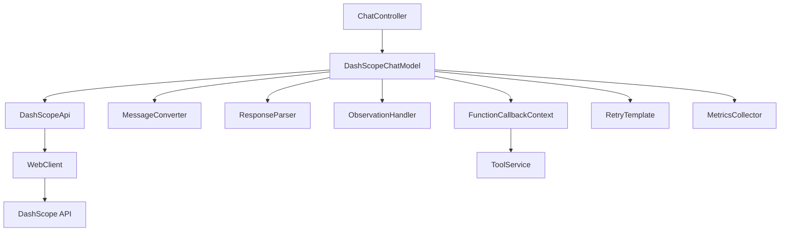

# Spring AI Alibaba - Chat 对话模块详解

## 模块概述

**Chat对话模块** 是Spring AI Alibaba中最核心的功能模块之一，实现了与阿里云通义千问系列模型的完整集成。该模块提供了同步、异步和流式对话能力，支持函数调用、多轮对话和复杂的对话场景。

## 核心架构

### 1. 类层次结构

```
DashScopeChatModel (主要实现类)
├── implements ChatModel              # Spring AI标准对话接口
├── implements StreamingChatModel     # 流式对话接口
├── implements FunctionCallingModel   # 函数调用接口
└── implements ObservationAware       # 可观测性接口

DashScopeChatOptions (配置类)
├── implements ChatOptions           # Spring AI标准配置
└── implements Serializable         # 序列化支持
```

### 2. 核心组件交互



## 详细实现分析

### 1. DashScopeChatModel 核心实现

#### 1.1 基础结构
```java
@Component
public class DashScopeChatModel implements ChatModel, StreamingChatModel, 
                                          FunctionCallingModel, ObservationAware {
    
    private final DashScopeApi dashScopeApi;
    private final DashScopeChatOptions defaultOptions;
    private final FunctionCallbackContext functionCallbackContext;
    private final RetryTemplate retryTemplate;
    private final ObservationRegistry observationRegistry;
    private final MeterRegistry meterRegistry;
    
    // 指标收集器
    private final Counter requestCounter;
    private final Timer responseTimer;
    private final DistributionSummary tokenDistribution;
    
    public DashScopeChatModel(DashScopeApi dashScopeApi, 
                             DashScopeChatOptions options,
                             FunctionCallbackContext functionCallbackContext,
                             ObservationRegistry observationRegistry,
                             MeterRegistry meterRegistry) {
        this.dashScopeApi = dashScopeApi;
        this.defaultOptions = options;
        this.functionCallbackContext = functionCallbackContext;
        this.observationRegistry = observationRegistry;
        this.meterRegistry = meterRegistry;
        
        // 初始化指标
        this.requestCounter = Counter.builder("dashscope.chat.requests")
            .description("DashScope聊天请求总数")
            .register(meterRegistry);
        this.responseTimer = Timer.builder("dashscope.chat.response.duration")
            .description("DashScope聊天响应时间")
            .register(meterRegistry);
        this.tokenDistribution = DistributionSummary.builder("dashscope.chat.tokens")
            .description("DashScope聊天token使用分布")
            .register(meterRegistry);
    }
}
```

#### 1.2 同步对话实现
```java
@Override
public ChatResponse call(Prompt prompt) {
    return ChatModelObservationContext.builder()
        .prompt(prompt)
        .provider(DashScopeApi.PROVIDER_NAME)
        .requestOptions(buildRequestOptions(prompt))
        .build()
        .observe(observationRegistry, () -> {
            
            Timer.Sample sample = Timer.start(meterRegistry);
            
            try {
                // 构建请求
                DashScopeApi.ChatCompletion request = createRequest(prompt, false);
                
                // 执行API调用（支持重试）
                DashScopeApi.ChatCompletionChunk response = retryTemplate.execute(context -> {
                    requestCounter.increment(Tags.of("model", request.getModel()));
                    return dashScopeApi.chatCompletionEntity(request);
                });
                
                // 转换响应
                ChatResponse chatResponse = toChatResponse(response);
                
                // 处理函数调用
                if (isToolCall(response)) {
                    chatResponse = handleToolCalls(prompt, chatResponse);
                }
                
                // 记录指标
                recordMetrics(request.getModel(), response, sample);
                
                return chatResponse;
                
            } catch (Exception e) {
                sample.stop(responseTimer.tag("status", "error"));
                throw new ChatModelException("DashScope聊天调用失败", e);
            }
        });
}

private void recordMetrics(String model, DashScopeApi.ChatCompletionChunk response, 
                          Timer.Sample sample) {
    sample.stop(responseTimer.tag("model", model).tag("status", "success"));
    
    if (response.getUsage() != null) {
        tokenDistribution.record(response.getUsage().getTotalTokens(), 
            Tags.of("model", model, "type", "total"));
        tokenDistribution.record(response.getUsage().getInputTokens(), 
            Tags.of("model", model, "type", "input"));
        tokenDistribution.record(response.getUsage().getOutputTokens(), 
            Tags.of("model", model, "type", "output"));
    }
}
```

#### 1.3 流式对话实现
```java
@Override
public Flux<ChatResponse> stream(Prompt prompt) {
    return ChatModelObservationContext.builder()
        .prompt(prompt)
        .provider(DashScopeApi.PROVIDER_NAME)
        .requestOptions(buildRequestOptions(prompt))
        .build()
        .observe(observationRegistry, () -> {
            
            // 构建流式请求
            DashScopeApi.ChatCompletion request = createRequest(prompt, true);
            
            return dashScopeApi.chatCompletionStream(request)
                .doOnSubscribe(s -> requestCounter.increment(
                    Tags.of("model", request.getModel(), "type", "stream")))
                .map(this::toChatResponse)
                .doOnNext(response -> {
                    // 记录流式响应指标
                    if (response.getResult() != null && 
                        response.getResult().getMetadata() != null) {
                        Usage usage = response.getResult().getMetadata().getUsage();
                        if (usage != null) {
                            tokenDistribution.record(usage.getTotalTokens(), 
                                Tags.of("model", request.getModel(), "type", "stream"));
                        }
                    }
                })
                .onErrorMap(throwable -> new ChatModelException(
                    "DashScope流式聊天调用失败", throwable));
        });
}
```

### 2. 请求构建与转换

#### 2.1 请求构建
```java
private DashScopeApi.ChatCompletion createRequest(Prompt prompt, boolean stream) {
    // 合并配置选项
    DashScopeChatOptions options = mergeChatOptions(prompt);
    
    // 转换消息格式
    List<DashScopeApi.ChatCompletionMessage> messages = prompt.getInstructions()
        .stream()
        .map(this::toApiMessage)
        .collect(Collectors.toList());
    
    // 构建参数
    DashScopeApi.ChatCompletionRequest.Parameters parameters = 
        DashScopeApi.ChatCompletionRequest.Parameters.builder()
            .resultFormat("message")
            .incrementalOutput(stream)
            .temperature(options.getTemperature())
            .topP(options.getTopP())
            .topK(options.getTopK())
            .maxTokens(options.getMaxTokens())
            .stop(options.getStop())
            .enableSearch(options.getEnableSearch())
            .seed(options.getSeed())
            .repetitionPenalty(options.getRepetitionPenalty())
            .build();
    
    // 处理函数调用
    if (isToolPrompt(prompt)) {
        parameters.setTools(buildTools(prompt));
    }
    
    return DashScopeApi.ChatCompletion.builder()
        .model(options.getModel())
        .input(DashScopeApi.ChatCompletionRequest.Input.builder()
            .messages(messages)
            .build())
        .parameters(parameters)
        .build();
}
```

#### 2.2 消息转换
```java
private DashScopeApi.ChatCompletionMessage toApiMessage(Message message) {
    if (message instanceof SystemMessage) {
        return DashScopeApi.ChatCompletionMessage.builder()
            .role("system")
            .content(message.getContent())
            .build();
    } else if (message instanceof UserMessage) {
        UserMessage userMessage = (UserMessage) message;
        
        // 处理多模态消息
        if (userMessage.hasMediaData()) {
            List<DashScopeApi.Content> contents = new ArrayList<>();
            
            // 添加文本内容
            if (StringUtils.hasText(userMessage.getContent())) {
                contents.add(DashScopeApi.Content.builder()
                    .type("text")
                    .text(userMessage.getContent())
                    .build());
            }
            
            // 添加媒体内容
            userMessage.getMedia().forEach(media -> {
                if (media instanceof ImageMedia) {
                    contents.add(DashScopeApi.Content.builder()
                        .type("image")
                        .image(((ImageMedia) media).getData())
                        .build());
                }
            });
            
            return DashScopeApi.ChatCompletionMessage.builder()
                .role("user")
                .content(contents)
                .build();
        } else {
            return DashScopeApi.ChatCompletionMessage.builder()
                .role("user")
                .content(userMessage.getContent())
                .build();
        }
    } else if (message instanceof AssistantMessage) {
        AssistantMessage assistantMessage = (AssistantMessage) message;
        
        DashScopeApi.ChatCompletionMessage.Builder builder = 
            DashScopeApi.ChatCompletionMessage.builder()
                .role("assistant")
                .content(assistantMessage.getContent());
        
        // 处理工具调用
        if (assistantMessage.hasToolCalls()) {
            List<DashScopeApi.ToolCall> toolCalls = assistantMessage.getToolCalls()
                .stream()
                .map(this::toApiToolCall)
                .collect(Collectors.toList());
            builder.toolCalls(toolCalls);
        }
        
        return builder.build();
    } else if (message instanceof ToolResponseMessage) {
        ToolResponseMessage toolMessage = (ToolResponseMessage) message;
        return DashScopeApi.ChatCompletionMessage.builder()
            .role("tool")
            .content(toolMessage.getContent())
            .toolCallId(toolMessage.getToolCallId())
            .build();
    }
    
    throw new IllegalArgumentException("不支持的消息类型: " + message.getClass());
}
```

### 3. 函数调用支持

#### 3.1 工具定义构建
```java
private List<DashScopeApi.Tool> buildTools(Prompt prompt) {
    return functionCallbackContext.getFunctionDefinitions(prompt)
        .stream()
        .map(this::toApiTool)
        .collect(Collectors.toList());
}

private DashScopeApi.Tool toApiTool(FunctionDefinition functionDef) {
    return DashScopeApi.Tool.builder()
        .type("function")
        .function(DashScopeApi.Function.builder()
            .name(functionDef.getName())
            .description(functionDef.getDescription())
            .parameters(convertParameters(functionDef.getParameters()))
            .build())
        .build();
}

private Map<String, Object> convertParameters(String parametersJson) {
    try {
        return objectMapper.readValue(parametersJson, 
            new TypeReference<Map<String, Object>>() {});
    } catch (Exception e) {
        log.warn("解析函数参数失败: {}", parametersJson, e);
        return Map.of();
    }
}
```

#### 3.2 工具调用处理
```java
private ChatResponse handleToolCalls(Prompt prompt, ChatResponse response) {
    AssistantMessage assistantMessage = (AssistantMessage) response.getResult().getOutput();
    
    if (!assistantMessage.hasToolCalls()) {
        return response;
    }
    
    // 执行工具调用
    List<Message> toolMessages = new ArrayList<>();
    toolMessages.add(assistantMessage);
    
    for (AssistantMessage.ToolCall toolCall : assistantMessage.getToolCalls()) {
        try {
            // 执行函数调用
            String result = functionCallbackContext.call(
                toolCall.name(), toolCall.arguments());
            
            // 创建工具响应消息
            toolMessages.add(new ToolResponseMessage(result, toolCall.id()));
            
        } catch (Exception e) {
            log.error("函数调用执行失败: {}", toolCall.name(), e);
            toolMessages.add(new ToolResponseMessage(
                "函数执行失败: " + e.getMessage(), toolCall.id()));
        }
    }
    
    // 构建新的提示词并重新调用
    List<Message> newMessages = new ArrayList<>(prompt.getInstructions());
    newMessages.addAll(toolMessages);
    
    Prompt newPrompt = new Prompt(newMessages, prompt.getOptions());
    return call(newPrompt);
}
```

### 4. 配置选项管理

#### 4.1 DashScopeChatOptions
```java
@JsonInclude(JsonInclude.Include.NON_NULL)
public class DashScopeChatOptions implements ChatOptions, Serializable {
    
    /**
     * 模型名称
     */
    private String model = DashScopeApi.DEFAULT_CHAT_MODEL;
    
    /**
     * 温度参数 (0.0-2.0)
     */
    private Double temperature;
    
    /**
     * Top-p参数 (0.0-1.0)
     */
    private Double topP;
    
    /**
     * Top-k参数
     */
    private Integer topK;
    
    /**
     * 最大输出token数
     */
    private Integer maxTokens;
    
    /**
     * 停止词列表
     */
    private List<String> stop;
    
    /**
     * 重复惩罚 (1.0-1.1)
     */
    private Double repetitionPenalty;
    
    /**
     * 是否启用搜索
     */
    private Boolean enableSearch;
    
    /**
     * 随机种子
     */
    private Integer seed;
    
    /**
     * 是否流式输出
     */
    private Boolean incrementalOutput;
    
    /**
     * 结果格式
     */
    private String resultFormat = "message";
    
    // 构建器模式
    public static Builder builder() {
        return new Builder();
    }
    
    public static class Builder {
        private DashScopeChatOptions options = new DashScopeChatOptions();
        
        public Builder model(String model) {
            options.model = model;
            return this;
        }
        
        public Builder temperature(Double temperature) {
            options.temperature = temperature;
            return this;
        }
        
        public Builder topP(Double topP) {
            options.topP = topP;
            return this;
        }
        
        public Builder maxTokens(Integer maxTokens) {
            options.maxTokens = maxTokens;
            return this;
        }
        
        public Builder enableSearch(Boolean enableSearch) {
            options.enableSearch = enableSearch;
            return this;
        }
        
        public DashScopeChatOptions build() {
            return options;
        }
    }
    
    // 配置合并
    public DashScopeChatOptions merge(DashScopeChatOptions other) {
        if (other == null) return this;
        
        return DashScopeChatOptions.builder()
            .model(other.model != null ? other.model : this.model)
            .temperature(other.temperature != null ? other.temperature : this.temperature)
            .topP(other.topP != null ? other.topP : this.topP)
            .topK(other.topK != null ? other.topK : this.topK)
            .maxTokens(other.maxTokens != null ? other.maxTokens : this.maxTokens)
            .enableSearch(other.enableSearch != null ? other.enableSearch : this.enableSearch)
            .build();
    }
}
```

### 5. 多轮对话支持

#### 5.1 对话历史管理
```java
@Component
public class ConversationManager {
    
    private final Map<String, List<Message>> conversations = new ConcurrentHashMap<>();
    private final DashScopeChatModel chatModel;
    
    public String chat(String conversationId, String userMessage) {
        // 获取对话历史
        List<Message> history = conversations.computeIfAbsent(
            conversationId, k -> new ArrayList<>());
        
        // 添加用户消息
        history.add(new UserMessage(userMessage));
        
        // 创建提示词
        Prompt prompt = new Prompt(history);
        
        // 调用模型
        ChatResponse response = chatModel.call(prompt);
        String assistantReply = response.getResult().getOutput().getContent();
        
        // 保存助手回复
        history.add(new AssistantMessage(assistantReply));
        
        // 限制历史长度
        if (history.size() > 20) {
            history.subList(0, history.size() - 20).clear();
        }
        
        return assistantReply;
    }
    
    public void clearConversation(String conversationId) {
        conversations.remove(conversationId);
    }
    
    public List<Message> getConversationHistory(String conversationId) {
        return new ArrayList<>(conversations.getOrDefault(conversationId, List.of()));
    }
}
```

### 6. 错误处理与重试

#### 6.1 异常处理策略
```java
@Component
public class DashScopeChatErrorHandler {
    
    public boolean shouldRetry(Throwable throwable) {
        if (throwable instanceof DashScopeException) {
            DashScopeException ex = (DashScopeException) throwable;
            
            // 可重试的错误码
            return Arrays.asList(
                "Throttling.RateQuota",
                "InternalError.Timeout",
                "ServiceUnavailable"
            ).contains(ex.getErrorCode());
        }
        
        return throwable instanceof ConnectTimeoutException ||
               throwable instanceof ReadTimeoutException;
    }
    
    public Duration getRetryDelay(int attempt, Throwable throwable) {
        if (throwable instanceof DashScopeException) {
            DashScopeException ex = (DashScopeException) throwable;
            
            if ("Throttling.RateQuota".equals(ex.getErrorCode())) {
                // 限流错误，使用较长的等待时间
                return Duration.ofSeconds((long) Math.pow(2, attempt) * 5);
            }
        }
        
        // 默认指数退避
        return Duration.ofSeconds((long) Math.pow(2, attempt));
    }
}
```

## 使用示例

### 1. 基础对话
```java
@Service
public class ChatService {
    
    @Autowired
    private DashScopeChatModel chatModel;
    
    public String simpleChat(String message) {
        Prompt prompt = new Prompt(message);
        ChatResponse response = chatModel.call(prompt);
        return response.getResult().getOutput().getContent();
    }
}
```

### 2. 流式对话
```java
@RestController
public class StreamChatController {
    
    @Autowired
    private DashScopeChatModel chatModel;
    
    @GetMapping(value = "/stream-chat", produces = MediaType.TEXT_EVENT_STREAM_VALUE)
    public Flux<String> streamChat(@RequestParam String message) {
        Prompt prompt = new Prompt(message);
        
        return chatModel.stream(prompt)
            .map(response -> response.getResult().getOutput().getContent())
            .filter(content -> !content.isEmpty());
    }
}
```

### 3. 函数调用
```java
@Component
public class WeatherFunction implements Function<WeatherRequest, String> {
    
    @Override
    public String apply(WeatherRequest request) {
        // 模拟天气查询
        return String.format("%s的天气是晴天，温度25°C", request.getCity());
    }
}

@Service
public class FunctionCallService {
    
    @Autowired
    private DashScopeChatModel chatModel;
    
    public String chatWithFunction(String message) {
        // 定义函数
        FunctionDefinition weatherFunction = FunctionDefinition.builder()
            .name("get_weather")
            .description("查询城市天气")
            .parameters("""
                {
                    "type": "object",
                    "properties": {
                        "city": {
                            "type": "string",
                            "description": "城市名称"
                        }
                    },
                    "required": ["city"]
                }
                """)
            .build();
        
        Prompt prompt = new Prompt(message, 
            DashScopeChatOptions.builder()
                .functions(Set.of("get_weather"))
                .build());
        
        ChatResponse response = chatModel.call(prompt);
        return response.getResult().getOutput().getContent();
    }
}
```

## 总结

Spring AI Alibaba的Chat模块提供了功能完整、性能优秀的对话能力，支持多种高级特性如函数调用、多模态输入、流式响应等。其良好的可观测性和错误处理机制，使其能够胜任企业级的对话AI应用场景。

**主要特点**：
- 完整的Spring AI标准接口实现
- 支持同步、异步、流式多种调用方式
- 原生函数调用和工具集成能力
- 多模态消息处理支持
- 企业级的监控和错误处理
- 灵活的配置选项和参数调优

---

*作者：senrian*  
*最后更新：2024年* 