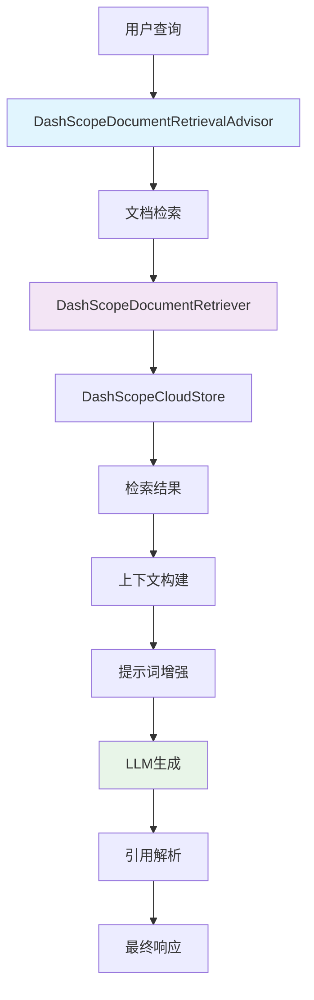

# Spring AI Alibaba - RAG 检索增强生成模块详解

## 模块概述

**RAG检索增强生成模块** 是Spring AI Alibaba中的核心智能功能模块，实现了完整的检索增强生成流程。该模块通过Advisor模式优雅地将文档检索能力集成到对话生成过程中，支持智能引用、多文档检索、重排序等高级特性。

## 核心架构

### 1. 模块结构图

```
spring-ai-alibaba-rag/
├── DashScopeDocumentRetrievalAdvisor    # 核心检索建议器
├── DashScopeDocumentRetriever          # 文档检索器
├── DashScopeDocumentTransformer        # 文档转换器
├── DashScopeDocumentCloudReader        # 云端文档读取器
├── DashScopeCloudStore                 # 云端向量存储
└── options/                            # 配置选项类
    ├── DashScopeDocumentRetrieverOptions
    ├── DashScopeDocumentTransformerOptions
    └── DashScopeStoreOptions
```

### 2. RAG处理流程



## 核心组件详解

### 1. DashScopeDocumentRetrievalAdvisor

#### 1.1 Advisor模式实现
```java
public class DashScopeDocumentRetrievalAdvisor 
    implements CallAroundAdvisor, StreamAroundAdvisor {
    
    private static final Pattern RAG_REFERENCE_PATTERN = 
        Pattern.compile("<ref>(.*?)</ref>");
    
    private static final Pattern RAG_REFERENCE_INNER_PATTERN = 
        Pattern.compile("\\[([0-9]+)(?:[,，]?([0-9]+))*]");
    
    // 默认的RAG提示词模板
    private static final String DEFAULT_USER_TEXT_ADVISE = """
        # 知识库
        请记住以下材料，他们可能对回答问题有帮助。
        指令：您需要仅使用提供的搜索文档为给定问题写出高质量的答案，并正确引用它们。
        引用多个搜索结果时，请使用<ref>[编号]</ref>格式，注意确保这些引用直接有助于解答问题，
        编号需与材料原始编号一致且唯一。请注意，每个句子中必须至少引用一个文档。
        换句话说，你禁止在没有引用任何文献的情况下写句子。
        此外，您应该在每个句子中添加引用符号，注意在句号之前。
        
        对于每个问题按照下面的推理步骤得到带引用的答案：
        步骤1：我判断文档1和文档2与问题相关。
        步骤2：根据文档1，我写了一个回答陈述并引用了该文档。
        步骤3：根据文档2，我写一个答案声明并引用该文档。
        步骤4：我将以上两个答案语句进行合并、排序和连接，以获得流畅连贯的答案。
        
        $$材料：
        {question_answer_context}
        """;
    
    private final DocumentRetriever retriever;
    private final String userTextAdvise;
    private final boolean enableReference;
    private final boolean protectFromBlocking;  // 保护非阻塞线程
    private final int order;
    
    public DashScopeDocumentRetrievalAdvisor(DocumentRetriever retriever, 
                                           boolean enableReference) {
        this(retriever, DEFAULT_USER_TEXT_ADVISE, enableReference);
    }
    
    public DashScopeDocumentRetrievalAdvisor(DocumentRetriever retriever, 
                                           String userTextAdvise,
                                           boolean enableReference,
                                           boolean protectFromBlocking,
                                           int order) {
        this.retriever = retriever;
        this.userTextAdvise = userTextAdvise;
        this.enableReference = enableReference;
        this.protectFromBlocking = protectFromBlocking;
        this.order = order;
    }
}
```

#### 1.2 核心处理逻辑
```java
@Override
public AdvisedResponse aroundCall(AdvisedRequest advisedRequest, 
                                 CallAroundAdvisorChain chain) {
    // 前置处理：检索文档并增强提示词
    advisedRequest = this.before(advisedRequest);
    
    // 执行实际的LLM调用
    AdvisedResponse advisedResponse = chain.nextAroundCall(advisedRequest);
    
    // 后置处理：解析引用
    return this.after(advisedResponse);
}

@Override
public Flux<AdvisedResponse> aroundStream(AdvisedRequest advisedRequest, 
                                         StreamAroundAdvisorChain chain) {
    // 非阻塞线程保护
    Flux<AdvisedResponse> advisedResponses = (this.protectFromBlocking) ?
        Mono.just(advisedRequest)
            .publishOn(Schedulers.boundedElastic())
            .map(this::before)
            .flatMapMany(chain::nextAroundStream)
        : chain.nextAroundStream(this.before(advisedRequest));
    
    return advisedResponses.map(ar -> {
        if (onFinishReason().test(ar)) {
            ar = after(ar);
        }
        return ar;
    });
}

/**
 * 前置处理：检索文档并构建上下文
 */
private AdvisedRequest before(AdvisedRequest request) {
    var context = new HashMap<>(request.adviseContext());
    
    // 执行文档检索
    List<Document> documents = retriever.retrieve(new Query(request.userText()));
    
    // 构建文档上下文
    Map<String, Document> documentMap = new HashMap<>();
    StringBuffer documentContext = new StringBuffer();
    
    for (int i = 0; i < documents.size(); i++) {
        Document document = documents.get(i);
        String indexId = String.format("[%d]", i + 1);
        
        String docInfo = String.format("""
            %s 【文档名】%s
            【标题】%s
            【正文】%s
            """, 
            indexId, 
            document.getMetadata().get("doc_name"), 
            document.getMetadata().get("title"),
            document.getText());
        
        documentContext.append(docInfo);
        documentContext.append(System.lineSeparator());
        
        // 保存索引信息
        document.getMetadata().put("index_id", i);
        documentMap.put(indexId, document);
    }
    
    // 保存到上下文
    context.put(RETRIEVED_DOCUMENTS, documentMap);
    
    // 构建增强的提示词
    Map<String, Object> advisedUserParams = new HashMap<>(request.userParams());
    advisedUserParams.put(RETRIEVED_DOCUMENTS, documentContext);
    
    // 将RAG指令添加到用户查询
    String enhancedUserText = request.userText() + System.lineSeparator() + 
                             this.userTextAdvise.replace("{question_answer_context}", 
                                                        documentContext.toString());
    
    return AdvisedRequest.from(request)
        .userText(enhancedUserText)
        .userParams(advisedUserParams)
        .adviseContext(context)
        .build();
}
```

#### 1.3 智能引用解析
```java
/**
 * 后置处理：解析和验证引用
 */
private AdvisedResponse after(AdvisedResponse advisedResponse) {
    if (!enableReference) {
        return advisedResponse;
    }
    
    var response = advisedResponse.response();
    var context = advisedResponse.adviseContext();
    
    // 检查是否完成生成
    ChatCompletionFinishReason finishReason = ChatCompletionFinishReason
        .valueOf(response.getResult().getMetadata().getFinishReason());
    
    if (finishReason == ChatCompletionFinishReason.NULL) {
        // 流式响应中间状态，累积内容
        String fullContent = context.getOrDefault("full_content", "").toString()
                + response.getResult().getOutput().getText();
        context.put("full_content", fullContent);
        return advisedResponse;
    }
    
    // 获取完整内容
    String content = context.getOrDefault("full_content", "").toString();
    if ("".equalsIgnoreCase(content)) {
        content = response.getResult().getOutput().getText();
    }
    
    // 解析引用
    Map<String, Document> documentMap = 
        (Map<String, Document>) context.get(RETRIEVED_DOCUMENTS);
    List<Document> referencedDocuments = extractReferences(content, documentMap);
    
    // 构建增强的响应元数据
    ChatResponseMetadata.Builder metadataBuilder = ChatResponseMetadata.builder();
    metadataBuilder.keyValue(RETRIEVED_DOCUMENTS, referencedDocuments);
    
    // 保留原有元数据
    ChatResponseMetadata metadata = advisedResponse.response().getMetadata();
    if (metadata != null) {
        metadataBuilder.id(metadata.getId());
        metadataBuilder.model(metadata.getModel());
        metadataBuilder.usage(metadata.getUsage());
        metadataBuilder.promptMetadata(metadata.getPromptMetadata());
        metadataBuilder.rateLimit(metadata.getRateLimit());
        
        // 复制所有自定义元数据
        Set<Map.Entry<String, Object>> entries = metadata.entrySet();
        for (Map.Entry<String, Object> entry : entries) {
            metadataBuilder.keyValue(entry.getKey(), entry.getValue());
        }
    }
    
    ChatResponse chatResponse = new ChatResponse(
        advisedResponse.response().getResults(), 
        metadataBuilder.build());
    
    return new AdvisedResponse(chatResponse, context);
}

/**
 * 提取引用的文档
 */
private List<Document> extractReferences(String content, 
                                       Map<String, Document> documentMap) {
    List<Document> referencedDocuments = new ArrayList<>();
    
    // 匹配引用模式：<ref>[1,2,3]</ref>
    Matcher refMatcher = RAG_REFERENCE_PATTERN.matcher(content);
    
    while (refMatcher.find()) {
        String refContent = refMatcher.group(1);
        Matcher numberMatcher = RAG_REFERENCE_INNER_PATTERN.matcher(refContent);
        
        while (numberMatcher.find()) {
            for (int i = 1; i <= numberMatcher.groupCount(); i++) {
                if (numberMatcher.group(i) != null) {
                    String index = "[" + numberMatcher.group(i) + "]";
                    Document document = documentMap.get(index);
                    if (document != null) {
                        referencedDocuments.add(document);
                    }
                }
            }
        }
    }
    
    return referencedDocuments.stream().distinct().collect(Collectors.toList());
}
```

### 2. DashScopeDocumentRetriever

#### 2.1 检索器实现
```java
public class DashScopeDocumentRetriever implements DocumentRetriever {
    
    private final DashScopeDocumentRetrieverOptions options;
    private final DashScopeApi dashScopeApi;
    
    public DashScopeDocumentRetriever(DashScopeApi dashScopeApi,
                                    DashScopeDocumentRetrieverOptions options) {
        this.dashScopeApi = dashScopeApi;
        this.options = options;
    }
    
    @Override
    public List<Document> retrieve(Query query) {
        try {
            // 构建检索请求
            DashScopeApi.DocumentRetrievalRequest request = 
                DashScopeApi.DocumentRetrievalRequest.builder()
                    .query(query.text())
                    .topK(options.getTopK())
                    .scoreThreshold(options.getScoreThreshold())
                    .indexName(options.getIndexName())
                    .filters(buildFilters(query))
                    .build();
            
            // 执行检索
            DashScopeApi.DocumentRetrievalResponse response = 
                dashScopeApi.retrieveDocuments(request);
            
            // 转换结果
            return response.getDocuments().stream()
                .map(this::convertToDocument)
                .collect(Collectors.toList());
                
        } catch (Exception e) {
            throw new DocumentRetrievalException("文档检索失败", e);
        }
    }
    
    private Document convertToDocument(DashScopeApi.RetrievedDocument apiDoc) {
        Map<String, Object> metadata = new HashMap<>();
        metadata.put("doc_name", apiDoc.getTitle());
        metadata.put("title", apiDoc.getTitle());
        metadata.put("source", apiDoc.getSource());
        metadata.put("score", apiDoc.getScore());
        metadata.put("chunk_id", apiDoc.getChunkId());
        
        return new Document(apiDoc.getContent(), metadata);
    }
    
    private Map<String, Object> buildFilters(Query query) {
        Map<String, Object> filters = new HashMap<>();
        
        // 从查询中提取过滤条件
        if (query.getFilterExpression() != null) {
            // 解析过滤表达式
            filters.putAll(parseFilterExpression(query.getFilterExpression()));
        }
        
        // 添加默认过滤条件
        if (options.getDefaultFilters() != null) {
            filters.putAll(options.getDefaultFilters());
        }
        
        return filters;
    }
}
```

#### 2.2 配置选项
```java
@Data
@Builder
public class DashScopeDocumentRetrieverOptions {
    
    /**
     * 检索的文档数量
     */
    @Builder.Default
    private Integer topK = 5;
    
    /**
     * 相似度阈值
     */
    @Builder.Default
    private Double scoreThreshold = 0.0;
    
    /**
     * 索引名称
     */
    private String indexName;
    
    /**
     * 默认过滤条件
     */
    private Map<String, Object> defaultFilters;
    
    /**
     * 是否启用重排序
     */
    @Builder.Default
    private Boolean enableRerank = false;
    
    /**
     * 重排序模型
     */
    private String rerankModel;
    
    /**
     * 重排序的top-n数量
     */
    @Builder.Default
    private Integer rerankTopN = 3;
    
    /**
     * 检索模式
     */
    @Builder.Default
    private RetrievalMode mode = RetrievalMode.HYBRID;
    
    /**
     * 语义检索权重
     */
    @Builder.Default
    private Double semanticWeight = 0.7;
    
    /**
     * 关键词检索权重
     */
    @Builder.Default
    private Double keywordWeight = 0.3;
    
    public enum RetrievalMode {
        SEMANTIC,    // 纯语义检索
        KEYWORD,     // 纯关键词检索
        HYBRID       // 混合检索
    }
    
    // 预设配置
    public static DashScopeDocumentRetrieverOptions defaultOptions() {
        return DashScopeDocumentRetrieverOptions.builder()
            .topK(5)
            .scoreThreshold(0.1)
            .enableRerank(true)
            .rerankTopN(3)
            .mode(RetrievalMode.HYBRID)
            .build();
    }
    
    public static DashScopeDocumentRetrieverOptions highPrecision() {
        return DashScopeDocumentRetrieverOptions.builder()
            .topK(10)
            .scoreThreshold(0.3)
            .enableRerank(true)
            .rerankTopN(5)
            .mode(RetrievalMode.SEMANTIC)
            .semanticWeight(0.9)
            .keywordWeight(0.1)
            .build();
    }
    
    public static DashScopeDocumentRetrieverOptions fastRetrieval() {
        return DashScopeDocumentRetrieverOptions.builder()
            .topK(3)
            .scoreThreshold(0.0)
            .enableRerank(false)
            .mode(RetrievalMode.KEYWORD)
            .build();
    }
}
```

### 3. DashScopeCloudStore

#### 3.1 云端向量存储实现
```java
public class DashScopeCloudStore implements VectorStore {
    
    private final DashScopeApi dashScopeApi;
    private final DashScopeStoreOptions options;
    private final EmbeddingModel embeddingModel;
    
    public DashScopeCloudStore(DashScopeApi dashScopeApi,
                              DashScopeStoreOptions options,
                              EmbeddingModel embeddingModel) {
        this.dashScopeApi = dashScopeApi;
        this.options = options;
        this.embeddingModel = embeddingModel;
    }
    
    @Override
    public void add(List<Document> documents) {
        try {
            // 批量处理文档
            List<List<Document>> batches = partitionDocuments(documents, 
                                                             options.getBatchSize());
            
            for (List<Document> batch : batches) {
                processBatch(batch);
            }
            
        } catch (Exception e) {
            throw new VectorStoreException("文档存储失败", e);
        }
    }
    
    private void processBatch(List<Document> documents) {
        // 生成嵌入向量
        List<String> texts = documents.stream()
            .map(Document::getContent)
            .collect(Collectors.toList());
        
        EmbeddingResponse embeddingResponse = embeddingModel.embedForResponse(texts);
        List<Embedding> embeddings = embeddingResponse.getResults();
        
        // 构建存储请求
        List<DashScopeApi.DocumentIndex> indexRequests = new ArrayList<>();
        
        for (int i = 0; i < documents.size(); i++) {
            Document doc = documents.get(i);
            Embedding embedding = embeddings.get(i);
            
            DashScopeApi.DocumentIndex indexRequest = 
                DashScopeApi.DocumentIndex.builder()
                    .id(generateDocumentId(doc))
                    .content(doc.getContent())
                    .embedding(embedding.getOutput())
                    .metadata(doc.getMetadata())
                    .build();
            
            indexRequests.add(indexRequest);
        }
        
        // 执行批量索引
        DashScopeApi.IndexBatchRequest batchRequest = 
            DashScopeApi.IndexBatchRequest.builder()
                .indexName(options.getIndexName())
                .documents(indexRequests)
                .build();
        
        dashScopeApi.indexDocuments(batchRequest);
    }
    
    @Override
    public Optional<Boolean> delete(List<String> idList) {
        try {
            DashScopeApi.DeleteRequest deleteRequest = 
                DashScopeApi.DeleteRequest.builder()
                    .indexName(options.getIndexName())
                    .documentIds(idList)
                    .build();
            
            DashScopeApi.DeleteResponse response = 
                dashScopeApi.deleteDocuments(deleteRequest);
            
            return Optional.of(response.isSuccess());
            
        } catch (Exception e) {
            throw new VectorStoreException("文档删除失败", e);
        }
    }
    
    @Override
    public List<Document> similaritySearch(SearchRequest request) {
        try {
            // 生成查询向量
            String queryText = request.getQuery();
            EmbeddingResponse embeddingResponse = 
                embeddingModel.embedForResponse(List.of(queryText));
            
            List<Double> queryEmbedding = embeddingResponse.getResults()
                .get(0).getOutput();
            
            // 构建搜索请求
            DashScopeApi.SearchRequest searchRequest = 
                DashScopeApi.SearchRequest.builder()
                    .indexName(options.getIndexName())
                    .query(queryText)
                    .queryEmbedding(queryEmbedding)
                    .topK(request.getTopK())
                    .scoreThreshold(request.getSimilarityThreshold())
                    .filters(request.getFilterExpression())
                    .hybridSearch(options.isEnableHybridSearch())
                    .build();
            
            // 执行搜索
            DashScopeApi.SearchResponse searchResponse = 
                dashScopeApi.searchDocuments(searchRequest);
            
            // 转换结果
            return searchResponse.getResults().stream()
                .map(this::convertSearchResult)
                .collect(Collectors.toList());
                
        } catch (Exception e) {
            throw new VectorStoreException("相似度搜索失败", e);
        }
    }
    
    private Document convertSearchResult(DashScopeApi.SearchResult result) {
        Map<String, Object> metadata = new HashMap<>(result.getMetadata());
        metadata.put("score", result.getScore());
        metadata.put("distance", result.getDistance());
        
        return new Document(result.getContent(), metadata);
    }
}
```

## 高级特性

### 1. 多文档类型支持

#### 1.1 文档类型识别
```java
@Component
public class DocumentTypeDetector {
    
    public DocumentType detectType(Document document) {
        String content = document.getContent();
        Map<String, Object> metadata = document.getMetadata();
        
        // 基于元数据判断
        if (metadata.containsKey("doc_type")) {
            return DocumentType.valueOf(metadata.get("doc_type").toString());
        }
        
        // 基于内容特征判断
        if (content.contains("```") || content.contains("import ") || 
            content.contains("function ")) {
            return DocumentType.CODE;
        }
        
        if (content.length() > 5000 && content.contains("\n\n")) {
            return DocumentType.ARTICLE;
        }
        
        if (content.contains("Q:") || content.contains("A:")) {
            return DocumentType.QA;
        }
        
        return DocumentType.TEXT;
    }
    
    public enum DocumentType {
        TEXT,       // 普通文本
        ARTICLE,    // 文章
        CODE,       // 代码
        QA,         // 问答
        TABLE,      // 表格
        JSON        // JSON数据
    }
}
```

#### 1.2 类型特定处理
```java
@Component
public class TypeSpecificProcessor {
    
    public String processForRAG(Document document, DocumentType type) {
        switch (type) {
            case CODE:
                return processCodeDocument(document);
            case ARTICLE:
                return processArticleDocument(document);
            case QA:
                return processQADocument(document);
            case TABLE:
                return processTableDocument(document);
            default:
                return document.getContent();
        }
    }
    
    private String processCodeDocument(Document document) {
        String content = document.getContent();
        
        // 添加代码语言信息
        String language = detectProgrammingLanguage(content);
        
        return String.format("""
            【代码文档】
            语言：%s
            功能：%s
            
            代码内容：
            %s
            """, 
            language,
            extractCodeFunction(content),
            content);
    }
    
    private String processArticleDocument(Document document) {
        String content = document.getContent();
        
        // 提取关键信息
        String title = extractTitle(content);
        String summary = extractSummary(content);
        
        return String.format("""
            【文章文档】
            标题：%s
            摘要：%s
            
            正文：
            %s
            """, 
            title,
            summary,
            content);
    }
}
```

### 2. 智能重排序

#### 2.1 重排序实现
```java
@Component
public class DashScopeReranker {
    
    private final DashScopeApi dashScopeApi;
    
    public List<Document> rerank(String query, List<Document> documents, 
                                RerankOptions options) {
        try {
            // 构建重排序请求
            List<DashScopeApi.RerankDocument> rerankDocs = documents.stream()
                .map(doc -> DashScopeApi.RerankDocument.builder()
                    .text(doc.getContent())
                    .title(doc.getMetadata().get("title"))
                    .build())
                .collect(Collectors.toList());
            
            DashScopeApi.RerankRequest request = 
                DashScopeApi.RerankRequest.builder()
                    .model(options.getModel())
                    .query(query)
                    .documents(rerankDocs)
                    .topN(options.getTopN())
                    .returnDocuments(true)
                    .build();
            
            // 执行重排序
            DashScopeApi.RerankResponse response = dashScopeApi.rerank(request);
            
            // 按重排序结果重新排列文档
            List<Document> rerankedDocs = new ArrayList<>();
            for (DashScopeApi.RerankResult result : response.getResults()) {
                int index = result.getIndex();
                Document originalDoc = documents.get(index);
                
                // 添加重排序分数
                Map<String, Object> metadata = new HashMap<>(originalDoc.getMetadata());
                metadata.put("rerank_score", result.getRelevanceScore());
                
                rerankedDocs.add(new Document(originalDoc.getContent(), metadata));
            }
            
            return rerankedDocs;
            
        } catch (Exception e) {
            log.warn("重排序失败，返回原始结果", e);
            return documents;
        }
    }
}
```

### 3. 上下文窗口管理

#### 3.1 智能截断
```java
@Component
public class ContextWindowManager {
    
    private final TokenCounter tokenCounter;
    
    public String buildOptimalContext(List<Document> documents, 
                                    String query,
                                    int maxTokens) {
        StringBuilder context = new StringBuilder();
        int usedTokens = tokenCounter.count(query);
        
        // 预留一些token给回复
        int availableTokens = maxTokens - usedTokens - 500;
        
        for (int i = 0; i < documents.size(); i++) {
            Document doc = documents.get(i);
            String docContent = formatDocument(doc, i + 1);
            
            int docTokens = tokenCounter.count(docContent);
            
            if (usedTokens + docTokens <= availableTokens) {
                context.append(docContent).append("\n\n");
                usedTokens += docTokens;
            } else {
                // 尝试截断文档
                String truncatedContent = truncateDocument(docContent, 
                                                          availableTokens - usedTokens);
                if (truncatedContent.length() > 100) {
                    context.append(truncatedContent).append("\n\n");
                }
                break;
            }
        }
        
        return context.toString();
    }
    
    private String truncateDocument(String content, int maxTokens) {
        if (tokenCounter.count(content) <= maxTokens) {
            return content;
        }
        
        // 按句子截断
        String[] sentences = content.split("[。！？]");
        StringBuilder result = new StringBuilder();
        
        for (String sentence : sentences) {
            String nextResult = result + sentence + "。";
            if (tokenCounter.count(nextResult) > maxTokens) {
                break;
            }
            result.append(sentence).append("。");
        }
        
        return result.toString();
    }
}
```

## 配置与使用

### 1. 配置示例
```yaml
spring:
  ai:
    alibaba:
      dashscope:
        rag:
          enabled: true
          retriever:
            index-name: "knowledge-base"
            top-k: 5
            score-threshold: 0.1
            enable-rerank: true
            rerank-model: "gte-rerank"
            rerank-top-n: 3
            mode: HYBRID
            semantic-weight: 0.7
            keyword-weight: 0.3
          store:
            batch-size: 100
            enable-hybrid-search: true
          reference:
            enabled: true
            pattern-validation: true
```

### 2. 编程使用
```java
@Service
public class RAGService {
    
    @Autowired
    private ChatModel chatModel;
    
    @Autowired
    private DashScopeDocumentRetrievalAdvisor ragAdvisor;
    
    public String ragChat(String question) {
        return ChatClient.builder(chatModel)
            .defaultAdvisors(ragAdvisor)
            .build()
            .prompt()
            .user(question)
            .call()
            .content();
    }
    
    public Flux<String> ragChatStream(String question) {
        return ChatClient.builder(chatModel)
            .defaultAdvisors(ragAdvisor)
            .build()
            .prompt()
            .user(question)
            .stream()
            .content();
    }
}
```

## 总结

Spring AI Alibaba的RAG模块通过Advisor模式优雅地实现了检索增强生成，具有以下特点：

**核心优势**：
- **Advisor模式**：无侵入式的RAG功能集成
- **智能引用**：自动化的文档引用和验证
- **多模态检索**：支持文本、代码、表格等多种文档类型
- **重排序优化**：基于相关性的智能重排序
- **上下文管理**：智能的token窗口管理

**企业级特性**：
- 完整的配置选项和预设模板
- 异常处理和降级策略
- 性能监控和指标收集
- 支持流式和批量处理

该模块为Java企业级应用提供了生产就绪的RAG能力，能够显著提升AI应用的准确性和可解释性。

---

*作者：senrian*  
*最后更新：2024年* 