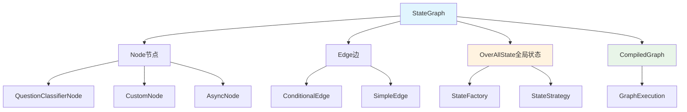

# Spring AI Alibaba - Graph 工作流引擎模块详解

## 模块概述

**Spring AI Alibaba Graph** 是一个面向Java开发者的**工作流和多智能体框架**，专门用于构建由多个AI模型或步骤组成的复杂应用。该模块通过有向图（Graph）的形式连接各个节点，形成可定制的执行流程，有效解决了**单一大模型对复杂任务力不从心**的问题。

## 核心架构

### 1. 架构设计图



### 2. 核心设计理念

#### 2.1 状态驱动的工作流模型
```java
// 状态驱动的核心设计
public class StateGraph {
    private final String name;
    private final OverAllStateFactory stateFactory;
    private final Map<String, NodeAction> nodes = new HashMap<>();
    private final List<Edge> edges = new ArrayList<>();
    
    /**
     * 添加节点 - 封装AI模型或业务逻辑
     */
    public StateGraph addNode(String name, NodeAction action) {
        nodes.put(name, action);
        return this;
    }
    
    /**
     * 添加简单边 - 定义固定的流转路径
     */
    public StateGraph addEdge(String from, String to) {
        edges.add(new SimpleEdge(from, to));
        return this;
    }
    
    /**
     * 添加条件边 - 根据状态动态决定下一步
     */
    public StateGraph addConditionalEdges(String from, 
                                         EdgeFunction edgeFunction,
                                         Map<String, String> conditionMap) {
        edges.add(new ConditionalEdge(from, edgeFunction, conditionMap));
        return this;
    }
}
```

#### 2.2 节点抽象设计
```java
/**
 * 节点动作接口 - 所有节点的基础抽象
 */
@FunctionalInterface
public interface NodeAction {
    /**
     * 执行节点逻辑
     * @param state 全局状态
     * @return 执行结果状态
     */
    OverAllState invoke(OverAllState state);
}

/**
 * 异步节点包装器
 */
public static NodeAction node_async(NodeAction action) {
    return state -> {
        CompletableFuture<OverAllState> future = CompletableFuture
            .supplyAsync(() -> action.invoke(state));
        return future.join();
    };
}
```

## 核心组件详解

### 1. StateGraph - 状态图核心

#### 1.1 图构建与验证
```java
public class StateGraph {
    
    /**
     * 编译状态图为可执行图
     */
    public CompiledGraph compile() {
        // 1. 验证图结构的完整性
        validateGraph();
        
        // 2. 构建节点映射
        Map<String, NodeAction> compiledNodes = new HashMap<>(nodes);
        
        // 3. 构建边映射和条件路由
        Map<String, List<Edge>> edgeMap = buildEdgeMap();
        
        // 4. 创建执行引擎
        GraphExecutor executor = new GraphExecutor(
            compiledNodes, 
            edgeMap, 
            stateFactory
        );
        
        return new CompiledGraph(this.name, executor);
    }
    
    /**
     * 验证图结构
     */
    private void validateGraph() {
        Set<String> nodeNames = nodes.keySet();
        
        // 检查边的完整性
        for (Edge edge : edges) {
            if (!nodeNames.contains(edge.getFrom()) && 
                !START.equals(edge.getFrom())) {
                throw new GraphValidationException(
                    "源节点不存在: " + edge.getFrom());
            }
            
            if (edge instanceof SimpleEdge) {
                SimpleEdge simpleEdge = (SimpleEdge) edge;
                if (!nodeNames.contains(simpleEdge.getTo()) && 
                    !END.equals(simpleEdge.getTo())) {
                    throw new GraphValidationException(
                        "目标节点不存在: " + simpleEdge.getTo());
                }
            }
        }
        
        // 检查是否存在起始边
        boolean hasStartEdge = edges.stream()
            .anyMatch(edge -> START.equals(edge.getFrom()));
        if (!hasStartEdge) {
            throw new GraphValidationException("缺少起始边");
        }
    }
    
    /**
     * 构建边映射关系
     */
    private Map<String, List<Edge>> buildEdgeMap() {
        Map<String, List<Edge>> edgeMap = new HashMap<>();
        
        for (Edge edge : edges) {
            edgeMap.computeIfAbsent(edge.getFrom(), k -> new ArrayList<>())
                   .add(edge);
        }
        
        return edgeMap;
    }
}
```

### 2. Node节点系统

#### 2.1 预定义节点类型

**QuestionClassifierNode - 问题分类节点**:
```java
public class QuestionClassifierNode implements NodeAction {
    
    private final ChatClient chatClient;
    private final String inputTextKey;
    private final List<String> categories;
    private final List<String> classificationInstructions;
    private final String outputKey;
    
    private QuestionClassifierNode(Builder builder) {
        this.chatClient = builder.chatClient;
        this.inputTextKey = builder.inputTextKey;
        this.categories = builder.categories;
        this.classificationInstructions = builder.classificationInstructions;
        this.outputKey = builder.outputKey != null ? 
                        builder.outputKey : "classifier_output";
    }
    
    @Override
    public OverAllState invoke(OverAllState state) {
        // 1. 获取输入文本
        String inputText = state.get(inputTextKey, String.class);
        if (inputText == null || inputText.trim().isEmpty()) {
            throw new NodeExecutionException("输入文本为空: " + inputTextKey);
        }
        
        // 2. 构建分类提示词
        String classificationPrompt = buildClassificationPrompt(inputText);
        
        // 3. 调用大模型进行分类
        String classificationResult = chatClient.prompt()
            .user(classificationPrompt)
            .call()
            .content();
        
        // 4. 解析分类结果
        String category = parseClassificationResult(classificationResult);
        
        // 5. 更新状态
        state.update(outputKey, category);
        
        return state;
    }
    
    /**
     * 构建分类提示词
     */
    private String buildClassificationPrompt(String inputText) {
        StringBuilder prompt = new StringBuilder();
        
        prompt.append("请对以下文本进行分类：\n\n");
        prompt.append("文本内容：").append(inputText).append("\n\n");
        
        prompt.append("可选分类：\n");
        for (int i = 0; i < categories.size(); i++) {
            prompt.append(String.format("%d. %s\n", i + 1, categories.get(i)));
        }
        
        if (!classificationInstructions.isEmpty()) {
            prompt.append("\n分类指导：\n");
            for (String instruction : classificationInstructions) {
                prompt.append("- ").append(instruction).append("\n");
            }
        }
        
        prompt.append("\n请只返回最合适的分类名称，不要包含其他内容。");
        
        return prompt.toString();
    }
    
    /**
     * 解析分类结果
     */
    private String parseClassificationResult(String result) {
        String cleaned = result.trim().toLowerCase();
        
        // 查找最匹配的分类
        for (String category : categories) {
            if (cleaned.contains(category.toLowerCase())) {
                return category;
            }
        }
        
        // 如果没有直接匹配，返回第一个分类作为默认值
        return categories.get(0);
    }
    
    /**
     * 构建器模式
     */
    public static Builder builder() {
        return new Builder();
    }
    
    public static class Builder {
        private ChatClient chatClient;
        private String inputTextKey;
        private List<String> categories;
        private List<String> classificationInstructions = new ArrayList<>();
        private String outputKey;
        
        public Builder chatClient(ChatClient chatClient) {
            this.chatClient = chatClient;
            return this;
        }
        
        public Builder inputTextKey(String inputTextKey) {
            this.inputTextKey = inputTextKey;
            return this;
        }
        
        public Builder categories(List<String> categories) {
            this.categories = categories;
            return this;
        }
        
        public Builder classificationInstructions(List<String> instructions) {
            this.classificationInstructions = instructions;
            return this;
        }
        
        public Builder outputKey(String outputKey) {
            this.outputKey = outputKey;
            return this;
        }
        
        public QuestionClassifierNode build() {
            if (chatClient == null) {
                throw new IllegalArgumentException("ChatClient不能为空");
            }
            if (inputTextKey == null) {
                throw new IllegalArgumentException("InputTextKey不能为空");
            }
            if (categories == null || categories.isEmpty()) {
                throw new IllegalArgumentException("Categories不能为空");
            }
            
            return new QuestionClassifierNode(this);
        }
    }
}
```

**自定义节点示例**:
```java
public class DataProcessingNode implements NodeAction {
    
    private final String inputKey;
    private final String outputKey;
    private final Function<String, String> processor;
    
    public DataProcessingNode(String inputKey, String outputKey, 
                             Function<String, String> processor) {
        this.inputKey = inputKey;
        this.outputKey = outputKey;
        this.processor = processor;
    }
    
    @Override
    public OverAllState invoke(OverAllState state) {
        // 获取输入数据
        String input = state.get(inputKey, String.class);
        
        // 处理数据
        String result = processor.apply(input);
        
        // 更新状态
        state.update(outputKey, result);
        
        return state;
    }
}
```

### 3. Edge边和条件路由

#### 3.1 边的类型系统
```java
/**
 * 边的基础接口
 */
public interface Edge {
    String getFrom();
}

/**
 * 简单边 - 固定路径
 */
public class SimpleEdge implements Edge {
    private final String from;
    private final String to;
    
    public SimpleEdge(String from, String to) {
        this.from = from;
        this.to = to;
    }
    
    @Override
    public String getFrom() { return from; }
    public String getTo() { return to; }
}

/**
 * 条件边 - 动态路径选择
 */
public class ConditionalEdge implements Edge {
    private final String from;
    private final EdgeFunction edgeFunction;
    private final Map<String, String> conditionMap;
    
    public ConditionalEdge(String from, 
                          EdgeFunction edgeFunction,
                          Map<String, String> conditionMap) {
        this.from = from;
        this.edgeFunction = edgeFunction;
        this.conditionMap = conditionMap;
    }
    
    /**
     * 根据状态决定下一个节点
     */
    public String getNextNode(OverAllState state) {
        String condition = edgeFunction.apply(state);
        return conditionMap.get(condition);
    }
    
    @Override
    public String getFrom() { return from; }
    public EdgeFunction getEdgeFunction() { return edgeFunction; }
    public Map<String, String> getConditionMap() { return conditionMap; }
}
```

#### 3.2 条件函数实现
```java
/**
 * 边函数接口
 */
@FunctionalInterface
public interface EdgeFunction {
    String apply(OverAllState state);
}

/**
 * 异步边函数包装器
 */
public static EdgeFunction edge_async(EdgeFunction function) {
    return state -> {
        CompletableFuture<String> future = CompletableFuture
            .supplyAsync(() -> function.apply(state));
        return future.join();
    };
}

/**
 * 反馈分发器示例
 */
public class FeedbackQuestionDispatcher implements EdgeFunction {
    
    @Override
    public String apply(OverAllState state) {
        String classifierOutput = state.get("classifier_output", String.class);
        
        if (classifierOutput == null) {
            return "positive"; // 默认路径
        }
        
        // 根据分类结果决定路径
        if (classifierOutput.toLowerCase().contains("negative")) {
            return "negative";
        } else {
            return "positive";
        }
    }
}

/**
 * 具体问题分发器
 */
public class SpecificQuestionDispatcher implements EdgeFunction {
    
    @Override
    public String apply(OverAllState state) {
        String classifierOutput = state.get("classifier_output", String.class);
        
        if (classifierOutput == null) {
            return "others";
        }
        
        String category = classifierOutput.toLowerCase();
        
        if (category.contains("after-sale")) {
            return "after_sale";
        } else if (category.contains("transportation")) {
            return "transportation";
        } else if (category.contains("quality")) {
            return "quality";
        } else {
            return "others";
        }
    }
}
```

### 4. OverAllState全局状态管理

#### 4.1 状态工厂设计
```java
public class OverAllStateFactory {
    
    private final Map<String, StateStrategy> strategies = new HashMap<>();
    
    /**
     * 注册状态键和对应的策略
     */
    public OverAllStateFactory register(String key, StateStrategy strategy) {
        strategies.put(key, strategy);
        return this;
    }
    
    /**
     * 创建初始状态
     */
    public OverAllState createInitialState(Map<String, Object> initialData) {
        OverAllState state = new OverAllState(strategies);
        
        // 初始化数据
        for (Map.Entry<String, Object> entry : initialData.entrySet()) {
            state.put(entry.getKey(), entry.getValue());
        }
        
        return state;
    }
    
    /**
     * 便利方法：注册替换策略
     */
    public OverAllStateFactory registerReplace(String key) {
        return register(key, new ReplaceStrategy());
    }
    
    /**
     * 便利方法：注册合并策略
     */
    public OverAllStateFactory registerMerge(String key) {
        return register(key, new MergeStrategy());
    }
    
    /**
     * 便利方法：注册追加策略
     */
    public OverAllStateFactory registerAppend(String key) {
        return register(key, new AppendStrategy());
    }
}
```

#### 4.2 状态策略系统
```java
/**
 * 状态更新策略接口
 */
public interface StateStrategy {
    Object update(Object oldValue, Object newValue);
}

/**
 * 替换策略 - 新值完全替换旧值
 */
public class ReplaceStrategy implements StateStrategy {
    @Override
    public Object update(Object oldValue, Object newValue) {
        return newValue;
    }
}

/**
 * 合并策略 - 适用于Map类型数据
 */
public class MergeStrategy implements StateStrategy {
    @Override
    public Object update(Object oldValue, Object newValue) {
        if (oldValue instanceof Map && newValue instanceof Map) {
            Map<Object, Object> merged = new HashMap<>((Map<?, ?>) oldValue);
            merged.putAll((Map<?, ?>) newValue);
            return merged;
        }
        return newValue; // 非Map类型直接替换
    }
}

/**
 * 追加策略 - 适用于List类型数据
 */
public class AppendStrategy implements StateStrategy {
    @Override
    public Object update(Object oldValue, Object newValue) {
        if (oldValue instanceof List && newValue instanceof List) {
            List<Object> combined = new ArrayList<>((List<?>) oldValue);
            combined.addAll((List<?>) newValue);
            return combined;
        } else if (oldValue instanceof List) {
            List<Object> combined = new ArrayList<>((List<?>) oldValue);
            combined.add(newValue);
            return combined;
        }
        return List.of(newValue); // 创建新列表
    }
}

/**
 * 全局状态实现
 */
public class OverAllState {
    
    private final Map<String, Object> data = new ConcurrentHashMap<>();
    private final Map<String, StateStrategy> strategies;
    
    public OverAllState(Map<String, StateStrategy> strategies) {
        this.strategies = strategies;
    }
    
    /**
     * 获取状态值
     */
    @SuppressWarnings("unchecked")
    public <T> T get(String key, Class<T> type) {
        Object value = data.get(key);
        if (value == null) {
            return null;
        }
        
        if (type.isInstance(value)) {
            return (T) value;
        }
        
        throw new ClassCastException(
            String.format("无法将 %s 转换为 %s", 
                         value.getClass().getName(), type.getName()));
    }
    
    /**
     * 更新状态值
     */
    public void update(String key, Object value) {
        StateStrategy strategy = strategies.get(key);
        if (strategy != null) {
            Object oldValue = data.get(key);
            Object newValue = strategy.update(oldValue, value);
            data.put(key, newValue);
        } else {
            data.put(key, value); // 默认替换策略
        }
    }
    
    /**
     * 直接设置状态值
     */
    public void put(String key, Object value) {
        data.put(key, value);
    }
    
    /**
     * 检查是否包含某个键
     */
    public boolean containsKey(String key) {
        return data.containsKey(key);
    }
    
    /**
     * 获取所有状态数据（只读）
     */
    public Map<String, Object> getAll() {
        return new HashMap<>(data);
    }
}
```

### 5. CompiledGraph执行引擎

#### 5.1 图执行器
```java
public class GraphExecutor {
    
    private final Map<String, NodeAction> nodes;
    private final Map<String, List<Edge>> edgeMap;
    private final OverAllStateFactory stateFactory;
    private final ExecutorService executorService;
    
    public GraphExecutor(Map<String, NodeAction> nodes,
                        Map<String, List<Edge>> edgeMap,
                        OverAllStateFactory stateFactory) {
        this.nodes = nodes;
        this.edgeMap = edgeMap;
        this.stateFactory = stateFactory;
        this.executorService = Executors.newCachedThreadPool();
    }
    
    /**
     * 执行图工作流
     */
    public Stream<GraphExecutionStep> execute(Map<String, Object> initialData) {
        OverAllState state = stateFactory.createInitialState(initialData);
        
        return executeFromStart(state);
    }
    
    /**
     * 从START节点开始执行
     */
    private Stream<GraphExecutionStep> executeFromStart(OverAllState state) {
        List<GraphExecutionStep> steps = new ArrayList<>();
        
        String currentNode = findNextNode(START, state);
        
        while (currentNode != null && !END.equals(currentNode)) {
            // 执行当前节点
            GraphExecutionStep step = executeNode(currentNode, state);
            steps.add(step);
            
            // 更新状态
            state = step.getResultState();
            
            // 查找下一个节点
            currentNode = findNextNode(currentNode, state);
        }
        
        return steps.stream();
    }
    
    /**
     * 执行单个节点
     */
    private GraphExecutionStep executeNode(String nodeName, OverAllState state) {
        long startTime = System.currentTimeMillis();
        
        try {
            NodeAction action = nodes.get(nodeName);
            if (action == null) {
                throw new NodeExecutionException("节点不存在: " + nodeName);
            }
            
            // 执行节点
            OverAllState resultState = action.invoke(state);
            
            long duration = System.currentTimeMillis() - startTime;
            
            return GraphExecutionStep.builder()
                .nodeName(nodeName)
                .inputState(state)
                .resultState(resultState)
                .duration(duration)
                .success(true)
                .build();
                
        } catch (Exception e) {
            long duration = System.currentTimeMillis() - startTime;
            
            return GraphExecutionStep.builder()
                .nodeName(nodeName)
                .inputState(state)
                .resultState(state) // 保持原状态
                .duration(duration)
                .success(false)
                .error(e)
                .build();
        }
    }
    
    /**
     * 查找下一个要执行的节点
     */
    private String findNextNode(String currentNode, OverAllState state) {
        List<Edge> edges = edgeMap.get(currentNode);
        if (edges == null || edges.isEmpty()) {
            return null;
        }
        
        for (Edge edge : edges) {
            if (edge instanceof SimpleEdge) {
                return ((SimpleEdge) edge).getTo();
            } else if (edge instanceof ConditionalEdge) {
                ConditionalEdge conditionalEdge = (ConditionalEdge) edge;
                return conditionalEdge.getNextNode(state);
            }
        }
        
        return null;
    }
}
```

#### 5.2 执行步骤记录
```java
@Data
@Builder
public class GraphExecutionStep {
    private final String nodeName;
    private final OverAllState inputState;
    private final OverAllState resultState;
    private final long duration;
    private final boolean success;
    private final Exception error;
    private final Map<String, Object> metadata;
    
    /**
     * 获取节点执行的输出
     */
    public Object getNodeOutput(String key) {
        if (resultState != null) {
            return resultState.get(key, Object.class);
        }
        return null;
    }
    
    /**
     * 判断是否有错误
     */
    public boolean hasError() {
        return error != null;
    }
    
    /**
     * 获取执行摘要
     */
    public String getSummary() {
        if (success) {
            return String.format("节点 '%s' 执行成功，耗时 %d ms", 
                               nodeName, duration);
        } else {
            return String.format("节点 '%s' 执行失败，耗时 %d ms，错误: %s", 
                               nodeName, duration, 
                               error != null ? error.getMessage() : "未知错误");
        }
    }
}
```

## 使用示例

### 1. 客户服务工作流示例

```java
@Configuration
public class CustomerServiceWorkflowConfig {
    
    @Bean
    public OverAllStateFactory stateFactory() {
        return new OverAllStateFactory()
            .registerReplace("input")           // 输入文本
            .registerReplace("classifier_output") // 分类结果
            .registerReplace("solution");       // 解决方案
    }
    
    @Bean
    public StateGraph customerServiceGraph(ChatClient chatClient, 
                                          OverAllStateFactory stateFactory) {
        
        // 创建分类节点
        QuestionClassifierNode feedbackClassifier = QuestionClassifierNode.builder()
            .chatClient(chatClient)
            .inputTextKey("input")
            .categories(List.of("positive feedback", "negative feedback"))
            .classificationInstructions(List.of(
                "Try to understand the user's feeling when giving feedback."))
            .build();
        
        QuestionClassifierNode specificQuestionClassifier = QuestionClassifierNode.builder()
            .chatClient(chatClient)
            .inputTextKey("input")
            .categories(List.of("after-sale service", "transportation", 
                               "product quality", "others"))
            .classificationInstructions(List.of(
                "What kind of service or help the customer is trying to get?"))
            .build();
        
        // 创建处理节点
        RecordingNode recorderNode = new RecordingNode();
        
        // 构建工作流图
        return new StateGraph("Customer Service Workflow", stateFactory)
            .addNode("feedback_classifier", node_async(feedbackClassifier))
            .addNode("specific_question_classifier", node_async(specificQuestionClassifier))
            .addNode("recorder", node_async(recorderNode))
            
            // 定义流程路径
            .addEdge(START, "feedback_classifier")
            .addConditionalEdges("feedback_classifier",
                edge_async(new FeedbackQuestionDispatcher()),
                Map.of("positive", "recorder", 
                      "negative", "specific_question_classifier"))
            .addConditionalEdges("specific_question_classifier",
                edge_async(new SpecificQuestionDispatcher()),
                Map.of("after_sale", "recorder",
                      "transportation", "recorder",
                      "quality", "recorder",
                      "others", "recorder"))
            .addEdge("recorder", END);
    }
}
```

### 2. REST控制器集成

```java
@RestController
@RequestMapping("/api/workflow")
public class WorkflowController {
    
    private final CompiledGraph customerServiceGraph;
    
    public WorkflowController(StateGraph customerServiceGraph) {
        this.customerServiceGraph = customerServiceGraph.compile();
    }
    
    @PostMapping("/customer-service")
    public ResponseEntity<WorkflowResult> processCustomerFeedback(
            @RequestBody CustomerFeedbackRequest request) {
        
        try {
            // 执行工作流
            Stream<GraphExecutionStep> steps = customerServiceGraph.execute(
                Map.of("input", request.getFeedbackText())
            );
            
            // 收集执行结果
            List<GraphExecutionStep> stepList = steps.collect(Collectors.toList());
            
            // 获取最终结果
            GraphExecutionStep lastStep = stepList.get(stepList.size() - 1);
            Object solution = lastStep.getNodeOutput("solution");
            
            WorkflowResult result = WorkflowResult.builder()
                .success(true)
                .solution(solution != null ? solution.toString() : "处理完成")
                .steps(stepList.stream()
                      .map(GraphExecutionStep::getSummary)
                      .collect(Collectors.toList()))
                .build();
            
            return ResponseEntity.ok(result);
            
        } catch (Exception e) {
            WorkflowResult result = WorkflowResult.builder()
                .success(false)
                .error(e.getMessage())
                .build();
            
            return ResponseEntity.status(HttpStatus.INTERNAL_SERVER_ERROR)
                                .body(result);
        }
    }
}

@Data
public class CustomerFeedbackRequest {
    private String feedbackText;
}

@Data
@Builder
public class WorkflowResult {
    private boolean success;
    private String solution;
    private List<String> steps;
    private String error;
}
```

## 高级特性

### 1. 并行节点执行

```java
public class ParallelExecutionNode implements NodeAction {
    
    private final List<NodeAction> parallelActions;
    private final ExecutorService executorService;
    
    public ParallelExecutionNode(List<NodeAction> parallelActions) {
        this.parallelActions = parallelActions;
        this.executorService = ForkJoinPool.commonPool();
    }
    
    @Override
    public OverAllState invoke(OverAllState state) {
        // 并行执行多个子任务
        List<CompletableFuture<OverAllState>> futures = parallelActions.stream()
            .map(action -> CompletableFuture.supplyAsync(() -> 
                action.invoke(state.copy()), executorService))
            .collect(Collectors.toList());
        
        // 等待所有任务完成
        CompletableFuture<Void> allFutures = CompletableFuture.allOf(
            futures.toArray(new CompletableFuture[0]));
        
        try {
            allFutures.get(30, TimeUnit.SECONDS); // 30秒超时
            
            // 合并所有结果
            OverAllState mergedState = state.copy();
            for (CompletableFuture<OverAllState> future : futures) {
                OverAllState result = future.get();
                mergedState.mergeFrom(result);
            }
            
            return mergedState;
            
        } catch (Exception e) {
            throw new NodeExecutionException("并行执行失败", e);
        }
    }
}
```

### 2. 条件循环和子图

```java
public class LoopNode implements NodeAction {
    
    private final String conditionKey;
    private final NodeAction loopBody;
    private final int maxIterations;
    
    public LoopNode(String conditionKey, NodeAction loopBody, int maxIterations) {
        this.conditionKey = conditionKey;
        this.loopBody = loopBody;
        this.maxIterations = maxIterations;
    }
    
    @Override
    public OverAllState invoke(OverAllState state) {
        OverAllState currentState = state;
        int iteration = 0;
        
        while (shouldContinue(currentState) && iteration < maxIterations) {
            currentState.update("iteration", iteration);
            currentState = loopBody.invoke(currentState);
            iteration++;
        }
        
        currentState.update("total_iterations", iteration);
        return currentState;
    }
    
    private boolean shouldContinue(OverAllState state) {
        Boolean condition = state.get(conditionKey, Boolean.class);
        return condition != null && condition;
    }
}
```

## 总结

Spring AI Alibaba Graph模块通过状态驱动的工作流设计，为Java企业级AI应用提供了强大的多智能体编排能力。其核心特点包括：

**架构优势**：
- **状态驱动**：全局状态贯穿整个工作流，简化数据传递
- **声明式API**：简洁的图构建API，易于理解和维护
- **类型安全**：强类型的节点和状态设计
- **可扩展性**：灵活的节点和边扩展机制

**企业级特性**：
- **Spring集成**：深度集成Spring Boot生态
- **异步支持**：支持异步节点和边的执行
- **错误处理**：完整的异常处理和状态恢复
- **监控能力**：详细的执行步骤记录和性能监控

**实用价值**：
- 解决单一大模型复杂任务处理能力不足的问题
- 提供可视化的工作流设计和执行体验
- 支持复杂的条件分支和循环控制
- 适合构建智能客服、文档处理、数据分析等复杂AI应用

该模块为Java开发者提供了一个生产就绪的多智能体工作流解决方案，在简洁性和功能性之间取得了良好的平衡。

---

*作者：senrian*  
*最后更新：2024年* 