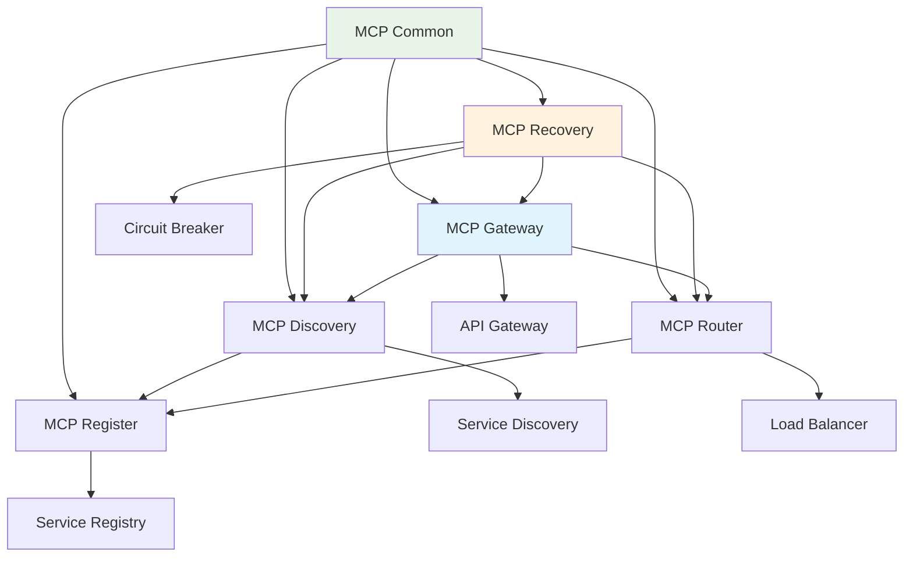

# Spring AI Alibaba - MCP 微服务架构模块详解

## 模块概述

**Spring AI Alibaba MCP (Micro Service Component Protocol)** 是一个专门为AI应用设计的微服务架构框架，提供了完整的服务发现、注册、网关、路由、容错恢复等企业级微服务能力。该模块专注于解决AI应用在分布式环境下的服务治理问题。

## 核心架构

### 1. 模块架构图



### 2. 架构设计理念

#### 2.1 AI优先的微服务设计
```java
/**
 * AI服务抽象 - 专门为AI模型服务设计的抽象
 */
public interface AIService {
    
    /**
     * 服务元信息
     */
    AIServiceMetadata getMetadata();
    
    /**
     * 健康检查 - 检查AI模型状态
     */
    HealthStatus checkHealth();
    
    /**
     * 服务能力描述
     */
    List<AICapability> getCapabilities();
    
    /**
     * 负载指标 - AI服务特有的负载指标
     */
    AILoadMetrics getLoadMetrics();
}

/**
 * AI服务元信息
 */
@Data
@Builder
public class AIServiceMetadata {
    private String serviceId;
    private String serviceName;
    private String version;
    private AIServiceType serviceType;
    private List<String> modelIds;
    private Map<String, Object> modelConfig;
    private List<String> supportedLanguages;
    private int maxConcurrency;
    private Duration averageResponseTime;
    private Map<String, String> tags;
}

/**
 * AI服务类型
 */
public enum AIServiceType {
    CHAT_MODEL("对话模型"),
    EMBEDDING_MODEL("嵌入模型"), 
    IMAGE_MODEL("图像模型"),
    AUDIO_MODEL("音频模型"),
    MULTIMODAL_MODEL("多模态模型"),
    RAG_SERVICE("RAG服务"),
    WORKFLOW_ENGINE("工作流引擎"),
    CUSTOM_SERVICE("自定义服务");
    
    private final String description;
    
    AIServiceType(String description) {
        this.description = description;
    }
}
```

## 核心组件详解

### 1. MCP Common - 公共基础组件

#### 1.1 服务定义和注解
```java
/**
 * AI服务注解 - 标记AI服务
 */
@Target(ElementType.TYPE)
@Retention(RetentionPolicy.RUNTIME)
@Component
public @interface AIService {
    
    /**
     * 服务名称
     */
    String value() default "";
    
    /**
     * 服务类型
     */
    AIServiceType type();
    
    /**
     * 支持的模型ID列表
     */
    String[] models() default {};
    
    /**
     * 最大并发数
     */
    int maxConcurrency() default 10;
    
    /**
     * 服务版本
     */
    String version() default "1.0.0";
    
    /**
     * 服务标签
     */
    String[] tags() default {};
}

/**
 * AI端点注解 - 标记AI服务的端点
 */
@Target(ElementType.METHOD)
@Retention(RetentionPolicy.RUNTIME)
public @interface AIEndpoint {
    
    /**
     * 端点路径
     */
    String path();
    
    /**
     * 支持的HTTP方法
     */
    RequestMethod[] methods() default {RequestMethod.POST};
    
    /**
     * 端点描述
     */
    String description() default "";
    
    /**
     * 是否支持流式响应
     */
    boolean streaming() default false;
    
    /**
     * 预期响应时间（毫秒）
     */
    long expectedResponseTime() default 5000;
}
```

#### 1.2 服务契约定义
```java
/**
 * AI服务契约
 */
public interface AIServiceContract {
    
    /**
     * 服务基本信息
     */
    @Data
    @Builder
    class ServiceInfo {
        private String serviceId;
        private String serviceName;
        private String version;
        private AIServiceType type;
        private String description;
        private List<String> tags;
        private Map<String, Object> metadata;
    }
    
    /**
     * 端点信息
     */
    @Data
    @Builder
    class EndpointInfo {
        private String path;
        private String method;
        private String description;
        private boolean streaming;
        private long expectedResponseTime;
        private RequestSchema requestSchema;
        private ResponseSchema responseSchema;
    }
    
    /**
     * 请求模式
     */
    @Data
    @Builder
    class RequestSchema {
        private String contentType;
        private Map<String, ParameterSpec> parameters;
        private String exampleRequest;
    }
    
    /**
     * 响应模式
     */
    @Data
    @Builder
    class ResponseSchema {
        private String contentType;
        private Map<String, ParameterSpec> fields;
        private String exampleResponse;
    }
    
    /**
     * 参数规格
     */
    @Data
    @Builder
    class ParameterSpec {
        private String name;
        private String type;
        private boolean required;
        private String description;
        private Object defaultValue;
        private List<String> allowedValues;
    }
}
```

### 2. MCP Register - 服务注册中心

#### 2.1 注册中心核心实现
```java
/**
 * AI服务注册中心
 */
@Service
public class AIServiceRegistry {
    
    private final Map<String, RegisteredAIService> registeredServices = 
        new ConcurrentHashMap<>();
    private final Map<AIServiceType, List<String>> servicesByType = 
        new ConcurrentHashMap<>();
    private final ScheduledExecutorService healthCheckExecutor = 
        Executors.newScheduledThreadPool(5);
    
    /**
     * 注册AI服务
     */
    public void registerService(AIServiceRegistration registration) {
        String serviceId = registration.getServiceId();
        
        RegisteredAIService service = RegisteredAIService.builder()
            .registration(registration)
            .registrationTime(Instant.now())
            .status(ServiceStatus.HEALTHY)
            .healthCheckFailureCount(0)
            .lastHealthCheck(Instant.now())
            .build();
        
        registeredServices.put(serviceId, service);
        
        // 按类型分组
        AIServiceType serviceType = registration.getServiceType();
        servicesByType.computeIfAbsent(serviceType, k -> new ArrayList<>())
                     .add(serviceId);
        
        // 启动健康检查
        startHealthCheck(serviceId);
        
        log.info("AI服务注册成功: {} ({})", 
                registration.getServiceName(), serviceId);
    }
    
    /**
     * 注销服务
     */
    public void deregisterService(String serviceId) {
        RegisteredAIService service = registeredServices.remove(serviceId);
        if (service != null) {
            // 从类型分组中移除
            AIServiceType serviceType = service.getRegistration().getServiceType();
            List<String> services = servicesByType.get(serviceType);
            if (services != null) {
                services.remove(serviceId);
            }
            
            log.info("AI服务注销成功: {}", serviceId);
        }
    }
    
    /**
     * 获取可用服务列表
     */
    public List<RegisteredAIService> getAvailableServices(AIServiceType serviceType) {
        List<String> serviceIds = servicesByType.get(serviceType);
        if (serviceIds == null) {
            return Collections.emptyList();
        }
        
        return serviceIds.stream()
            .map(registeredServices::get)
            .filter(Objects::nonNull)
            .filter(service -> service.getStatus() == ServiceStatus.HEALTHY)
            .collect(Collectors.toList());
    }
    
    /**
     * 根据模型ID查找服务
     */
    public List<RegisteredAIService> getServicesByModel(String modelId) {
        return registeredServices.values().stream()
            .filter(service -> service.getRegistration().getSupportedModels().contains(modelId))
            .filter(service -> service.getStatus() == ServiceStatus.HEALTHY)
            .collect(Collectors.toList());
    }
    
    /**
     * 启动健康检查
     */
    private void startHealthCheck(String serviceId) {
        healthCheckExecutor.scheduleWithFixedDelay(() -> {
            performHealthCheck(serviceId);
        }, 30, 30, TimeUnit.SECONDS); // 每30秒检查一次
    }
    
    /**
     * 执行健康检查
     */
    private void performHealthCheck(String serviceId) {
        RegisteredAIService service = registeredServices.get(serviceId);
        if (service == null) {
            return;
        }
        
        try {
            AIServiceRegistration registration = service.getRegistration();
            HealthStatus health = checkServiceHealth(registration);
            
            if (health.isHealthy()) {
                service.setStatus(ServiceStatus.HEALTHY);
                service.setHealthCheckFailureCount(0);
            } else {
                service.incrementHealthCheckFailureCount();
                if (service.getHealthCheckFailureCount() >= 3) {
                    service.setStatus(ServiceStatus.UNHEALTHY);
                    log.warn("AI服务健康检查失败超过3次，标记为不健康: {}", serviceId);
                }
            }
            
            service.setLastHealthCheck(Instant.now());
            
        } catch (Exception e) {
            service.incrementHealthCheckFailureCount();
            if (service.getHealthCheckFailureCount() >= 3) {
                service.setStatus(ServiceStatus.UNHEALTHY);
            }
            log.error("AI服务健康检查异常: {}", serviceId, e);
        }
    }
    
    /**
     * 检查服务健康状态
     */
    private HealthStatus checkServiceHealth(AIServiceRegistration registration) {
        // 实现HTTP健康检查
        String healthCheckUrl = registration.getServiceUrl() + "/actuator/health";
        
        try {
            HttpResponse<String> response = HttpClient.newHttpClient()
                .send(HttpRequest.newBuilder()
                    .uri(URI.create(healthCheckUrl))
                    .timeout(Duration.ofSeconds(5))
                    .GET()
                    .build(), 
                HttpResponse.BodyHandlers.ofString());
            
            if (response.statusCode() == 200) {
                return HealthStatus.healthy();
            } else {
                return HealthStatus.unhealthy("HTTP状态码: " + response.statusCode());
            }
            
        } catch (Exception e) {
            return HealthStatus.unhealthy("连接失败: " + e.getMessage());
        }
    }
}

/**
 * 已注册的AI服务
 */
@Data
@Builder
public class RegisteredAIService {
    private AIServiceRegistration registration;
    private Instant registrationTime;
    private ServiceStatus status;
    private int healthCheckFailureCount;
    private Instant lastHealthCheck;
    private Map<String, Object> metrics;
    
    public void incrementHealthCheckFailureCount() {
        this.healthCheckFailureCount++;
    }
}

/**
 * 服务状态枚举
 */
public enum ServiceStatus {
    HEALTHY("健康"),
    UNHEALTHY("不健康"),
    UNKNOWN("未知");
    
    private final String description;
    
    ServiceStatus(String description) {
        this.description = description;
    }
}
```

#### 2.2 服务注册配置
```java
/**
 * AI服务注册配置
 */
@Data
@Builder
public class AIServiceRegistration {
    private String serviceId;
    private String serviceName;
    private String version;
    private AIServiceType serviceType;
    private String serviceUrl;
    private String healthCheckUrl;
    private List<String> supportedModels;
    private Map<String, Object> modelConfigs;
    private int maxConcurrency;
    private Duration averageResponseTime;
    private List<String> tags;
    private Map<String, Object> metadata;
    private List<AIEndpointInfo> endpoints;
}

/**
 * AI服务自动注册
 */
@Component
public class AIServiceAutoRegistration {
    
    private final AIServiceRegistry registry;
    private final ApplicationContext applicationContext;
    
    @EventListener(ApplicationReadyEvent.class)
    public void registerAIServices() {
        // 扫描所有带@AIService注解的Bean
        Map<String, Object> aiServiceBeans = applicationContext
            .getBeansWithAnnotation(AIService.class);
        
        for (Map.Entry<String, Object> entry : aiServiceBeans.entrySet()) {
            String beanName = entry.getKey();
            Object bean = entry.getValue();
            
            AIService annotation = bean.getClass().getAnnotation(AIService.class);
            if (annotation != null) {
                registerService(beanName, bean, annotation);
            }
        }
    }
    
    private void registerService(String beanName, Object bean, AIService annotation) {
        // 构建服务注册信息
        AIServiceRegistration registration = AIServiceRegistration.builder()
            .serviceId(generateServiceId(beanName))
            .serviceName(StringUtils.hasText(annotation.value()) ? 
                        annotation.value() : beanName)
            .version(annotation.version())
            .serviceType(annotation.type())
            .serviceUrl(getServiceUrl())
            .healthCheckUrl(getHealthCheckUrl())
            .supportedModels(Arrays.asList(annotation.models()))
            .maxConcurrency(annotation.maxConcurrency())
            .tags(Arrays.asList(annotation.tags()))
            .endpoints(discoverEndpoints(bean))
            .build();
        
        // 注册服务
        registry.registerService(registration);
    }
    
    /**
     * 发现服务端点
     */
    private List<AIEndpointInfo> discoverEndpoints(Object bean) {
        List<AIEndpointInfo> endpoints = new ArrayList<>();
        
        Method[] methods = bean.getClass().getDeclaredMethods();
        for (Method method : methods) {
            AIEndpoint annotation = method.getAnnotation(AIEndpoint.class);
            if (annotation != null) {
                AIEndpointInfo endpoint = AIEndpointInfo.builder()
                    .path(annotation.path())
                    .methods(Arrays.asList(annotation.methods()))
                    .description(annotation.description())
                    .streaming(annotation.streaming())
                    .expectedResponseTime(annotation.expectedResponseTime())
                    .build();
                
                endpoints.add(endpoint);
            }
        }
        
        return endpoints;
    }
}
```

### 3. MCP Discovery - 服务发现

#### 3.1 服务发现实现
```java
/**
 * AI服务发现客户端
 */
@Component
public class AIServiceDiscoveryClient {
    
    private final AIServiceRegistry registry;
    private final LoadBalancer loadBalancer;
    private final CircuitBreakerFactory circuitBreakerFactory;
    
    /**
     * 发现AI服务实例
     */
    public Optional<RegisteredAIService> discoverService(AIServiceDiscoveryRequest request) {
        // 1. 根据服务类型获取候选服务
        List<RegisteredAIService> candidates = getCandidateServices(request);
        
        if (candidates.isEmpty()) {
            return Optional.empty();
        }
        
        // 2. 应用过滤器
        candidates = applyFilters(candidates, request.getFilters());
        
        // 3. 负载均衡选择
        return loadBalancer.choose(candidates, request.getLoadBalancingStrategy());
    }
    
    /**
     * 批量发现服务
     */
    public List<RegisteredAIService> discoverServices(AIServiceDiscoveryRequest request) {
        List<RegisteredAIService> candidates = getCandidateServices(request);
        
        // 应用过滤器
        candidates = applyFilters(candidates, request.getFilters());
        
        // 根据数量限制返回
        int limit = request.getLimit();
        if (limit > 0 && candidates.size() > limit) {
            candidates = candidates.subList(0, limit);
        }
        
        return candidates;
    }
    
    /**
     * 获取候选服务
     */
    private List<RegisteredAIService> getCandidateServices(AIServiceDiscoveryRequest request) {
        if (request.getServiceType() != null) {
            return registry.getAvailableServices(request.getServiceType());
        }
        
        if (request.getModelId() != null) {
            return registry.getServicesByModel(request.getModelId());
        }
        
        if (request.getServiceName() != null) {
            return registry.getServicesByName(request.getServiceName());
        }
        
        return registry.getAllAvailableServices();
    }
    
    /**
     * 应用过滤器
     */
    private List<RegisteredAIService> applyFilters(List<RegisteredAIService> services,
                                                  List<ServiceFilter> filters) {
        if (filters == null || filters.isEmpty()) {
            return services;
        }
        
        return services.stream()
            .filter(service -> filters.stream()
                .allMatch(filter -> filter.matches(service)))
            .collect(Collectors.toList());
    }
}

/**
 * 服务发现请求
 */
@Data
@Builder
public class AIServiceDiscoveryRequest {
    private AIServiceType serviceType;
    private String serviceName;
    private String modelId;
    private String version;
    private List<String> tags;
    private List<ServiceFilter> filters;
    private LoadBalancingStrategy loadBalancingStrategy;
    private int limit;
    private Duration timeout;
}

/**
 * 服务过滤器接口
 */
public interface ServiceFilter {
    boolean matches(RegisteredAIService service);
}

/**
 * 版本过滤器
 */
public class VersionFilter implements ServiceFilter {
    private final String targetVersion;
    
    public VersionFilter(String targetVersion) {
        this.targetVersion = targetVersion;
    }
    
    @Override
    public boolean matches(RegisteredAIService service) {
        String serviceVersion = service.getRegistration().getVersion();
        return targetVersion.equals(serviceVersion);
    }
}

/**
 * 标签过滤器
 */
public class TagFilter implements ServiceFilter {
    private final Set<String> requiredTags;
    
    public TagFilter(Set<String> requiredTags) {
        this.requiredTags = requiredTags;
    }
    
    @Override
    public boolean matches(RegisteredAIService service) {
        List<String> serviceTags = service.getRegistration().getTags();
        return serviceTags != null && serviceTags.containsAll(requiredTags);
    }
}

/**
 * 负载过滤器
 */
public class LoadFilter implements ServiceFilter {
    private final double maxLoadThreshold;
    
    public LoadFilter(double maxLoadThreshold) {
        this.maxLoadThreshold = maxLoadThreshold;
    }
    
    @Override
    public boolean matches(RegisteredAIService service) {
        // 检查服务当前负载
        AILoadMetrics metrics = getCurrentLoadMetrics(service);
        return metrics.getCurrentLoad() <= maxLoadThreshold;
    }
    
    private AILoadMetrics getCurrentLoadMetrics(RegisteredAIService service) {
        // 实现负载指标获取逻辑
        return AILoadMetrics.builder()
            .currentLoad(0.5) // 示例值
            .build();
    }
}
```

### 4. MCP Gateway - API网关

#### 4.1 AI专用API网关
```java
/**
 * AI API网关
 */
@RestController
@RequestMapping("/ai-gateway")
public class AIGatewayController {
    
    private final AIServiceDiscoveryClient discoveryClient;
    private final AIRequestRouter requestRouter;
    private final AIResponseAggregator responseAggregator;
    private final RateLimiter rateLimiter;
    
    /**
     * 统一AI服务调用入口
     */
    @PostMapping("/{serviceType}/{endpoint}")
    public Mono<ResponseEntity<?>> routeAIRequest(
            @PathVariable AIServiceType serviceType,
            @PathVariable String endpoint,
            @RequestBody Object request,
            ServerHttpRequest httpRequest) {
        
        // 1. 限流检查
        if (!rateLimiter.tryAcquire(httpRequest.getRemoteAddress())) {
            return Mono.just(ResponseEntity.status(HttpStatus.TOO_MANY_REQUESTS)
                .body("请求频率超限"));
        }
        
        // 2. 服务发现
        AIServiceDiscoveryRequest discoveryRequest = AIServiceDiscoveryRequest.builder()
            .serviceType(serviceType)
            .loadBalancingStrategy(LoadBalancingStrategy.LEAST_LOAD)
            .timeout(Duration.ofSeconds(30))
            .build();
        
        Optional<RegisteredAIService> serviceOpt = discoveryClient.discoverService(discoveryRequest);
        
        if (serviceOpt.isEmpty()) {
            return Mono.just(ResponseEntity.status(HttpStatus.SERVICE_UNAVAILABLE)
                .body("未找到可用的" + serviceType + "服务"));
        }
        
        RegisteredAIService service = serviceOpt.get();
        
        // 3. 请求路由和转发
        return routeRequest(service, endpoint, request, httpRequest)
            .map(response -> ResponseEntity.ok(response))
            .onErrorResume(throwable -> {
                log.error("AI服务调用失败", throwable);
                return Mono.just(ResponseEntity.status(HttpStatus.INTERNAL_SERVER_ERROR)
                    .body("服务调用失败: " + throwable.getMessage()));
            });
    }
    
    /**
     * 流式AI服务调用
     */
    @PostMapping(value = "/{serviceType}/{endpoint}/stream", 
                produces = MediaType.TEXT_EVENT_STREAM_VALUE)
    public Flux<ServerSentEvent<String>> streamAIRequest(
            @PathVariable AIServiceType serviceType,
            @PathVariable String endpoint,
            @RequestBody Object request) {
        
        // 服务发现
        AIServiceDiscoveryRequest discoveryRequest = AIServiceDiscoveryRequest.builder()
            .serviceType(serviceType)
            .filters(List.of(new StreamingSupportFilter()))
            .build();
        
        Optional<RegisteredAIService> serviceOpt = discoveryClient.discoverService(discoveryRequest);
        
        if (serviceOpt.isEmpty()) {
            return Flux.just(ServerSentEvent.<String>builder()
                .event("error")
                .data("未找到支持流式响应的" + serviceType + "服务")
                .build());
        }
        
        RegisteredAIService service = serviceOpt.get();
        
        // 流式请求路由
        return routeStreamRequest(service, endpoint, request)
            .map(data -> ServerSentEvent.<String>builder()
                .event("data")
                .data(data)
                .build())
            .onErrorResume(throwable -> 
                Flux.just(ServerSentEvent.<String>builder()
                    .event("error")
                    .data("流式调用失败: " + throwable.getMessage())
                    .build()));
    }
    
    /**
     * 多服务聚合调用
     */
    @PostMapping("/aggregate")
    public Mono<ResponseEntity<AggregatedResponse>> aggregateAIRequest(
            @RequestBody AggregationRequest aggregationRequest) {
        
        List<Mono<ServiceResponse>> responseMonos = aggregationRequest.getRequests().stream()
            .map(this::callSingleService)
            .collect(Collectors.toList());
        
        return Flux.merge(responseMonos)
            .collectList()
            .map(responses -> {
                AggregatedResponse aggregated = responseAggregator.aggregate(responses);
                return ResponseEntity.ok(aggregated);
            })
            .onErrorResume(throwable -> 
                Mono.just(ResponseEntity.status(HttpStatus.PARTIAL_CONTENT)
                    .body(AggregatedResponse.partial("部分服务调用失败"))));
    }
    
    /**
     * 路由请求到具体服务
     */
    private Mono<Object> routeRequest(RegisteredAIService service, 
                                     String endpoint, 
                                     Object request,
                                     ServerHttpRequest httpRequest) {
        
        String targetUrl = service.getRegistration().getServiceUrl() + "/" + endpoint;
        
        return WebClient.create()
            .post()
            .uri(targetUrl)
            .bodyValue(request)
            .headers(headers -> copyHeaders(httpRequest.getHeaders(), headers))
            .retrieve()
            .bodyToMono(Object.class)
            .timeout(Duration.ofSeconds(30))
            .doOnSuccess(response -> recordSuccess(service))
            .doOnError(error -> recordError(service, error));
    }
    
    /**
     * 路由流式请求
     */
    private Flux<String> routeStreamRequest(RegisteredAIService service,
                                           String endpoint,
                                           Object request) {
        
        String targetUrl = service.getRegistration().getServiceUrl() + "/" + endpoint + "/stream";
        
        return WebClient.create()
            .post()
            .uri(targetUrl)
            .bodyValue(request)
            .retrieve()
            .bodyToFlux(String.class)
            .timeout(Duration.ofMinutes(5))
            .doOnComplete(() -> recordSuccess(service))
            .doOnError(error -> recordError(service, error));
    }
}

/**
 * 流式支持过滤器
 */
public class StreamingSupportFilter implements ServiceFilter {
    @Override
    public boolean matches(RegisteredAIService service) {
        return service.getRegistration().getEndpoints().stream()
            .anyMatch(AIEndpointInfo::isStreaming);
    }
}
```

### 5. MCP Recovery - 容错恢复

#### 5.1 熔断器实现
```java
/**
 * AI服务熔断器
 */
@Component
public class AICircuitBreakerManager {
    
    private final Map<String, CircuitBreaker> circuitBreakers = new ConcurrentHashMap<>();
    private final CircuitBreakerConfig defaultConfig;
    
    public AICircuitBreakerManager() {
        this.defaultConfig = CircuitBreakerConfig.custom()
            .failureRateThreshold(50) // 失败率50%触发熔断
            .waitDurationInOpenState(Duration.ofSeconds(30)) // 熔断30秒
            .slidingWindowSize(10) // 滑动窗口大小
            .minimumNumberOfCalls(5) // 最小调用次数
            .build();
    }
    
    /**
     * 获取服务的熔断器
     */
    public CircuitBreaker getCircuitBreaker(String serviceId) {
        return circuitBreakers.computeIfAbsent(serviceId, id -> {
            return CircuitBreaker.of(id, defaultConfig);
        });
    }
    
    /**
     * 带熔断保护的服务调用
     */
    public <T> Mono<T> executeWithCircuitBreaker(String serviceId, 
                                                Supplier<Mono<T>> operation) {
        CircuitBreaker circuitBreaker = getCircuitBreaker(serviceId);
        
        Supplier<Mono<T>> decoratedSupplier = CircuitBreaker
            .decorateSupplier(circuitBreaker, operation);
        
        return decoratedSupplier.get()
            .onErrorResume(CallNotPermittedException.class, 
                exception -> handleCircuitBreakerOpen(serviceId, exception));
    }
    
    /**
     * 处理熔断器打开状态
     */
    private <T> Mono<T> handleCircuitBreakerOpen(String serviceId, 
                                                CallNotPermittedException exception) {
        log.warn("服务 {} 熔断器已打开，拒绝调用", serviceId);
        
        // 尝试调用备用服务
        return findFallbackService(serviceId)
            .map(fallbackService -> callFallbackService(fallbackService))
            .orElse(Mono.error(new ServiceUnavailableException(
                "服务不可用且无备用服务: " + serviceId)));
    }
    
    /**
     * 查找备用服务
     */
    private Optional<RegisteredAIService> findFallbackService(String serviceId) {
        // 实现备用服务查找逻辑
        RegisteredAIService originalService = getServiceById(serviceId);
        if (originalService != null) {
            AIServiceType serviceType = originalService.getRegistration().getServiceType();
            List<RegisteredAIService> alternatives = 
                discoveryClient.discoverServices(AIServiceDiscoveryRequest.builder()
                    .serviceType(serviceType)
                    .filters(List.of(new HealthyServiceFilter()))
                    .build());
            
            return alternatives.stream()
                .filter(service -> !service.getRegistration().getServiceId().equals(serviceId))
                .findFirst();
        }
        
        return Optional.empty();
    }
}

/**
 * 重试机制
 */
@Component
public class AIRetryManager {
    
    private final RetryConfig defaultRetryConfig;
    
    public AIRetryManager() {
        this.defaultRetryConfig = RetryConfig.custom()
            .maxAttempts(3)
            .waitDuration(Duration.ofSeconds(1))
            .retryOnException(exception -> 
                exception instanceof ConnectTimeoutException ||
                exception instanceof ReadTimeoutException ||
                exception instanceof ServiceUnavailableException)
            .build();
    }
    
    /**
     * 带重试的服务调用
     */
    public <T> Mono<T> executeWithRetry(String serviceId, 
                                       Supplier<Mono<T>> operation) {
        Retry retry = Retry.of(serviceId + "-retry", defaultRetryConfig);
        
        return operation.get()
            .retryWhen(retry.toReactorRetry())
            .doOnRetry(retrySignal -> 
                log.warn("服务调用重试: {} - 第{}次重试", 
                        serviceId, retrySignal.totalRetries() + 1));
    }
}

/**
 * 健康服务过滤器
 */
public class HealthyServiceFilter implements ServiceFilter {
    @Override
    public boolean matches(RegisteredAIService service) {
        return service.getStatus() == ServiceStatus.HEALTHY;
    }
}
```

### 6. 负载均衡策略

#### 6.1 AI专用负载均衡器
```java
/**
 * AI服务负载均衡器
 */
@Component
public class AILoadBalancer implements LoadBalancer {
    
    /**
     * 选择最佳服务实例
     */
    @Override
    public Optional<RegisteredAIService> choose(List<RegisteredAIService> services,
                                               LoadBalancingStrategy strategy) {
        if (services == null || services.isEmpty()) {
            return Optional.empty();
        }
        
        if (services.size() == 1) {
            return Optional.of(services.get(0));
        }
        
        switch (strategy) {
            case ROUND_ROBIN:
                return chooseRoundRobin(services);
            case LEAST_LOAD:
                return chooseLeastLoad(services);
            case FASTEST_RESPONSE:
                return chooseFastestResponse(services);
            case MODEL_SPECIFIC:
                return chooseModelSpecific(services);
            default:
                return chooseRoundRobin(services);
        }
    }
    
    /**
     * 轮询策略
     */
    private Optional<RegisteredAIService> chooseRoundRobin(List<RegisteredAIService> services) {
        // 简单轮询实现
        int index = (int) (System.currentTimeMillis() % services.size());
        return Optional.of(services.get(index));
    }
    
    /**
     * 最少负载策略 - AI服务特有
     */
    private Optional<RegisteredAIService> chooseLeastLoad(List<RegisteredAIService> services) {
        return services.stream()
            .min(Comparator.comparing(service -> {
                AILoadMetrics metrics = getCurrentLoadMetrics(service);
                return metrics.getCurrentLoad();
            }));
    }
    
    /**
     * 最快响应策略
     */
    private Optional<RegisteredAIService> chooseFastestResponse(List<RegisteredAIService> services) {
        return services.stream()
            .min(Comparator.comparing(service -> {
                Duration avgResponseTime = service.getRegistration().getAverageResponseTime();
                return avgResponseTime != null ? avgResponseTime.toMillis() : Long.MAX_VALUE;
            }));
    }
    
    /**
     * 模型特定策略 - 基于模型性能选择
     */
    private Optional<RegisteredAIService> chooseModelSpecific(List<RegisteredAIService> services) {
        // 基于模型性能评分选择最佳服务
        return services.stream()
            .max(Comparator.comparing(service -> {
                Map<String, Object> metadata = service.getRegistration().getMetadata();
                Object score = metadata.get("performance_score");
                return score instanceof Number ? ((Number) score).doubleValue() : 0.0;
            }));
    }
    
    /**
     * 获取当前负载指标
     */
    private AILoadMetrics getCurrentLoadMetrics(RegisteredAIService service) {
        // 实现实时负载指标获取
        // 可以通过HTTP调用服务的指标端点
        String metricsUrl = service.getRegistration().getServiceUrl() + "/actuator/metrics";
        
        try {
            // 调用服务获取实时指标
            WebClient client = WebClient.create();
            Map<String, Object> metrics = client.get()
                .uri(metricsUrl)
                .retrieve()
                .bodyToMono(new ParameterizedTypeReference<Map<String, Object>>() {})
                .block(Duration.ofSeconds(2));
            
            return parseLoadMetrics(metrics);
            
        } catch (Exception e) {
            // 获取失败时返回默认值
            return AILoadMetrics.builder()
                .currentLoad(0.5)
                .build();
        }
    }
    
    private AILoadMetrics parseLoadMetrics(Map<String, Object> metrics) {
        // 解析指标数据
        double cpuUsage = extractMetric(metrics, "system.cpu.usage", 0.0);
        double memoryUsage = extractMetric(metrics, "jvm.memory.used", 0.0);
        int activeConnections = (int) extractMetric(metrics, "tomcat.sessions.active.current", 0.0);
        
        // 计算综合负载
        double currentLoad = (cpuUsage * 0.4 + memoryUsage * 0.3 + 
                            Math.min(activeConnections / 100.0, 1.0) * 0.3);
        
        return AILoadMetrics.builder()
            .currentLoad(currentLoad)
            .cpuUsage(cpuUsage)
            .memoryUsage(memoryUsage)
            .activeConnections(activeConnections)
            .build();
    }
    
    private double extractMetric(Map<String, Object> metrics, String key, double defaultValue) {
        Object value = metrics.get(key);
        if (value instanceof Number) {
            return ((Number) value).doubleValue();
        }
        return defaultValue;
    }
}

/**
 * AI负载指标
 */
@Data
@Builder
public class AILoadMetrics {
    private double currentLoad;      // 当前负载 (0-1)
    private double cpuUsage;         // CPU使用率
    private double memoryUsage;      // 内存使用率
    private int activeConnections;   // 活跃连接数
    private int queuedRequests;      // 排队请求数
    private Duration avgResponseTime; // 平均响应时间
}

/**
 * 负载均衡策略
 */
public enum LoadBalancingStrategy {
    ROUND_ROBIN("轮询"),
    LEAST_LOAD("最少负载"),
    FASTEST_RESPONSE("最快响应"),
    MODEL_SPECIFIC("模型特定"),
    RANDOM("随机");
    
    private final String description;
    
    LoadBalancingStrategy(String description) {
        this.description = description;
    }
}
```

## 使用示例

### 1. AI服务注册示例

```java
@AIService(
    value = "chat-service",
    type = AIServiceType.CHAT_MODEL,
    models = {"gpt-3.5-turbo", "gpt-4"},
    maxConcurrency = 50,
    version = "1.2.0",
    tags = {"openai", "chat", "production"}
)
@RestController
@RequestMapping("/chat")
public class ChatServiceController {
    
    @AIEndpoint(
        path = "/completions",
        description = "Chat completions endpoint",
        streaming = false,
        expectedResponseTime = 2000
    )
    @PostMapping("/completions")
    public Mono<ChatResponse> chatCompletions(@RequestBody ChatRequest request) {
        // 实现聊天逻辑
        return chatService.chat(request);
    }
    
    @AIEndpoint(
        path = "/completions/stream",
        description = "Streaming chat completions",
        streaming = true,
        expectedResponseTime = 5000
    )
    @PostMapping(value = "/completions/stream", 
                produces = MediaType.TEXT_EVENT_STREAM_VALUE)
    public Flux<String> streamChatCompletions(@RequestBody ChatRequest request) {
        // 实现流式聊天逻辑
        return chatService.chatStream(request);
    }
}
```

### 2. 服务发现和调用示例

```java
@Service
public class AIServiceClient {
    
    private final AIServiceDiscoveryClient discoveryClient;
    private final AICircuitBreakerManager circuitBreakerManager;
    
    /**
     * 调用聊天服务
     */
    public Mono<ChatResponse> callChatService(ChatRequest request) {
        // 1. 发现聊天服务
        AIServiceDiscoveryRequest discoveryRequest = AIServiceDiscoveryRequest.builder()
            .serviceType(AIServiceType.CHAT_MODEL)
            .filters(List.of(
                new TagFilter(Set.of("production")),
                new HealthyServiceFilter()
            ))
            .loadBalancingStrategy(LoadBalancingStrategy.LEAST_LOAD)
            .build();
        
        Optional<RegisteredAIService> serviceOpt = discoveryClient.discoverService(discoveryRequest);
        
        if (serviceOpt.isEmpty()) {
            return Mono.error(new ServiceUnavailableException("没有可用的聊天服务"));
        }
        
        RegisteredAIService service = serviceOpt.get();
        String serviceId = service.getRegistration().getServiceId();
        
        // 2. 带熔断保护的服务调用
        return circuitBreakerManager.executeWithCircuitBreaker(serviceId, () -> {
            String serviceUrl = service.getRegistration().getServiceUrl();
            
            return WebClient.create()
                .post()
                .uri(serviceUrl + "/chat/completions")
                .bodyValue(request)
                .retrieve()
                .bodyToMono(ChatResponse.class)
                .timeout(Duration.ofSeconds(30));
        });
    }
}
```

### 3. 配置示例

```yaml
# Spring AI Alibaba MCP配置
spring:
  ai:
    alibaba:
      mcp:
        # 服务注册配置
        register:
          enabled: true
          service-url: http://localhost:8080
          health-check-interval: 30s
          auto-register: true
          
        # 服务发现配置
        discovery:
          enabled: true
          cache-ttl: 60s
          retry-attempts: 3
          
        # 网关配置
        gateway:
          enabled: true
          rate-limit:
            enabled: true
            requests-per-second: 100
          timeout: 30s
          
        # 容错配置
        recovery:
          circuit-breaker:
            failure-rate-threshold: 50
            wait-duration: 30s
            sliding-window-size: 10
          retry:
            max-attempts: 3
            wait-duration: 1s
            
        # 负载均衡配置
        load-balancer:
          strategy: LEAST_LOAD
          health-check-enabled: true
```

## 总结

Spring AI Alibaba MCP模块为AI应用提供了完整的微服务架构支持，具有以下特点：

**核心优势**：
- **AI专用设计**：专门为AI服务设计的微服务架构
- **完整的服务治理**：注册、发现、网关、容错一体化
- **智能负载均衡**：基于AI服务特性的负载均衡策略
- **企业级可靠性**：熔断、重试、降级等容错机制

**技术特色**：
- **响应式架构**：基于Spring WebFlux的非阻塞设计
- **类型安全**：强类型的服务定义和发现
- **可观测性**：完整的监控和指标收集
- **配置驱动**：灵活的配置管理和热更新

**适用场景**：
- 大规模AI服务集群管理
- 多模型服务的统一接入
- 高可用AI应用架构
- 企业级AI服务治理

该模块为Java企业级AI应用提供了生产就绪的微服务架构解决方案，在性能、可靠性和可维护性方面都达到了企业级标准。

---

*作者：senrian*  
*最后更新：2024年* 